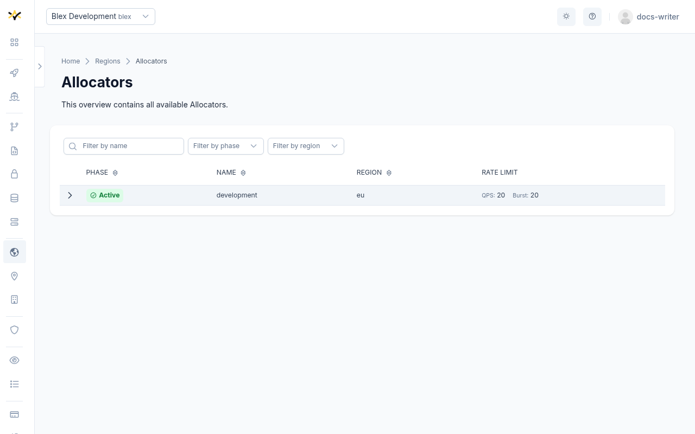
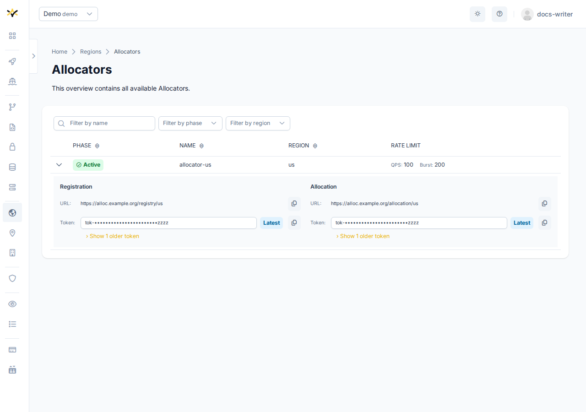

# Allocators

An Allocator is a managed game server allocation service provisioned and operated by GameFabric.
It acts as the central broker between game servers and matchmakers:

- **Game servers** register themselves with the Allocator's **Registry** endpoint when they become ready.
- **Matchmakers and backends** call the Allocator's **Allocation** endpoint to request an available server for a player session.

Allocators are global resources — they are not scoped to a specific Environment. They are read-only
in the UI; provisioning and decommissioning is handled by the platform operator through your
provisioning system.



## The region field

Every Allocator has a `spec.region` field. This is a plain string — an opaque label set at
provisioning time — that identifies where the allocator operates. It is **not** a reference to a
GameFabric Region object.

This distinction matters: the allocator's region string and the name of the GameFabric Region you
attach it to are two independent values. They may be identical by convention, or they may differ.
When game servers register with the Allocator, they advertise this string as their region. See
[Attaching an allocator to a Region](#attaching-an-allocator-to-a-region) and the
[Migration section](#migrating-from-manual-configuration) for the implications.

## Endpoints

Each Allocator exposes two endpoints, both visible when you expand a row on the Allocators page.



### Registry

Game servers use the Registry endpoint to register and deregister themselves. The `ALLOC_URL` and
`ALLOC_TOKEN` environment variables must point to this endpoint.

### Allocation

Matchmakers and backends use the Allocation endpoint to request an available game server. This
endpoint requires a separate Allocator Token — do not use the Registry Token here.

### Rotating tokens

Both endpoints maintain an ordered list of access tokens to allow zero-downtime token rotation.
Always use the **last token** in the list. Older tokens are kept visible during the rotation window
so that currently running game servers continue to authenticate without interruption.

## Attaching an allocator to a Region

A GameFabric Region can reference one Allocator via its `spec.allocator` field. You set or change
this in the **General** tab of the Region create wizard or the Region edit modal by selecting from
the **Allocator** dropdown.

Only Allocators in the `Active` phase can be attached. An Allocator that is `Terminating` is rejected.
The attachment can be cleared at any time by setting the field back to empty.

## Automatic environment variable injection

When an Allocator is attached to a Region, GameFabric automatically injects the following
environment variables into every game server container scheduled in that Region — across all
ArmadaSets, Armadas, Formations, and Vessels — without any manual configuration:

| Variable | Value |
|---|---|
| `ALLOC_URL` | Registry endpoint URL |
| `ALLOC_TOKEN` | Latest registry token (last in the rotation list) |
| `ALLOC_REGION` | The allocator's `spec.region` string |
| `ALLOC_PRIORITY` | Index of the Region Type in which the game server runs (0 = first type, 1 = second, …) |

::: info Allocation Sidecar
These variables are consumed by the **Allocation Sidecar** — a container that runs alongside your
game server and handles registration and deregistration automatically.

- For an overview of what the Allocation Sidecar is and when to use it, see
  [Sidecar Containers](/multiplayer-servers/architecture/sidecars#allocation-sidecar).
- For step-by-step configuration, see
  [Automatically Registering Game Servers](/multiplayer-servers/multiplayer-services/server-allocation/automatically-registering-game-servers).
:::

### Override precedence

The same variable name may appear in multiple configuration layers. When that happens, the
highest-precedence source wins:

| Precedence | Source | Example use case |
|---|---|---|
| Highest | Armada / Vessel env vars | Per-deployment overrides |
| High | Region Type template env vars | Type-level infrastructure context |
| Low | Allocator-injected env vars (`ALLOC_*`) | Automatic injection — see above |
| Lowest | Site template env vars | Platform-operator defaults |

This means that if you define `ALLOC_REGION` explicitly on a Region Type template, it overrides
the value injected by the allocator. If you define it on an Armada or Vessel directly, it overrides
everything. See the [Migration section](#migrating-from-manual-configuration) for guidance on
removing manual settings after enabling managed injection.

## Rate limiting

Each Allocator can be configured with rate limits that apply to incoming allocation requests:

- **QPS** — maximum number of queries per second.
- **Burst** — maximum burst size permitted above the QPS limit.

Both values are visible in the **Rate Limit** column of the Allocators table.

## Phase lifecycle

| Phase | Meaning |
|---|---|
| `Active` | The Allocator is operational and serving traffic. |
| `Terminating` | The Allocator is being decommissioned. It cannot be attached to new Regions. |

## Navigating to the Allocators page

The Allocators page is reached from the **Regions** overview via the **Allocators** summary card
at the top of the page. The card shows the current count of Allocators and links to the full list.

## Filtering

The Allocators table can be filtered by:

- **Name** — free-text search.
- **Phase** — multi-select (`Active`, `Terminating`).
- **Region** — multi-select by the allocator's `spec.region` string.

---

## Migrating from manual configuration

Previously, `ALLOC_URL`, `ALLOC_TOKEN`, and `ALLOC_REGION` were configured manually — either as
environment variables on a Region Type template, or directly on individual Armadas, Vessels, or
their containers. Attaching a managed Allocator to a Region replaces this manual workflow with
automatic injection.

### What changes

The most important change is **`ALLOC_REGION`**.

When you configured this manually, the value was a string entirely under your control. With a
managed Allocator, the value is derived from the allocator's `spec.region` field, which is set at
provisioning time and is immutable. This value may or may not match the string your game servers
have been using.

If the region string changes, game servers that registered under the new value will not be found
by a matchmaker that still queries under the old value. Registrations are attributed to the region string
in use at the time of registration.

### Before enabling a managed allocator on an existing region

1. Open the Allocators page and locate the allocator you intend to attach.
2. Check the value in the **Region** column — this is the allocator's `spec.region` string.
3. Compare it with the `ALLOC_REGION` value currently in use on your Region (check the Region
   Type template env vars and any Armada or Vessel overrides).
4. If the values differ, plan for the transition: game servers registered under the old string
   will not be discoverable under the new string until they re-register.

::: warning Test on a small or temporary region first
It is strongly recommended to enable the managed allocator on a newly created or low-traffic
Region first. This gives you a safe environment to verify that the allocator's region string is
correct for your setup — and that game servers register and are allocated correctly — before
applying the change to production regions.

Enabling an allocator on an existing production region without verifying the region string may
result in game servers registering under a different string than your matchmaker expects, causing
allocation failures.
:::

### Removing manual configuration after migration

Once you have verified that the managed allocator is injecting the correct values:

1. Remove any manually set `ALLOC_URL`, `ALLOC_TOKEN`, and `ALLOC_REGION` entries from Region
   Type templates.
2. Remove the same variables from any Armada or Vessel env vars that were carrying them.

Because manually set variables at the Armada/Vessel or Region Type level take precedence over
allocator-injected values (see [Override precedence](#override-precedence)), leaving them in place
will silently shadow the managed values and defeat the purpose of the managed allocator.

### Example

Suppose you have:

- An Allocator named `us-east-1` with `spec.region: "prod-us-east"`.
- A GameFabric Region named `us-east` with two types: `baremetal` (index 0) and `cloud` (index 1).
- Previously, the Region Type template had:
  ```
  ALLOC_URL   = https://allocator.example.com/prod/us-east/servers
  ALLOC_TOKEN = <your-registry-token>
  ALLOC_REGION = us-east
  ```

After attaching the `us-east-1` allocator to the `us-east` region:

- `ALLOC_URL` is injected automatically from the allocator's Registry endpoint URL.
- `ALLOC_TOKEN` is injected automatically (latest token from the rotation list).
- `ALLOC_REGION` becomes `"prod-us-east"` — the value from the allocator's `spec.region`.
- `ALLOC_PRIORITY` is injected as `0` for game servers in the `baremetal` type and `1` for those
  in the `cloud` type.

If your matchmaker was querying for servers in region `"us-east"` (the old manual value), it will
no longer find servers that register under `"prod-us-east"`. Verify this mismatch before switching,
and update your matchmaker's region filter if necessary.

Once confirmed, remove the manual `ALLOC_URL`, `ALLOC_TOKEN`, and `ALLOC_REGION` entries from the
Region Type template so that the managed values take effect.
