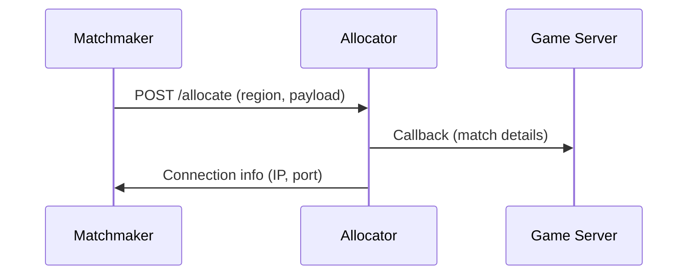

# Matchmaking

GameFabric is a hosting specialist. It runs game servers reliably at scale and deliberately does not bundle a matchmaker. This separation of concerns means studios keep full control over their matchmaking stack while relying on GameFabric for what it does best: server orchestration.

## Any matchmaker, one API call

Integrating a matchmaker with GameFabric requires a single REST API call. When the matchmaker decides that a group of players should play together, it sends a `POST` request to the Allocator's `/allocate` endpoint. The Allocator selects a ready server from the pool, notifies it, and returns the connection details to the matchmaker.

This model is matchmaker-agnostic by design. It works the same way regardless of whether the matchmaker is a commercial product, an open-source framework, or a custom in-house solution. There are no vendor-specific plugins or SDKs required — just a standard REST call.

## What the Allocator does

The Allocator is the broker between the matchmaker and GameFabric's pool of ready game servers. Game servers register with the Allocator when they start up. When an allocation request arrives, the Allocator picks the best available server, forwards any match-specific payload (map, mode, player list), and returns the server's connection details to the caller.

The entire handoff completes in under a second because servers are pre-warmed. Players connect immediately after matchmaking finishes, with no wait for a server to boot.

::: tip Full details
For a complete walkthrough of the allocation flow, registration options, and API reference, see [Server Allocation Overview](/multiplayer-servers/multiplayer-services/server-allocation/overview).
:::

## Integration in practice

Studios have integrated GameFabric with a variety of matchmaking systems using this single-endpoint approach. The existing integration examples demonstrate the pattern end to end:

- [Amazon GameLift integration](/multiplayer-servers/multiplayer-services/server-allocation/integration-examples/gamelift) — using GameLift queues with the Allocator
- [Amazon GameLift FlexMatch integration](/multiplayer-servers/multiplayer-services/server-allocation/integration-examples/flexmatch) — connecting FlexMatch to GameFabric in standalone mode

The same approach applies to any matchmaker that can issue an HTTP request.

## What's next?

- [Server Allocation Overview](/multiplayer-servers/multiplayer-services/server-allocation/overview) — when the Allocator is needed and how it works
- [Allocating from Armadas](/multiplayer-servers/multiplayer-services/server-allocation/allocating-from-armadas) — API details for the allocation request
- [Allocator API reference](/api-specs/allocation-allocator) — full API specification
