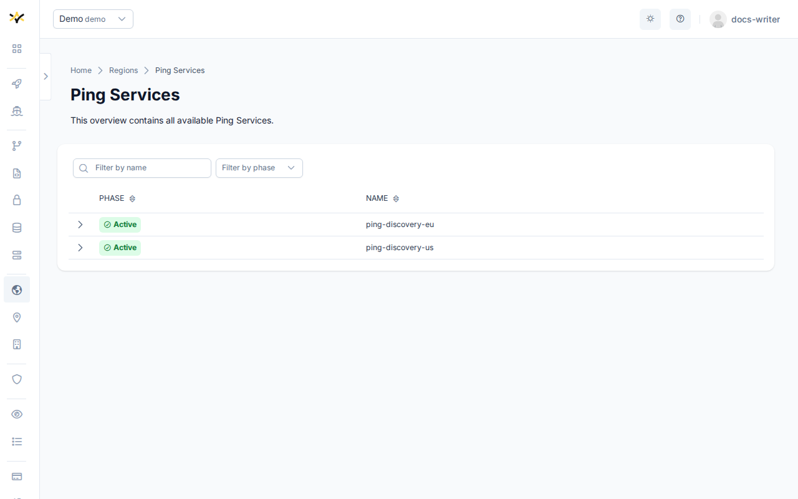
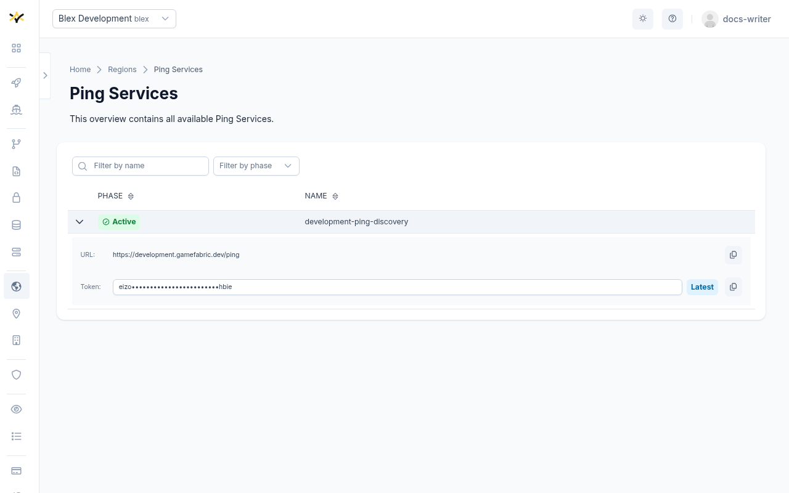

# Ping Services

A Ping Service (or Ping Discovery Service) is a managed network measurement service provisioned
and operated by GameFabric. It exposes a stable endpoint that game backends use to distribute ping
targets to game clients, who then measure round-trip latency to real game server nodes in each
region. This allows the matchmaker or game client to select the lowest-latency region for a player
session.

Ping Services are global resources — they are not scoped to a specific Environment. They have no
user-configurable spec and are read-only in the UI. Provisioning and decommissioning is handled
by the platform operator.

## Endpoint

Each Ping Service exposes a single URL and a rotating list of access tokens.

Always use the **last token** in the list. Older tokens are kept visible during the rotation window
so that currently running integrations continue to authenticate without interruption.

::: tip API Documentation
For the full Ping Discovery API specification, see the [Ping Discovery API](/api/multiplayer-servers/ping-discovery).
:::

## Phase lifecycle

| Phase         | Meaning                                                 |
|---------------|---------------------------------------------------------|
| `Active`      | The Ping Service is operational and accepting requests. |
| `Terminating` | The Ping Service is being decommissioned.               |

## Navigating to the Ping Services page

The Ping Services page is reached from the **Regions** overview via the **Ping Services** summary
card at the top of the page. The card shows the current count of Ping Services and links to the
full list.

## Filtering

The Ping Services table can be filtered by:

- **Name** — free-text search.
- **Phase** — multi-select (`Active`, `Terminating`).
