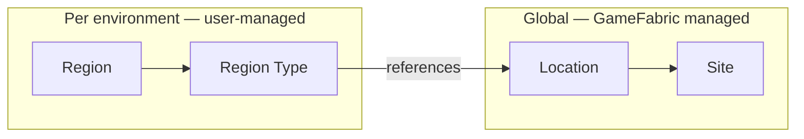

# Regions, Sites & Locations

GameFabric organizes compute capacity into three layers. Understanding how they relate to each
other helps you configure deployments correctly and diagnose capacity or scheduling issues.

Locations and Sites are global and provisioned by the platform operator (or via
[GameFabric Cloud self-service](/multiplayer-servers/getting-started/gamefabric-cloud)).
Regions are created and managed by your team inside a specific Environment.
A Region does not create capacity — it selects and organizes existing capacity for your
deployments.

See [Capacity Types](/multiplayer-servers/architecture/capacity-types) for details on bare metal,
GameFabric Cloud, and BYOC capacity.

## Regions

A Region is the capacity target for your game server deployments. When you create an Armada or
Formation, you target a Region. GameFabric schedules game server processes onto the Sites that
back that Region.

What counts as a logical region is a game-design decision, not a geographical one. You might group
Frankfurt, London, and Amsterdam into a single "EU" Region if your matchmaker treats Europe as
one pool. Or you might define "EU-West" and "EU-North" separately if latency matters for your
title. Region Types add a further dimension: you can prioritize bare metal Locations over cloud
within the same Region to manage cost, without changing any deployment configuration.

### Region Types

Every Region has one or more **Types**. A Type defines a class of infrastructure within the Region
and maps it to a set of Locations.

Common examples:

- `baremetal` — maps to Locations backed by Nitrado bare metal hardware
- `cloud` — maps to Locations backed by GameFabric Cloud or BYOC capacity

Types have a **priority** (0 = highest priority, 1 = lower, and so on). GameFabric fills the
highest-priority type first. Use this to prefer lower-cost bare metal capacity and only overflow
to cloud when bare metal is exhausted.

Each Type also carries an optional **template** that applies to all game servers scheduled in that
Type:

- **Environment variables** — injected into every game server container in this Type. Useful for
  passing infrastructure context (e.g. region name, capacity tier) without hardcoding it in your
  image.
- **Scheduling strategy** — controls how game servers are placed across nodes:
  - `Packed` (default) — game servers are co-located on shared nodes. Maximizes density.
  - `Distributed` — game servers spread across nodes. Reduces blast radius if a node fails.

### Capacity tracking

The Regions list shows aggregate CPU and memory usage across all Types for each Region as
progress bars. These bars reflect the combined used and limit values across all Types.

### Protection status

When SteelShield™ mitigations are active on your account, the Regions list shows a
**Protection Status** column. This status is derived from the Sites that back the Region's
Locations:

| Status              | Meaning                                                                              |
|---------------------|--------------------------------------------------------------------------------------|
| Protected           | All backing Sites are protected                                                      |
| Partially Protected | Some backing Sites are protected                                                     |
| Unprotected         | No backing Sites are protected                                                       |
| Unknown             | Protection state cannot be determined (no Sites resolved, or SteelShield not active) |

### Managing Regions

The following operations are available from the Regions list:

- **Edit** — opens a two-tab modal. The **General** tab updates display name and description. The
  **Types** tab adds, removes, reorders, and reconfigures types — including location assignments,
  priority, environment variables, and scheduling strategy.
- **Clone** — creates a new Region with the same type configuration. Useful when setting up
  parallel environments (e.g. cloning a `prod` region to create `staging`).
- **Delete** — removes the Region. Running deployments targeting this Region should be stopped
  first.

#### Region name constraints

- Maximum 24 characters
- Lowercase alphanumeric, `.` and `-` only
- Must start and end with a lowercase letter or digit

For a step-by-step walkthrough of creating a Region, see
[Set up your environment](/multiplayer-servers/getting-started/setup-your-environment).

::: info Filtering
The Regions list can be filtered by protection status and by type name. Use the type filter to
quickly find all Regions of a specific capacity class (for example, all Regions with a `cloud`
type to check overflow capacity).
:::

## Locations

A Location is a geographic node that groups one or more Sites. It is the unit that Region Types
reference when targeting capacity.

Locations are global and read-only for users, with two exceptions:

- Users with the `clouds: post` capability can **request GameFabric Cloud capacity** at an
  eligible Location.
- Users with the `clouds: patch,delete` capability can **remove GameFabric Cloud capacity** from a
  provisioned Location.

### Location types

Locations carry a type label (`g8c.io/location-type`) that identifies the kind of capacity they
represent:

| Type | Meaning |
|---|---|
| `baremetal` | Nitrado-owned physical hardware |
| `managed` | GameFabric Cloud (GCP-provisioned, billed through GameFabric) |
| `byoc` | Bring Your Own Cloud (customer's cloud account) |
| `unknown` | Type has not been classified |

GameFabric Cloud Locations display a `Managed` tag in the Locations list.

### Default filters

The Locations list opens with default filters applied to reduce noise:

- **Sites:** `used` and `unused` (excludes `unprovisioned`)
- **Regions:** `assigned` (excludes Locations not referenced by any Region)

Clear these filters to see all Locations including those with no active capacity.

### Requesting GameFabric Cloud capacity

On a Location that supports GameFabric Cloud provisioning, a **Request Cloud Location** button
appears in the actions column. Clicking it opens a form to request capacity at that Location.
While provisioning is in progress the row shows a `Provisioning requested` badge. Once complete,
the Location's type becomes `managed` and Sites appear under it.

To deprovision previously requested capacity, click **Remove Cloud Location** on a managed
Location. The row shows `Deprovisioning requested` while the operation is in progress.

::: info
GameFabric Cloud capacity cannot be added to Locations that already have BYOC capacity.
:::

### Cross-references in the Locations view

- The **Sites** count on each row opens the Sites list filtered to that Location.
- The **Associated Regions** count shows how many Regions across all environments reference this
  Location. Click it to see the list with links to each environment's Regions page.

::: info Filtering
The Locations list can be filtered by site state, region assignment, and location type. When
diagnosing why a Region has no available capacity, start here — check whether the Locations
referenced by your Region's Types have active, non-cordoned Sites.
:::

## Sites

A Site is a capacity cluster — a set of physical or virtual nodes represented as a Kubernetes
namespace — that belongs to a Location. Sites are **read-only** in the UI. They are created and
managed by the platform operator, or provisioned automatically when you request GameFabric Cloud
capacity.

### Site states

| State | Meaning |
|---|---|
| `Connected` | The Site is healthy and accepting new game server scheduling |
| `Pending` | The Site is being provisioned and is not yet ready |
| `Terminating` | The Site is being decommissioned |
| `Error` | The Site has a connection or configuration problem; the reason is shown in the details |

### Cordoned Sites

A cordoned Site does not accept new game server scheduling. Running game servers continue until
they shut down naturally, but new ones are not started on that Site. The Sites list marks cordoned
Sites with a `Cordoned` tag.

Cordoning is an operator action. It is typically applied when a Site is being prepared for
maintenance or deprovisioning, or when a freshly provisioned Site should not receive traffic yet.

### Capacity per Site

The Sites list shows:

- **Total CPU** and **Total Memory** — the configured resource limit for the Site
- **CPU used** and **Memory used** — live bars showing current utilization

### Protection status

When SteelShield™ is active, the Sites list adds a **Protection Status** column showing the
per-Site protection state: `Protected`, `Partially Protected`, `Unprotected`, or `Unknown`.
Per-Site protection states are the source of truth for the Region-level protection status.

### Site details

Click **Details** on any Site row to view site-level environment variables configured by the
operator. These variables are injected into all game servers scheduled on that Site.

::: info Filtering
The Sites list can be filtered by state and protection status. Filter by `cordoned` to audit
Sites that are not accepting new scheduling.
:::
