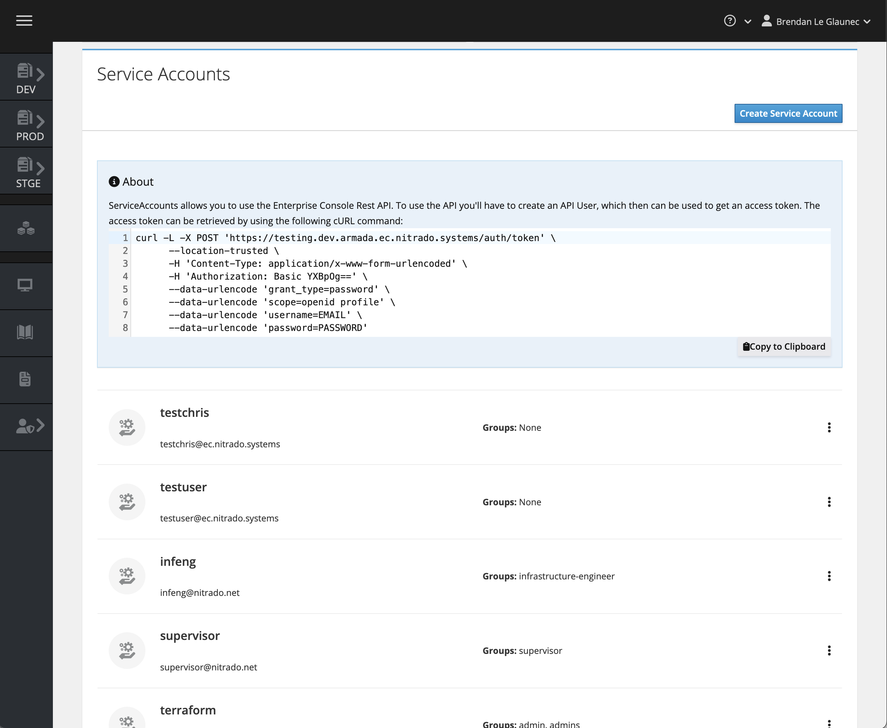
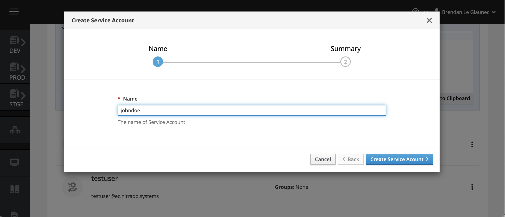
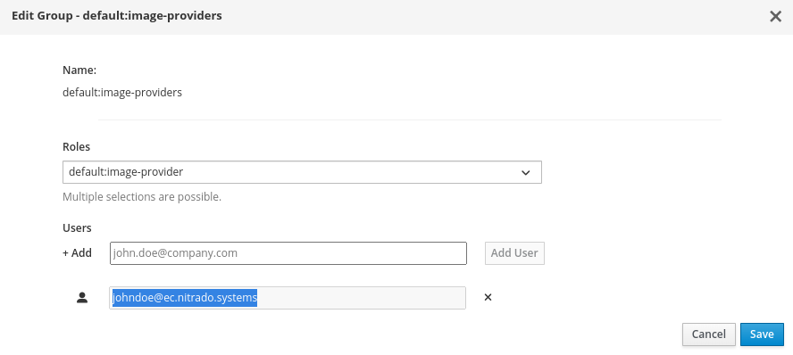
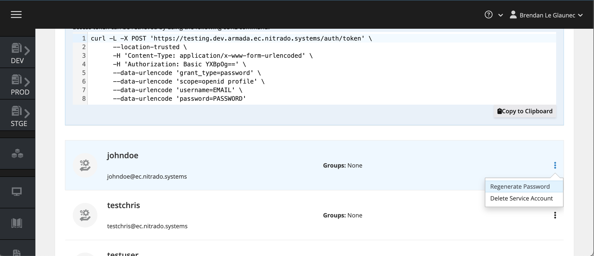

# Authentication

ServiceAccounts are required to push images and interact with the GameFabric REST API.

## Managing Service Accounts

To manage service accounts, navigate to the "Access Management" section of the WebUI, and into the "Users/Groups" page.



Click the "Create Service Account" button at the top right of the "Service Accounts" box.



The first step will prompt you to define the username for that service account, and once this is confirmed the account is created and a password is generated for it.
Make sure to copy this password, as it will not be shown again.


Service accounts need permissions. To use the service account for pushing container images, edit the
`default:image-providers` group and add the full identifier of the new service account to it:



If you lost the password for a service account, you can reset it by clicking the "Regenerate Password" button next to your service account.



## Pushing Docker Images to the Registry

Make note of the username and password for your service account, and use them to log in as described in the [Pushing Container Images](/multiplayer-servers/integration/pushing-container-images) guide.

## Making API requests

To access the GameFabric REST API, you must create a Service Account, which can then be used to generate an access token.
Replace your credentials and the host name in the following command:

```bash
curl --silent -L -X POST "https://${GAMEFABRIC_URL}/auth/token" \
      --location-trusted \
      -H 'Content-Type: application/x-www-form-urlencoded' \
      --data-urlencode 'client_id=api' \
      --data-urlencode 'grant_type=password' \
      --data-urlencode 'scope=openid email profile' \
      --data-urlencode 'username=${EMAIL}' \
      --data-urlencode 'password=${PASSWORD}'
```

You may now use the generated access token in the `Authorization` header of your API requests:

> **Note:** The access token is only **valid for 24 hours**. Once it expires, you need to generate a new token using your service account credentials, or use a refresh token (by including the `offline_access` scope).

```bash
curl -X 'GET' \
     "https://${GAMEFABRIC_URL}/api/armada/v1/armadagameserverstates" \
     -H 'accept: application/json' \
     -H "Authorization: Bearer ${TOKEN}"
```

::: tip API Documentation
For detailed API specifications and available endpoints, see:
- [GameFabric API Guide](/multiplayer-servers/api/guide)
- [API Server Documentation](/api/multiplayer-servers/apiserver)
- [Web API Documentation](/api/multiplayer-servers/webapi)
:::
