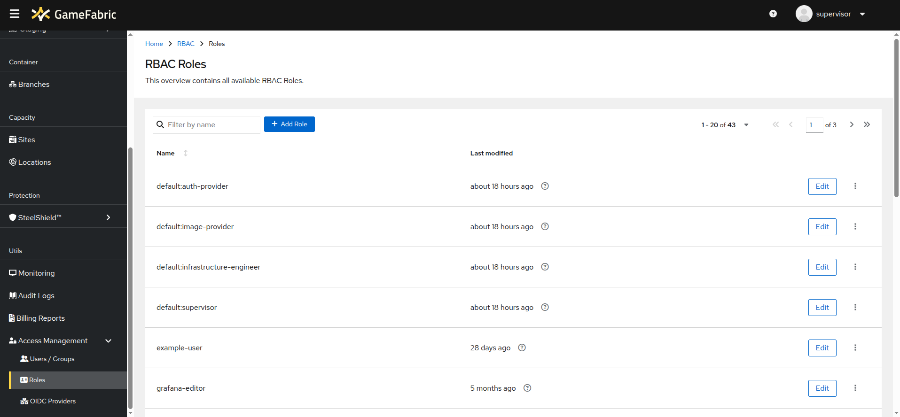

# Editing Permissions

## Overview

GameFabric uses RBAC (Role-Based Access Control) to manage who can access specific features and resources within your GameFabric installation.
This is achieved by defining a role — a set of **permissions** — and assigning it to groups of users.
To edit permissions, navigate to the **Access Management** section in the GameFabric UI and select either the **Users/Groups** or **Roles** page.

## Group

A group is a collection of users that can be assigned to roles.
Existing groups are listed on the **Users/Groups** page of the GameFabric UI, under the **Groups** section.
From here, you can view all groups, create new ones, or edit existing groups.

### Assign roles to a group

To add roles to a group, click the **Edit** button next to the desired group.
This opens the group edit modal, where you can add or remove roles.
Select the roles you want to assign, then click **Save**.

### Assign user to a group

In the group edit modal, click the **Users** tab. Here, you can enter an email address that is used to sign in.
Click **Add User**, select the desired user, and then click **Save** to apply your changes.

#### Unassign user from a group

To remove a user, click the **X** icon next to their email address. Then click **Save** to confirm.

## User

A user is an individual account that can be assigned to groups.
Users are managed on the **Users/Groups** page of the GameFabric UI, under the **Users** tab.
To edit a user, click the **Edit** button next to their name.
In the user edit modal, select the groups to which the user should belong.
Click **Save** to apply your changes.

::: info
- You can't add users directly.
- You add them by assigning them to at least one group.
:::

::: warning
- Only users that are assigned to a group are shown here.
- For proper offboarding, a user must be removed from all groups.
:::

::: info
To set up a Third-Party OIDC Provider, refer to the [Setup Third-Party OAuth Integration](setup-third-party-oauth.md) section.
:::

## Role

A role is a collection of permissions that can be assigned to groups.
To edit roles, navigate to the **Access Management** section in the GameFabric UI and select the **Roles** page.
To modify an existing role, click the **Edit** button next to it.

Each role has a set of permissions that define the actions available to users or groups assigned to that role.
The resources listed in the table correspond to the REST API. To grant a role permission to a resource, check the box in the respective column.

Resources can be environment-specific, meaning that a role will only have access in the specified environment.
To edit environment-based permissions, expand the resource by clicking the arrow next to it.
To bulk edit these permissions, use the checkboxes beside the resource name.

## Service Account

For the management of Service Accounts, refer to the [Authentication](authentication.md) section.
