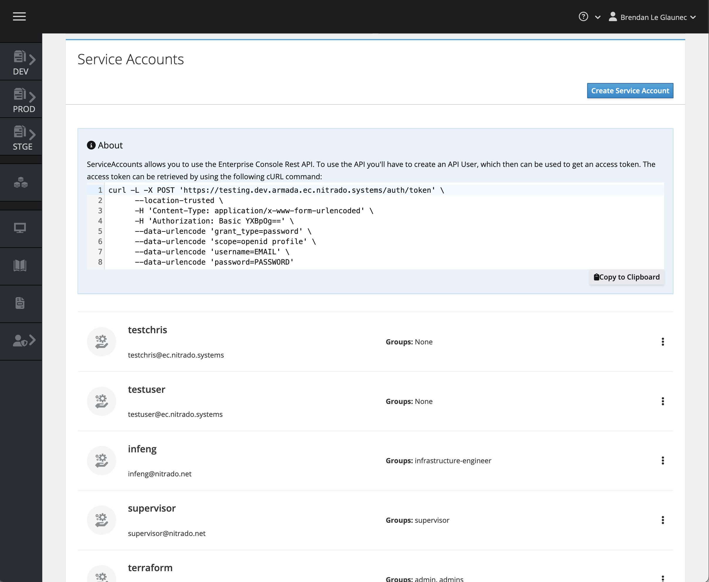
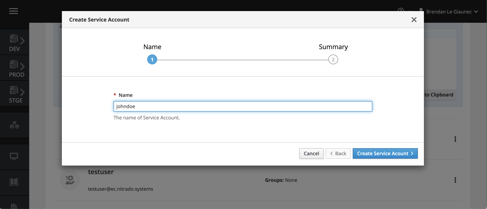
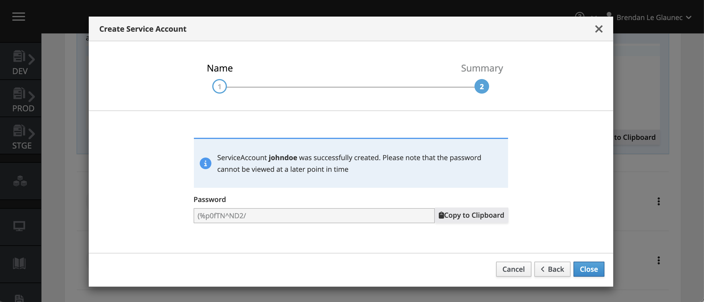
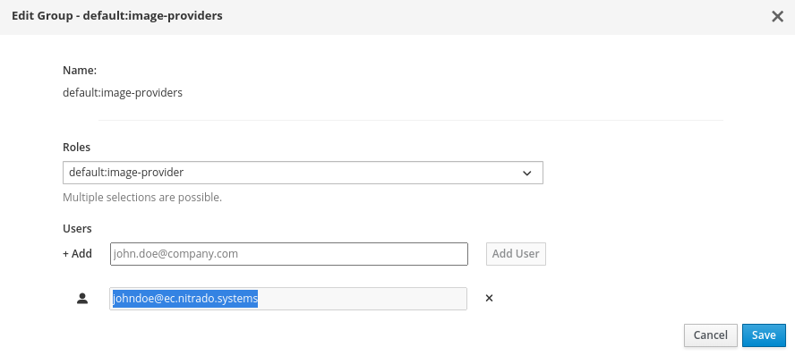
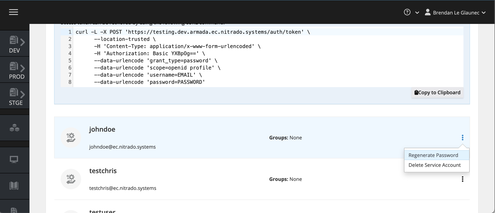

# Service Accounts

Service Accounts are required to push images and interact with the GameFabric REST API.

## Managing Service Accounts

To manage Service Accounts, navigate to the **Access Management** section of the UI, and select the **Users/Groups** page.



Click the **Create Service Account** button at the top right of the **Service Accounts** box.



The first step prompts you to define the username for that Service Account. Once confirmed, the account is created and a password is generated.
Make sure to copy this password, as it is not shown again.



Service Accounts need permissions. To use a Service Account for pushing container images, edit the
`default:image-providers` group and add the full identifier of the new Service Account to it:



If you lose the password for a Service Account, reset it by clicking the **Regenerate Password** button next to your Service Account.



## Pushing Docker images to the registry

Note the username and password for your Service Account, and use them to log in as described in the [Pushing Container Images](/multiplayer-servers/getting-started/pushing-container-images) guide.

## Making API requests

To access the GameFabric REST API, create a Service Account and use it to generate an access token.
Replace your credentials and the host name in the following command:

```bash
curl --silent -L -X POST "https://${GAMEFABRIC_URL}/auth/token" \
      --location-trusted \
      -H 'Content-Type: application/x-www-form-urlencoded' \
      --data-urlencode 'client_id=api' \
      --data-urlencode 'grant_type=password' \
      --data-urlencode 'scope=openid email profile' \
      --data-urlencode 'username=${EMAIL}' \
      --data-urlencode 'password=${PASSWORD}'
```

Use the generated access token in the `Authorization` header of your API requests:

> **Note:** The access token is only **valid for 24 hours**. After it expires, generate a new token using your Service Account credentials, or use a refresh token (by including the `offline_access` scope).

```bash
curl -X 'GET' \
     "https://${GAMEFABRIC_URL}/api/armada/v1/armadagameserverstates" \
     -H 'accept: application/json' \
     -H "Authorization: Bearer ${TOKEN}"
```

::: tip API Documentation
For detailed API specifications and available endpoints, see:
- [GameFabric API Guide](/multiplayer-servers/api/guide)
- [API Server Documentation](/api/multiplayer-servers/apiserver)
- [Web API Documentation](/api/multiplayer-servers/webapi)
:::
