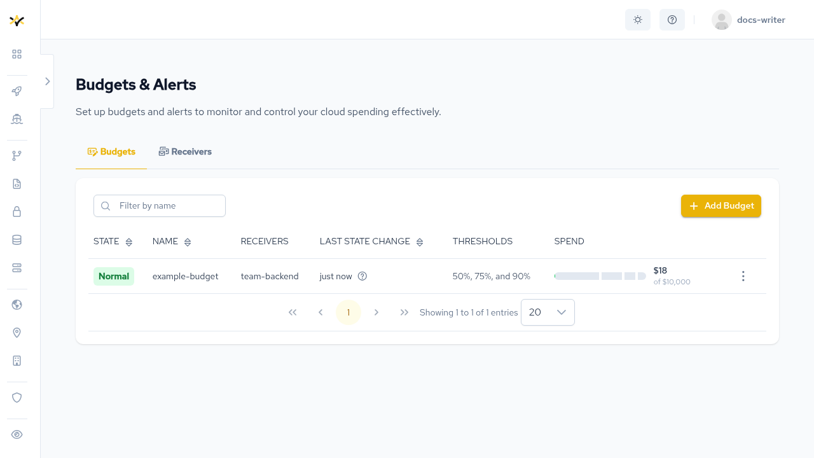
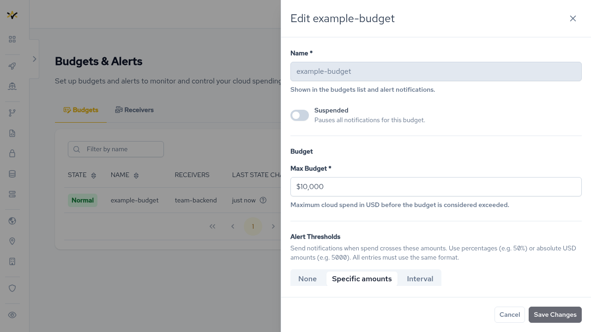
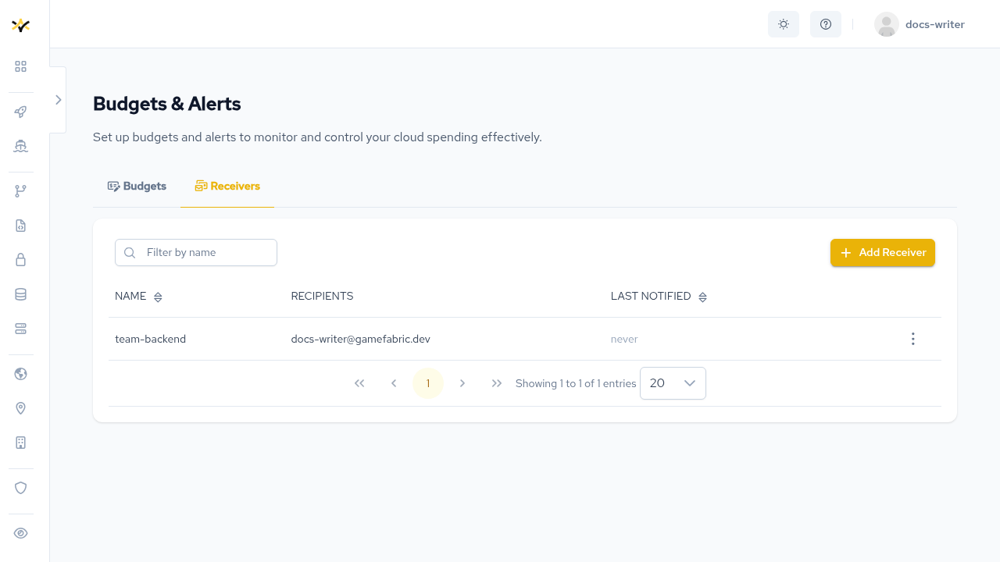
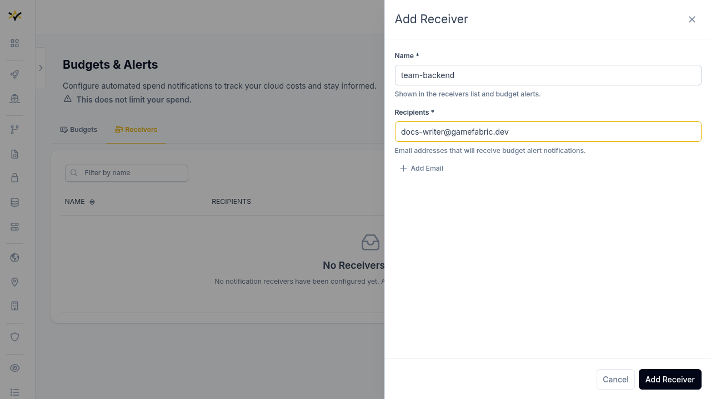

# Cloud budget

Cloud budget lets you define a maximum USD spend limit for your GameFabric Cloud usage and configure notification thresholds so you are alerted before that limit is reached.
When a threshold or the maximum budget is crossed, GameFabric sends email notifications to the configured receivers.
Reaching the maximum budget does not suspend or terminate any running services.

::: info GameFabric Cloud only
Cloud budget is only available for [GameFabric Cloud](/multiplayer-servers/getting-started/gamefabric-cloud) capacity.
It is not available for bare metal or Bring Your Own Cloud (BYOC) capacity.
:::

## Invoice period

An invoice period corresponds to a calendar month.
At any given time, one or two invoice periods may be active: the current month's, and potentially the previous month's if it has not yet been finalized.
Invoices are finalized with a delay to account for cloud provider reporting lag, so the previous month's invoice can remain open for up to five (5) business days into the new month.

Budget states and alert thresholds are evaluated independently for each open invoice period.
This means that at the turn of a month, spend tracked under the closing period and spend tracked under the opening period are counted separately — each can independently trigger alerts.

Once an invoice is finalized, its entry is removed from the cloud budget view.
No history is kept — budget tracking is only relevant while an invoice period is open.

## Budget states

Each budget reports a state that reflects the current spend for the active invoice period.

The following states are possible:

| State | Meaning |
|---|---|
| `Normal` | Spend is within all configured thresholds. |
| `ThresholdCrossed` | Spend has crossed at least one configured threshold. |
| `MaxBudgetExceeded` | Spend has exceeded the configured maximum budget. |
| `Suspended` | The budget is toggled off. No alerts are sent regardless of spend. |

## Maximum budget

The maximum budget is the upper USD spend limit for a billing period.
It must be greater than zero.

Exceeding the maximum budget triggers a critical alert to all configured receivers.
It does not pause, throttle, or terminate any running cloud capacity.

## Thresholds

Thresholds are intermediate spend levels that trigger early-warning alerts before the maximum budget is reached.
They are optional, but recommended.

Specific thresholds and interval thresholds can be configured independently or together.

### Specific thresholds

Specific thresholds are an explicit, ordered list of spend levels.
Each entry is either a fixed USD amount (an integer) or a percentage of the maximum budget.
All entries in the list must use the same format and must be sorted in ascending order.

Examples:

- Fixed amounts: `$50,000`, `$100,000`, `$200,000`
- Percentages: `25%`, `50%`, `75%`

### Interval thresholds

Interval thresholds define a repeating step size that GameFabric expands into a threshold list automatically, up to the maximum budget.
This is useful when you want evenly spaced alerts without listing every value.

Configuration:

- **Step** (required): the spacing between each threshold. Must be greater than zero.
- **Start** (optional): the first threshold. When omitted, the first alert fires at the step value.

Both `start` and `step` must use the same format: either both fixed USD amounts or both percentages.

Example with `start: $20,000` and `step: $20,000` on a `$100,000` budget:

> Thresholds at $20,000 — $40,000 — $60,000 — $80,000, then the maximum budget alert at $100,000.

## Receivers

A receiver is a named group of email addresses that GameFabric notifies when a threshold or the maximum budget is crossed.
Receivers are managed separately and can be reused across multiple budgets.

Each budget must reference at least one receiver and at most five.
A receiver cannot be deleted while any budget still references it.

## Alert notifications

GameFabric sends an email alert whenever a threshold or the maximum budget is crossed for the active invoice period.

### Threshold crossed

When spend crosses a configured threshold, all receivers for that budget receive an email with the subject **GameFabric Cloud Budget Alert: Threshold Crossed**.

### Maximum budget exceeded

When spend exceeds the maximum budget, all receivers for that budget receive an email with the subject **GameFabric Cloud Budget Alert: Maximum Budget Exceeded**.

::: info Concurrent invoices
At the turn of a month, both the closing and the opening invoice periods may be open simultaneously.
Each can independently trigger alerts, so you may receive notifications for both periods at the same time.
:::

## Suspending a budget

Suspending a budget stops all further alert notifications without deleting the budget or its configuration.
When re-enabled, GameFabric evaluates spend from the current state; no alerts are sent retroactively for thresholds crossed during the suspension period.

::: warning Spend tracking is paused while suspended
While a budget is suspended, GameFabric stops tracking spend against it.
Any spend already recorded for open invoice periods is cleared from the budget's perspective when you suspend it.
This does not affect invoicing — cloud spend continues to be recorded for billing purposes regardless.
:::

## Managing budgets

### Create a receiver

A budget requires at least one receiver, so create a receiver first if none exist.

1. Go to **Admin Area → Billing Reports → Budget Alerting**.
2. Select the **Receivers** tab and click **Add Receiver**.
3. Enter a name and one or more email addresses.

### Create a budget

1. Go to **Admin Area → Billing Reports → Budget Alerting**.
2. Select the **Budgets** tab and click **Add Budget**.
3. Enter a name and set the maximum budget in USD.
4. Optionally configure alert thresholds — specific amounts or an interval.
5. Select one or more receivers to notify.

## Permissions

To view and manage cloud budgets, a user must belong to a group with a role that grants the following permissions:

- `get` on the `cloudbudgets` resource — required to view budgets.
- `get` on the `receivers` resource — required to view and assign receivers.

::: tip Access control
For more information on managing permissions, see [Editing permissions](/multiplayer-servers/authentication/editing-permissions).
:::
