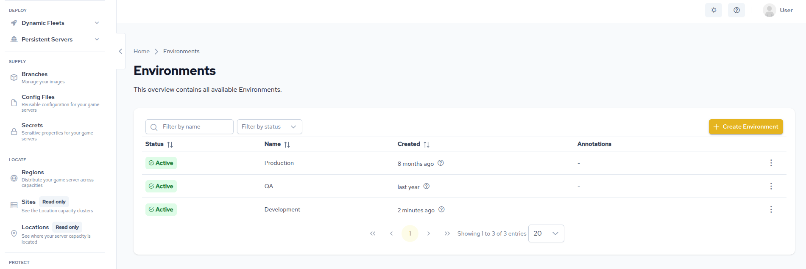
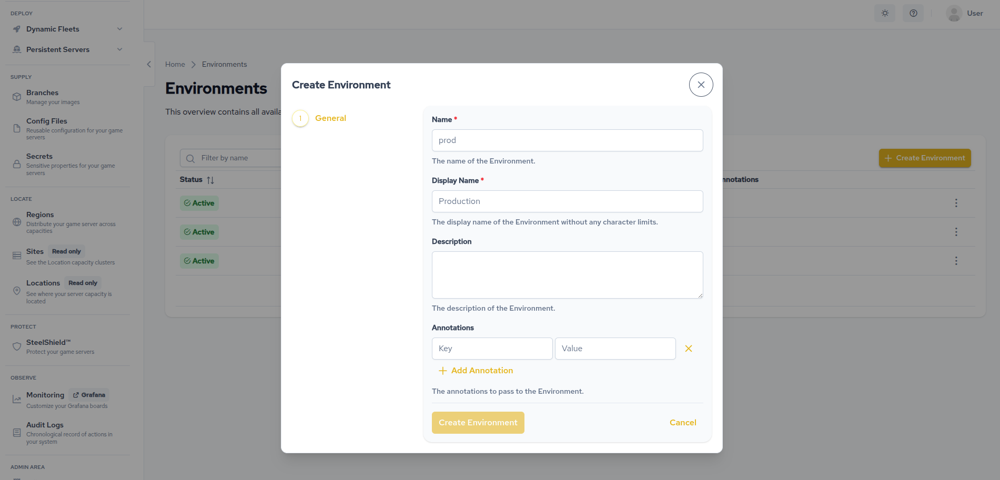

# Environments

An environment is the container every deployment resource lives in. Regions, Armadas, Formations,
Vessels, Config Files, Secrets and Volumes all belong to exactly one environment, and resources in
one environment never affect resources in another.

Use environments to separate production from staging and development. Most studios create three:
one for live players, one for pre-release testing, and one for daily development work.

::: tip Creating your first environment
The [get started track](/multiplayer-servers/get-started/set-up-your-environment) walks through
creating an environment and a region together. This page is the reference behind it.
:::

## Create an environment

Select **Environments** in the sidebar, then **Create Environment**.

| Field | Required | Notes |
|---|---|---|
| Environment Slug | Yes | At most 4 characters, lowercase letters and numbers only. Cannot be changed after creation. |
| Display Name | No | The human-readable name, such as "Production". |
| Description | No | What the environment is for. |
| Annotations | No | `key: value` pairs. Both key and value are required. |

The slug is the environment's identity across the API, the UI and every resource inside it. Four
characters is a hard limit, so choose carefully: `prod`, `stge`, `dev` and `qa` are the usual
choices. See [Quotas](/multiplayer-servers/configure/quotas#name-length) for the other name limits
in GameFabric.

Everything except the slug can be changed later.

## Select the active environment

Large parts of the UI are environment-scoped, including Config Files, Secrets, Dynamic Fleets and
Persistent Servers. In those sections a selector appears in the top bar. Whatever it shows is the
environment you are creating and editing resources in.

Your selection is remembered between visits. If you have ever created something in the wrong
place, this selector is why: check it before you start.

## Environment states

An environment is in one of two states.

| State | Meaning |
|---|---|
| `Active` | Ready to use. |
| `Terminating` | Deletion has been requested, and the environment is waiting for its child resources to be removed. |

## Delete an environment

Deletion is deliberately difficult, because deleting an environment would otherwise take live game
servers with it.

You must delete every resource inside the environment first: Armadas, ArmadaSets, Formations,
Vessels, Regions, Config Files, Secrets and Volumes. Requesting deletion before that moves the
environment to `Terminating`, where it stays until the last child resource is gone.

There is no force delete. If an environment is stuck in `Terminating`, something inside it still
exists.

## Where to go next

- [Regions](/multiplayer-servers/configure/regions) — the
  step-by-step walkthrough, including creating a region.
- [Config files](/multiplayer-servers/configure/config-files) and
  [Secrets](/multiplayer-servers/configure/secrets) — environment-scoped configuration.
- [Quotas](/multiplayer-servers/configure/quotas) — the limits that apply within an environment.
