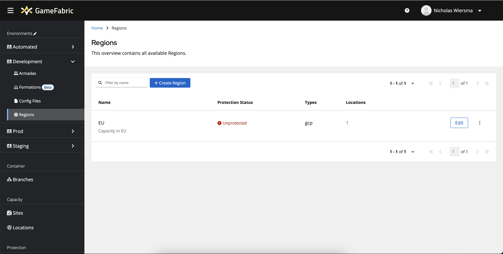
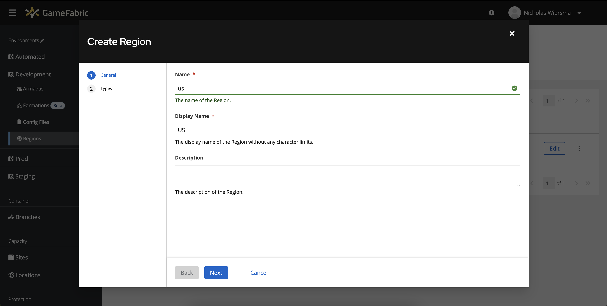
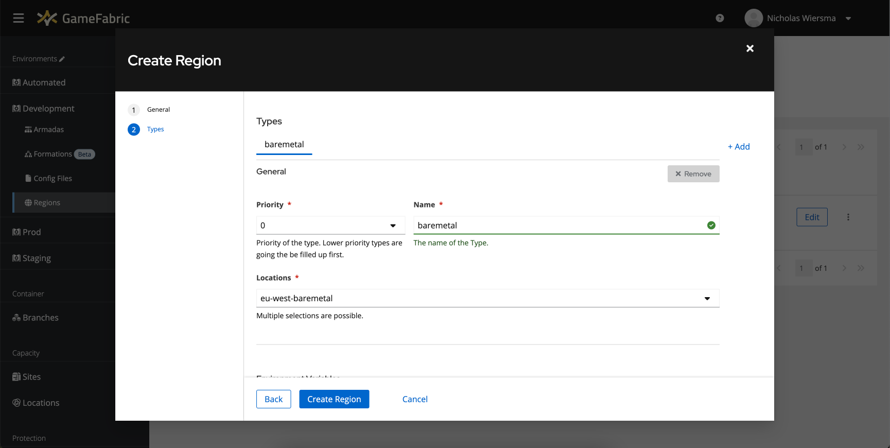
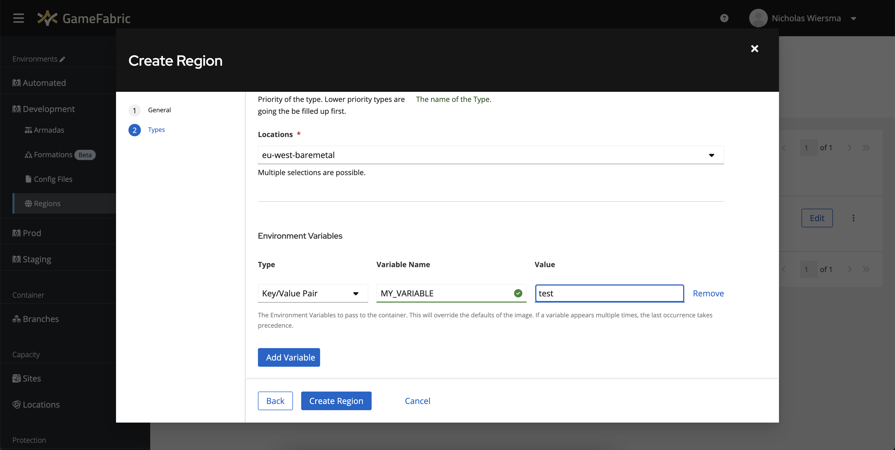

# Regions

A region groups the locations your game servers run in, usually geographically. It is what you
select when you deploy, and it decides which capacity is used first.

Regions live inside an [environment](/multiplayer-servers/configure/environments), so create the
environment first.

## Create a region

1. Check that the correct environment is selected in the top bar.
2. Select **Regions** in the sidebar.

3. Select **Create Region**.

4. Give the region a name and a display name that make its purpose obvious, such as `euw` and
   "Europe West", then select **Next**.

## Define region types

A region type is a group of locations with a priority attached. Types are how you express
"use this capacity before that capacity".

GameFabric places game servers into the lowest priority number that still has capacity, then falls
through to the next. A typical mixed region looks like this:

| Type name | Priority | Locations |
|---|---|---|
| `metal` | 1 | Bare metal locations in the region |
| `cloud` | 2 | GameFabric Cloud or bring your own cloud locations in the region |

Game servers then fill leased bare metal capacity first, and only spill into cloud once it is
full. Since bare metal is a committed cost and cloud is charged on use, this ordering is what
keeps your [cloud fees](/multiplayer-servers/administration/billing-reports) down.

For each type, set:

- a **name** and a **priority**, where lower numbers are used first
- the **locations** belonging to that type
- optionally, **environment variables** applied to every game server deployed into those locations

Type-level environment variables are the practical way to tell a game server what kind of capacity
it landed on, without configuring each deployment separately.

Select **Create Region** to finish. The region can now be used to deploy game servers.

::: info No locations to select?
Locations are provisioned for you, so an empty list means no capacity exists in that geography
yet. Contact your Nitrado representative for bare metal or GameFabric Cloud capacity, or check
your [cloud provider connection](/multiplayer-servers/configure/cloud-provider-setup) for bring
your own cloud.
:::

## Where to go next

- [Regions, sites and locations](/multiplayer-servers/concepts/regions-sites-and-locations) — what
  sits behind a region.
- [Scheduling strategy](/multiplayer-servers/concepts/scheduling-strategy) — how a game server is
  placed within a type.
- [Ping services](/multiplayer-servers/concepts/ping-services) — route players to the closest
  region.
- [Vessels](/multiplayer-servers/deploy/vessels) — deploy into the region you just created.
