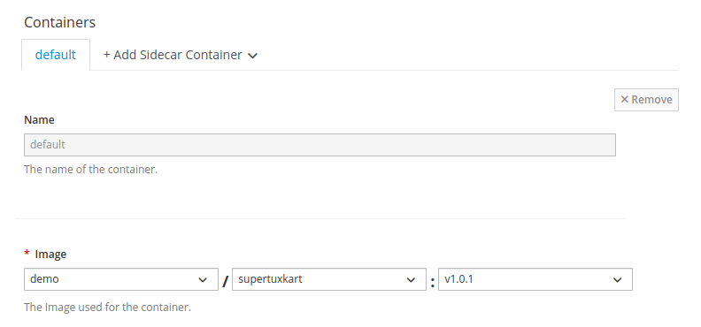
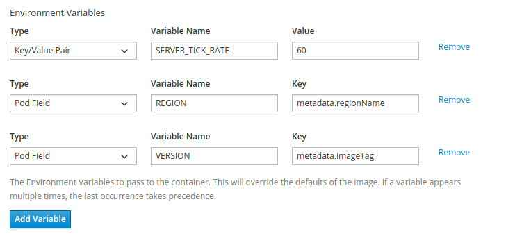
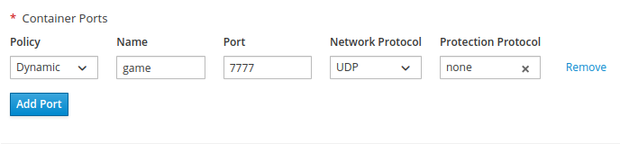
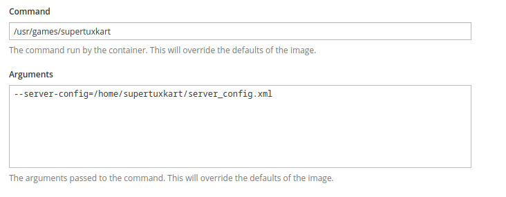
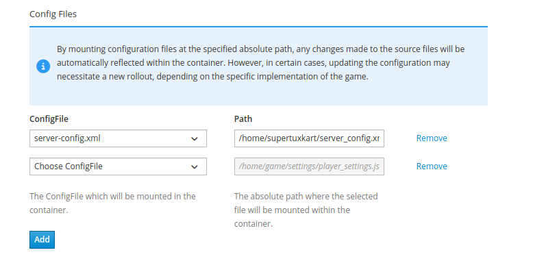
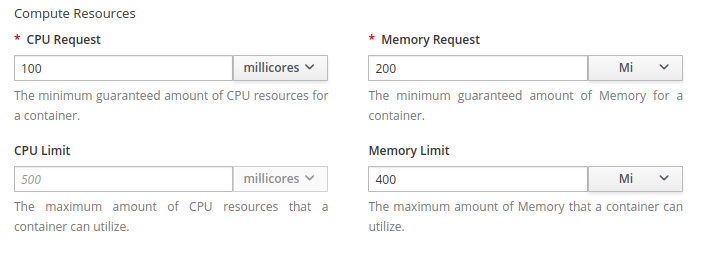
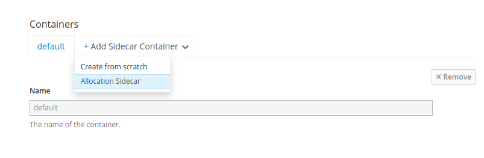
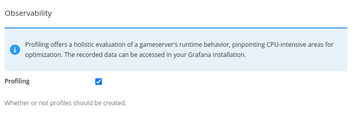
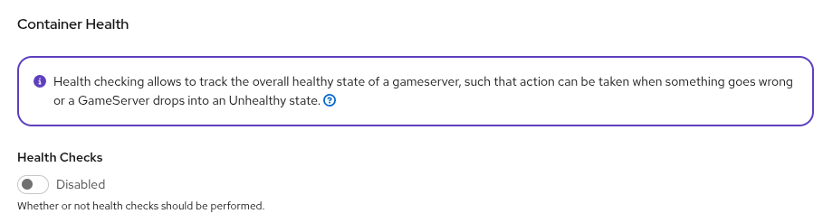
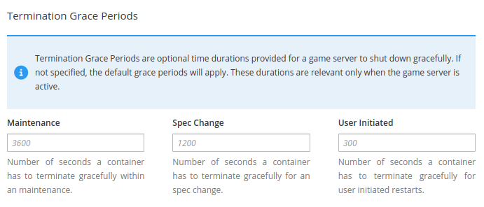

# Container configuration

The container and advanced settings are the same whether you are creating an ArmadaSet, an Armada,
a Formation or a Vessel. This page is the reference for all of them.

For the steps to create each resource, see [Vessels](/multiplayer-servers/deploy/vessels) and
[ArmadaSets](/multiplayer-servers/deploy/armadasets).

## Containers

### Image

Select the image and tag you [pushed to a branch](/multiplayer-servers/container-images/pushing-container-images).

:::warning
If you select `autoUpdate`, pushing a new version of your game server image immediately triggers an automatic rollout.
This can be very convenient for development purposes, as it avoids you having to edit the deployment whenever you push a new version.
:::

### Environment variables

Environment variables are a convenient way of exposing configuration options to the game server without defining a full configuration file.
You can define them as static key/value pairs, or, by selecting the "Pod Field" type, expose metadata about the deployed game server,
such as the name of the region the game server is deployed to or the version of the image in use.

Supported pod fields are:

| Pod field                     | Description                                                        | Resolved by                 |
|-------------------------------|--------------------------------------------------------------------|-----------------------------|
| `metadata.name`               | Name of the game server, usually referring to the unique pod name. | Kubernetes                  |
| `metadata.labels['<KEY>']`    | Accessor to the game server labels.                                | Kubernetes                  |
| `metadata.armadaName`         | Name of the associated Armada.                                     | GameFabric (Armada only)    |
| `metadata.vesselName`         | Name of the associated Vessel.                                     | GameFabric (Formation only) |
| `metadata.regionName`         | Name of the region.                                                | GameFabric (any)            |
| `metadata.regionTypeName`     | Name of the region type.                                           | GameFabric (any)            |
| `metadata.regionTypePriority` | Priority of the region type.                                       | GameFabric (any)            |
| `metadata.siteName`           | Name of the site.                                                  | GameFabric (any)            |
| `metadata.imageBranch`        | Name of the image branch of the used game server image.            | GameFabric (any)            |
| `metadata.imageName`          | Name of the used game server image.                                | GameFabric (any)            |
| `metadata.imageTag`           | Tag name of the used game server image.                            | GameFabric (any)            |

For more information, see the [full list of supported Kubernetes fields](https://kubernetes.io/docs/concepts/workloads/pods/downward-api/#downwardapi-fieldRef).

Variables set here override those set on a [region type](/multiplayer-servers/configure/regions),
and those injected by an [Allocator](/multiplayer-servers/concepts/allocators#override-precedence).

### Ports

Ports determine how your game server can be reached from the outside world.
Game servers live behind Network Address Translation (NAT), that means the public IP and ports differ from the IP and ports that the game server binds to locally.

There are two types of ports you can configure:

* **Dynamic** is the preferred default. The game server locally binds to a predetermined port (such as `7777`) and
  at runtime, a random public port is chosen that game clients can then use to reach the game server. If the game server
  needs to communicate its public IP and ports to an outside system, such as a server list, the game server needs to
  query this data from the Agones SDK. See [Discovering Your Public Address](/multiplayer-servers/integrate/your-game-server#discovering-your-public-address) for details.
* **Passthrough** may be required if a game server requires public and local port to be the same (Steam's A2S query
  being a notable example). The public port is randomly chosen at runtime, and the game server then has to locally
  bind to that specific port after retrieving it from the Agones SDK. Passthrough should only be used when required.

Some port name conventions and what they are typically used for:

| Port Name | Usage                                                                              |
|-----------|------------------------------------------------------------------------------------|
| game      | Primary game traffic port, often UDP.                                              |
| query     | Port to retrieve meta data about the server, such as current number of players.    |
| rcon      | Any remote control endpoint that can be used to manage the game server at runtime. |
| allocator | Callback endpoint for a server allocation mechanism.                               |

::: info
The `allocator` port is used by the [Allocator service](/multiplayer-servers/integrate/server-allocation/overview), which manages server assignment for matchmaking-based games. Games that rely on a server browser instead of matchmaking do not require this port.
:::

Each port can also be assigned a [protection protocol](/multiplayer-servers/protect/protocols). A
port with no protocol assigned has no DDoS protection.

### Command and arguments

You can also override the command run by the container, as well as CLI arguments your game server starts with.

If left empty, the game server starts with the default arguments defined in the container's Dockerfile for the
properties CMD and ARGS, respectively.

### Volumes

Point [volumes](/multiplayer-servers/configure/volumes) declared on the deployment at specific
paths inside the container. Each mount takes a volume name, a mount path, and optionally a sub path
and a read-only flag.

### Config files

Mount [config files](/multiplayer-servers/configure/config-files) and
[secrets](/multiplayer-servers/configure/secrets) defined in your environment. The mount path
includes the filename your game server expects.

### Resources

Resources are the CPU and memory required by your game server. This definition comes in two parts:

* **Requests** (Mandatory): These are the resources that are guaranteed to your game server, and should be set to values
  that realistically resemble the resource consumption of an average game server that is in use. These requested values
  are used for scheduling decisions, which means that the game server is only started on a node that is guaranteed to
  still have these resources available.
* **Limits** (Optional): Additionally, hard limits can be set for the resources the game server is allowed to use. If the
  game server exceeds its memory limits, it will be terminated, and if it exceeds its CPU limits, it will be throttled.
  It is generally recommended to set the memory limit to a threshold that would indicate a memory leak that warrants
  termination, and to not apply CPU limits, unless negative effects have been observed.

::: tip Requests drive your bill
The GameFabric fee is charged on cores, and cores are counted from requests rather than actual
usage. See [Resource management](/multiplayer-servers/configure/resource-management) for how to
size these from measured data, and [Billing reports](/multiplayer-servers/administration/billing-reports)
for where it shows up.
:::

### Sidecars

Once you are done configuring your game server container, you may go back to the top of the page to add a sidecar
container if you want to use one. The selector allows you to directly create an Allocation Sidecar, or to create a
new arbitrary container from scratch.

See [Sidecar containers](/multiplayer-servers/concepts/sidecars) for what sidecars are used for,
and [Automatically registering game servers](/multiplayer-servers/integrate/server-allocation/automatically-registering-game-servers)
for configuring the allocation sidecar.

## Advanced options

### Profiling

GameFabric Multiplayer Servers has built-in support for eBPF-based CPU performance profiling using [Grafana Pyroscope](https://grafana.com/oss/pyroscope/).
This feature has an expected CPU performance impact of just 2-3%, so in most cases it is safe to enable.

::: tip Learn More
For details on troubleshooting profiling issues, including symbol resolution, see the [Profiling guide](/multiplayer-servers/operate/profiling).
:::

### Health checks

If a game server fails to call `agones.Health()`, it will be considered unhealthy and terminated.
The thresholds for that process can be configured here. The default values are usually okay to use.

:::warning Health checks are disabled by default, and should not stay that way
Health checks are off by default to simplify the very first integration of your game server SDK.
Enable them as soon as your `Health()` calls work, and certainly before production.

Without health checks, a game server that freezes cannot be detected or cleaned up by the platform,
which causes matchmaking failures. GameFabric also makes no promises about life cycle handling for
game servers without health checks: they may be evicted at a moment's notice during maintenance.
:::

### Termination grace periods

Game servers may receive [*Shutdown Hints*](terminating-game-servers), observable via the Agones SDK.
These hints are used when game servers need to shut down within a specific time frame due to an external reason.

The reasons for a server to be told it should shut down are:

* **Maintenance**: The Site the game server is running on is being put into maintenance and needs to be emptied.
* **Spec Change**: The game server configuration was updated (such as a new version being available), and the game
  server needs to shut down so that the new configuration can be applied.
* **User Initiated**: A suspension or restart was triggered by a user through the GameFabric UI or API.

Your game server is expected to handle shutdown hints explicitly:

1. Observe the shutdown hint on the Agones GameServer object.
1. If a hint is present, treat its timestamp as a deadline and start shutdown handling immediately.
1. Exit the game server process before the hint timestamp is reached.

For the best player experience, implement graceful shutdown logic that lets active sessions end cleanly before exit.
At minimum, show an in-game message such as "This server will shut down in X minutes" and stop accepting new matches.

The configured grace period is the time that the game server can use to gracefully shut down, for example,
by informing the players to disconnect and shutting down when all players have left.
When the game server has not shut down before the grace period has passed, it is forcefully terminated.

## Where to go next

- [Vessels](/multiplayer-servers/deploy/vessels) — create a single long-lived game server.
- [ArmadaSets](/multiplayer-servers/deploy/armadasets) — create an auto-scaling fleet.
- [Production requirements](/multiplayer-servers/operate/production-requirements) — what these
  settings must look like before launch.
