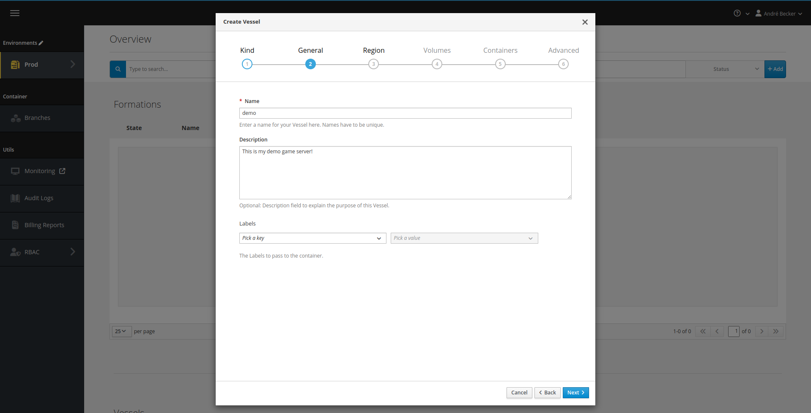
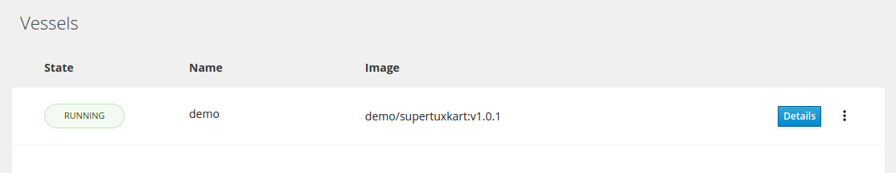
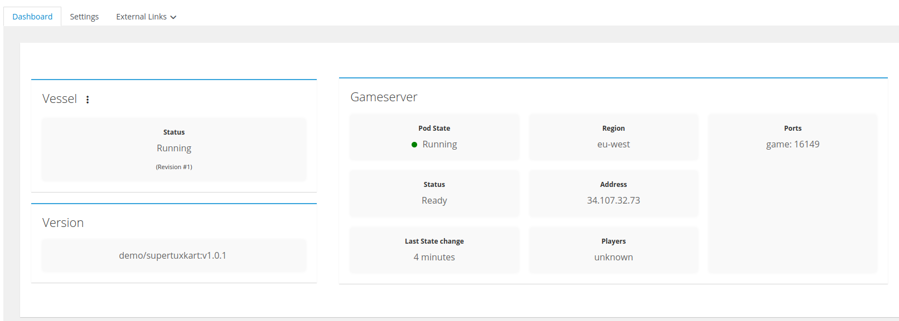
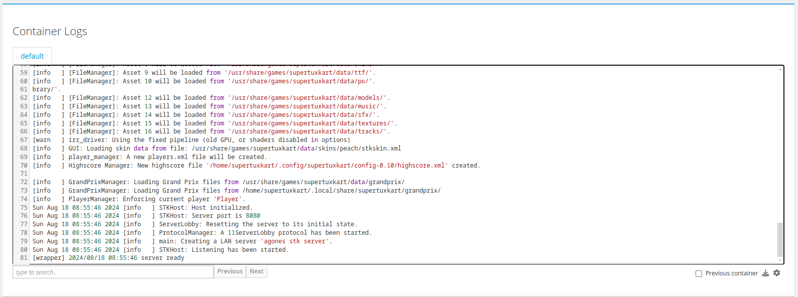

# Vessels

A Vessel is a single long-lived game server with its own name, region and configuration. This page
covers creating one.

If this is your first deployment, follow the
[get started track](/multiplayer-servers/get-started/deploy-your-first-game-server) instead. It
covers the same ground in order, with the surrounding steps.

## Prerequisites

In order to follow this guide, make sure you have the following:

* User credentials to access your GameFabric UI and environment of choice
* A container image that has been [pushed to a branch in the registry](/multiplayer-servers/container-images/pushing-container-images)
* Basic understanding of [Agones SDK integration](/multiplayer-servers/integrate/your-game-server) for proper game server lifecycle

Log into the GameFabric UI before proceeding.

::: tip Vessel or Armada?
Vessels suit persistent servers that players return to. For session-based games where a matchmaker
assigns players, use [ArmadaSets](/multiplayer-servers/deploy/armadasets). See
[Hosting models](/multiplayer-servers/concepts/hosting-models) to choose, and
[Formations and Vessels](/multiplayer-servers/concepts/formations) for the object model.
:::

## Create a Vessel

Visit **Persistent Servers > Vessels** in the UI, and select **Add**. Creating from the Vessels
list produces a standalone Vessel; to create one that inherits from a
[Formation](/multiplayer-servers/deploy/formations), start from the Formations list instead.

The wizard has four steps.

### General

In this step, specify a unique name for your Vessel.
You can also assign a description as a reminder what this Vessel is used for.

### Region

Select the Region that this Vessel should run in.
Please note that you do not need to specify the type of capacity within the Region (i.e. Bare Metal vs. Cloud).
This scheduling decision is performed automatically and adjusts dynamically when capacity changes.

::: info Region Immutability

The Region of a Vessel is immutable, which means that if you want to change the Region, you need to create a new Vessel and delete the old one.
This is because the Region is a fundamental part of the Vessel's identity and configuration.

Instead, the Vessel can be cloned, which creates a new Vessel with the same configuration as the original one, but with a different name and Region.
This allows you to easily create multiple similar Vessels in different Regions without having to manually configure each one from scratch.

:::

### Container Templates & Volumes

This step holds the bulk of the configuration: image, environment variables, ports, command,
mounts, resources and sidecars.

It is also where you declare any [volumes](/multiplayer-servers/configure/volumes) the Vessel
needs, either for data that must survive a restart or to share data between containers in the same
pod. Skip volumes if your game server keeps no state on disk.

### Advanced & Protection

This step holds health checks, termination grace periods, profiling, and the SteelShield
protection settings.

The container and advanced settings are identical for Vessels, Formations, Armadas and ArmadaSets.
See [Container configuration](/multiplayer-servers/deploy/container-configuration) for every
option.

::: warning Enable health checks
They are disabled by default to ease first integration. A game server without health checks cannot
be detected when it freezes, and may be evicted without warning during maintenance.
:::

## Visualize and configure

Now that the Vessel has been successfully created, it should become visible under **Persistent Servers > Vessels**.
If the game server starts up as expected and completes its `agones.Ready()` call, the state of the Vessel should switch to "RUNNING".

You may click on the "Details" button to see more information.

In this view, you see the most important information about your game server, such as its public IP and ports.
You can now use this information to perform a test connection to your game server.

On the same page, you can also inspect the logs of your game server, to troubleshoot any issues that occur.

## Where to go next

- [Container configuration](/multiplayer-servers/deploy/container-configuration) — every setting in
  the container and advanced steps.
- [Formations](/multiplayer-servers/deploy/formations) — group Vessels under one shared
  configuration.
- [Vessel states](/multiplayer-servers/deploy/vessel-states) — what each state means.
- [Deploying a new build](/multiplayer-servers/deploy/deploying-a-new-build) — roll a new image out.
- [Debugging](/multiplayer-servers/operate/debugging) — when a Vessel does not reach RUNNING.
- [Terminating game servers](/multiplayer-servers/deploy/terminating-game-servers) — shut one down
  cleanly.
