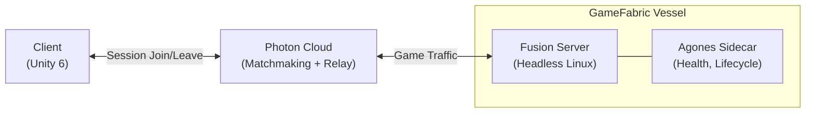

# Photon Fusion on GameFabric

## Introduction

[Photon Fusion](https://www.photonengine.com/fusion) is a high-performance multiplayer netcode SDK for Unity, Unreal, and Godot. In **Dedicated Server mode**, a headless game instance acts as the authoritative server while clients connect via the Photon Cloud.

This guide shows how to run a Photon Fusion Dedicated Server on GameFabric with full Agones lifecycle integration.

::: tip Prerequisites
This guide builds on top of [Unity on GameFabric](/multiplayer-servers/game-engine-examples/unity), which covers the Agones SDK setup, container build, and deployment basics for any Unity game server.
:::

## Architecture



The Fusion Dedicated Server connects to the Photon Cloud on startup and registers a session. Clients find and join the server through the Photon Cloud using the session name. All game traffic is relayed through the Photon Cloud — clients never need to know the server's IP or port.

## Prerequisites

| Requirement | Version | Notes |
|-------------|---------|-------|
| Unity | 6 (6000.x) | See [Unity on GameFabric](/multiplayer-servers/game-engine-examples/unity) for build setup |
| Photon Fusion SDK | 2.1+ | [Unity Asset Store](https://assetstore.unity.com/packages/tools/network/photon-fusion-multiplayer-sdk-267958) |
| Photon Fusion AppId | Free tier (20 CCU) | [Photon Dashboard](https://dashboard.photonengine.com) |
| Agones SDK for Unity | v1.59.0 | See [Unity on GameFabric](/multiplayer-servers/game-engine-examples/unity#agones-sdk-for-unity) |

## Fusion + Agones Lifecycle

The server integrates the Photon Fusion networking lifecycle with the [Agones game server lifecycle](/multiplayer-servers/integration/game-server-lifecycle):

| Event | Agones Call | Fusion Trigger |
|-------|-------------|----------------|
| Server initialized | `Ready()` | After `StartGame(GameMode.Server)` succeeds |
| First player joins | `Allocate()` | `INetworkRunnerCallbacks.OnPlayerJoined` (player count 0 → 1) |
| Health heartbeat | `Health()` | Automatic (Agones Unity SDK) |
| Last player leaves | `Shutdown()` | `INetworkRunnerCallbacks.OnPlayerLeft` (player count → 0) |

## Key Code

The server starts Fusion in `GameMode.Server` (headless, no local player) and then signals `Ready()` to Agones:

```csharp
private async Task StartServer()
{
    _agones = gameObject.AddComponent<AgonesSdk>();

    _runner = gameObject.AddComponent<NetworkRunner>();
    _runner.ProvideInput = false;

    await _runner.StartGame(new StartGameArgs()
    {
        GameMode = GameMode.Server,
        SessionName = "MySession",
        Scene = SceneRef.FromIndex(SceneManager.GetActiveScene().buildIndex),
        SceneManager = gameObject.AddComponent<NetworkSceneManagerDefault>()
    });

    bool ready = await _agones.Ready();
    if (!ready)
    {
        // If Ready() fails, the Agones sidecar is unreachable.
        // The server cannot participate in the fleet lifecycle,
        // so we quit and let the platform restart this instance.
        Application.Quit();
        return;
    }
}
```

Fusion's `INetworkRunnerCallbacks` drive the allocation and shutdown lifecycle:

```csharp
public async void OnPlayerJoined(NetworkRunner runner, PlayerRef player)
{
    _playerCount++;
    runner.Spawn(_playerPrefab, Vector3.up * 2, Quaternion.identity, player);

    if (_playerCount == 1)
        // Signal to GameFabric that this server is actively hosting a session.
        // While allocated, the server is protected from being shut down
        // for scaling or maintenance.
        await _agones.Allocate();
}

public async void OnPlayerLeft(NetworkRunner runner, PlayerRef player)
{
    _playerCount--;

    if (_playerCount <= 0)
    {
        // No players remaining — signal to GameFabric that the server
        // is done and can be removed from the fleet.
        await _agones.Shutdown();
        Application.Quit();
    }
}
```

## Photon Cloud and Session Management

Fusion uses the Photon Cloud for session discovery and traffic relay:

- The server registers a **session** with the Photon Cloud on startup (identified by `SessionName`)
- Clients connect to the same session by name — no IP or port needed
- All traffic is relayed through the Photon Cloud
- The server consumes 1 CCU on the Photon Cloud for session management

::: info AppId Configuration
Each server needs a Photon Fusion AppId. Create one for free at the [Photon Dashboard](https://dashboard.photonengine.com). In the Unity project, configure it via **Fusion → Realtime Settings → App Id Fusion**, or pass it as an environment variable at runtime.
:::

## Expected Logs

Once deployed on GameFabric, the vessel logs show the lifecycle:

```
[Fusion] Starting in Server mode...
[Fusion] Server started successfully.
[Agones] Ready signaled.
[Agones] Health checks active.
[Server] Player [Player:2] joined. Players: 1
[Agones] Allocated — first player joined.
[Server] Player [Player:2] left. Players: 0
[Agones] Shutdown — last player left.
```

## Next Steps

This guide uses a single Vessel with a hardcoded session name for simplicity. In production, each game server instance needs its own unique session identifier so that players are routed to the correct server.

**Unique Session IDs:** Replace the hardcoded `SessionName` with a unique identifier per game server instance (e.g. the pod name, a UUID, or a value provided by the allocator). This ensures multiple game servers can run simultaneously without session conflicts on the Photon Cloud.

**Dynamic scaling with Armada:** When your game needs to scale the number of game servers based on player demand, use Armada fleets instead of individual Vessels. Armada automatically manages a pool of ready servers and scales up/down based on buffer configuration.

- [Armada Scaling](/multiplayer-servers/multiplayer-services/scaling)
- [Replicas and Buffer Size](/multiplayer-servers/multiplayer-services/armada-replicas-and-buffer)

**Automatic server assignment with the GameFabric Allocator:** Instead of clients connecting to a fixed session name, use the GameFabric Allocator to assign a ready server to a match. The allocator picks a server from the pool, marks it as allocated, and returns connection information to your backend.

- [GameFabric Allocator](/multiplayer-servers/architecture/allocators)
- [Allocating from Armadas](/multiplayer-servers/multiplayer-services/server-allocation/allocating-from-armadas)
- [Server Allocation Overview](/multiplayer-servers/multiplayer-services/server-allocation/overview)
