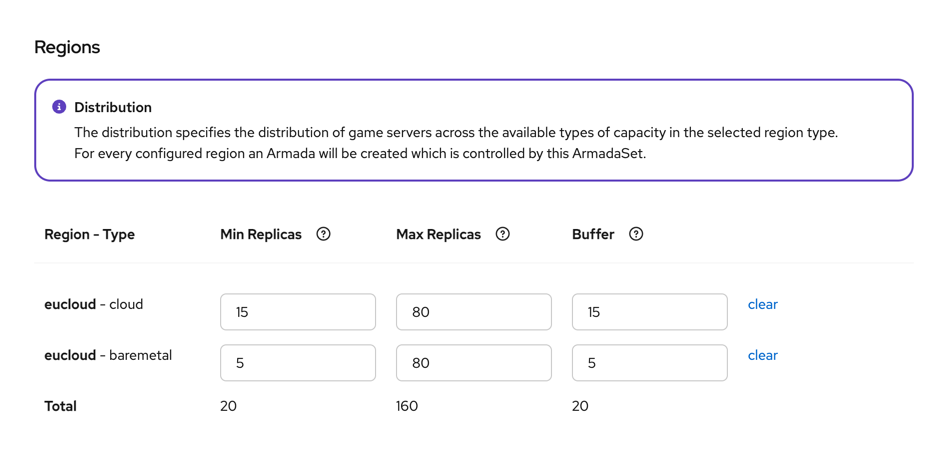
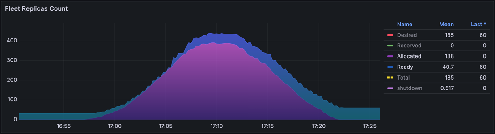

# Armada Replicas and Buffer

An Armada can spin up one game server, thousands of game servers, or anything in between, including no game servers as the special case of [Scaling Down](#scaling-down).
The number of game servers running in each Region Type is determined by the Replicas and Buffer settings:

- Minimum Replicas
- Maximum Replicas
- Buffer Size

When configured too high, it can lead to unnecessary costs, as game servers are running idle without players using them.
When configured too low, such as if not enough `Ready` game servers are available in time, it can lead to a poor matchmaking experience for players.

## Minimum/Maximum Replicas

Replicas are the number of game servers running in any given state, from `Starting` to `Ready`, from `Allocated` to `Unhealthy`, `Shutdown` or `Error`.

No matter the state of the game servers, the **Minimum Replicas** setting makes sure there are at least that many game servers running at any given time.
If that is not the case, GameFabric spins up new game servers.

The **Maximum Replicas** setting makes sure no more game servers are started when the total number of game servers reaches that number.

## Buffer Size

The Buffer Size is the [approximate](#buffer-size-1) number of game servers that are kept in the `Ready` state, waiting to get `Allocated`.
This is important so players can find a game server quickly, without having to wait for a new game server to start up.

## Input Validation

When configuring an Armada, the following validation rules apply:

- Minimum Replicas must be at least as big as the Buffer Size
- Minimum Replicas must be smaller or equal to Maximum Replicas

whereas `0, 0, 0` is considered [Scaling Down](#scaling-down).

## Finding the Right Values

Finding the right values for Minimum Replicas, Maximum Replicas, and Buffer Size is non-trivial and relies on historical data, prior experience, and expectations of future demand.

### Buffer Size

The Buffer Size is the number of `Ready` game servers. Even when no players are playing, these game servers are running and waiting for players to join.

The **recommended default** when there is no experience or history to look at is to set the Buffer Size to 10% of the Maximum Replicas.
Once there is some history to look at, the Buffer Size should be adjusted.

**Important factors to determine the Buffer Size:**

1. **Game server startup time:**
   
   Quicker startup times reduce the need for a large Buffer Size.

2. **Game session duration:**

   Shorter game sessions increase the churn of players leaving and joining new game sessions, increasing the need for a larger Buffer Size.

3. **Concurrent users (CCU):**

   More players increase the number of game servers that are `Allocated` at any given time, increasing the need for a larger Buffer Size.

Every game has different characteristics, so there is no one-size-fits-all recommendation.
Let's approach the problem to find the right value with an example.

Buffer Size Example

::: info Example
The following assumptions are made for a Region Type:

- Average game server startup time is `30s`,
- Average game session lasts `10m`,
- Average CCU is `1500` players,
- Game type in that Region is 3on3 (`6` players).

Intermediate conclusion:

- `250` game servers are `Allocated` (`1500/6`).
- Around 5% (`30s/10m`) or ~`12.5` game servers must be `Ready` at any given time just to accommodate the current player base.

It is safe to assume doubling the calculated Buffer Size to 25 game servers is a good starting point to accommodate decent spikes in player count.
If there is the expectation of steeper spikes, like in the evening or at the weekend, the Buffer Size can be increased further.

For this example, without further information, the recommended Buffer Size could be `25`.
:::

**What happens if the Buffer Size is set too low?**

Players have to wait for a game server to start up, leading to a poor player experience.

**What happens if the Buffer Size is set too high?**

Game servers are running idle, leading to unnecessary costs.

::: info Recommendation
Frequently revisit and adjust the Minimum Replicas, Maximum Replicas, and Buffer Size settings to avoid unnecessary costs or poor player experience.
:::

### Minimum Replicas

Choosing a value for the Minimum Replicas is mostly driven by the Buffer Size, as the Minimum Replicas must always be at least as high as the Buffer Size.

The **recommended default** is to set the Minimum Replicas to the value of the Buffer Size.

In case of an upcoming Release or Launch, with the expectation of an instant high player count, the Minimum Replicas can be set to a higher value to ensure enough game servers are running initially to accommodate the expected load.
It is vital to review and adjust the value after the initial peak has subsided, to avoid unnecessary costs.

### Maximum Replicas

When looking from a resource perspective, the Maximum Replicas can be estimated by the available resources on the Location associated to the Region Type, divided by the [Resource Requests](../multiplayer-services/resource-management#resource-requests) of the game server.
A location can hold multiple different Armadas, each with different Resource Request settings.

**Important factors to determine the Maximum Replicas:**

1. **Available resources:**
   
   The total CPU and Memory available on the Locations associated with the Region Type define the technical limit for the Maximum Replicas.

2. **Game server Resource Requests:**

   The requested CPU and Memory consumption of (eventually many different) game servers define how many game servers can be run on the available resources.

3. **Distribution of game server demand:**

   Different Armadas may have different demand patterns.
   An open world game mode requires more resources than a town server that only handles social interactions, but both may end up on the same Locations.

4. **Overcommitment strategy:**
   
   Not all game servers are `Allocated` at the same time, some stay `Ready` for a while.
   Intentional overcommitment is generally recommended to improve overall utilization.
   The challenge is managing allocations when multiple Armadas share the same underlying resources.

Let's approach the problem to find the right value with an example.

Maximum Replicas Example

::: info
The following assumptions are made:

- Two Locations (`2`) are associated to the Region Type
- Each Location has `64` CPU cores and `128Gi` of RAM available for game servers.
- Each game server `A` requests `4` CPU cores and `6Gi` of RAM.
- Each game server `B` requests `8` CPU cores and `8Gi` of RAM.

Intermediate conclusion:

- CPU-wise `32` game servers `A` (`2*64/4`) fit into these Locations,
- Memory-wise `42` game servers `A` (`2*128/6`),
- CPU-wise `16` game servers `B` (`2*64/8`),
- Memory-wise `32` game servers `B` (`2*128/8`).

If expected demand is `20%` for `A` and `80%` for `B`, overcommitment can be applied by allocating `25%` of the shared resources to `A` and `85%` to `B`.
While neither is expected to consistently reach its configured maximum, this approach provides enough flexibility for each Armada to take advantage of unused capacity and better match real, observed demand.
As we choose the lower number of game servers that fit for CPU or Memory, the math then is `32 * 0.25 = 8` for `A` and `16 * 0.85 = ~13.6` for `B`.

For this example, without further information, the recommended Maximum Replicas could be `22`.
:::

**What happens if the Maximum Replicas is set too low?**

Resources are wasted. Nodes in these Locations may have available resources, but no new game servers are started because the Maximum Replicas limit has been reached.

**What happens if the Maximum Replicas is set too high?**

The Compute Resource Request setting for the Armada always applies, so the game server has guaranteed resources, or is not scheduled to the Location at all.
To avoid degraded performance with reduced CPU availability, or OOMKills when memory is overcommitted, see [Resource Limits](../multiplayer-services/resource-management#resource-limits).

::: warning
The Maximum Replicas is not only a consideration of physical resources, but also financial protection.
Whether through player peaks, due to bugs or DDoS attacks, always choose a limit that is within your budget, especially on cloud.
:::

## Scaling Down

To gracefully scale down a Region Type, the Minimum Replicas, the Maximum Replicas, and the Buffer Size can be set to zero.
Game servers that are `Allocated` continue to run until they are `Shutdown`, but new game servers are no longer being scheduled.
