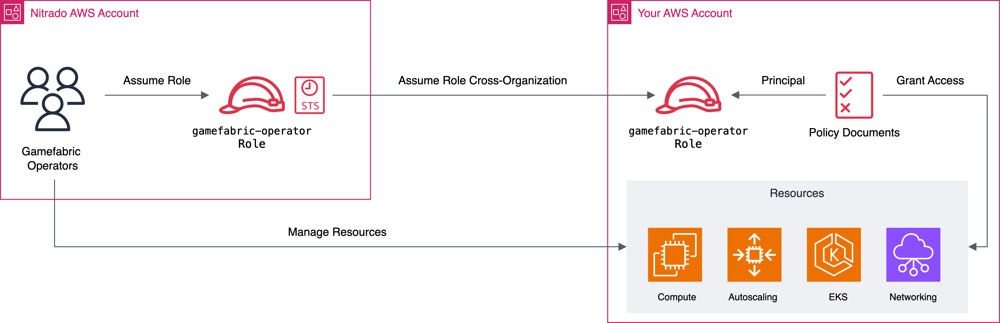

# Configuring your cloud provider

This document describes the steps required to set up your Cloud provider for use with GameFabric.
This setup is also known as <span class="nbsp">Bring Your Own Cloud</span> (BYOC), where GameFabric manages resources within your Cloud provider account.

Currently supported Cloud providers are Google Cloud (GCP), Azure, and Amazon Web Services (AWS).

Public documentation is currently limited to Google Cloud and AWS.
For setup instructions for other Cloud providers, please contact your Customer Success Manager at Nitrado.

::: tip Pre-requisites
Make sure you understand the [hosting models](/multiplayer-servers/architecture/identifying-your-hosting-model) and have your [environment set up](/multiplayer-servers/getting-started/setup-your-environment) before configuring cloud capacity.
:::

## Google Cloud

### GCP prerequisites

* You **must** already have an existing Google Cloud organization
* You **must** possess the necessary permissions to manage principals and billing accounts in your organization

If any of those pre-requisites are not met, like if you don't yet have an organization, you must contact Nitrado as the steps are different from what is described below.

### Creating a Principal

* Visit the [Cloud Resource Manager](https://console.cloud.google.com/cloud-resource-manager) page
  * Click the _Create Folder_ button and name it _Nitrado_
  * You might have to press **F5** for the folder to become visible
* Select the _Nitrado_ folder
* Click the _Add Principal_ button
* Input `operations@gamefabric.com` as the value for _New Principal_

### Allowing project management

The Nitrado principal requires the permissions to manage all resources within the Nitrado folder.
**Everything else within your organization is invisible and inaccessible to Nitrado.**

Assign the following roles to the `operations@gamefabric.com` principal:

* Folder Admin
* Owner
* Project Creator

Now follow the same steps in the Organization page, but instead, assign the following role to our Principal:

* Organization Viewer

### Allowing billing management

In order to link your billing account to the projects managed by Nitrado, and to create Billing Reports, the Nitrado principal requires following the steps below:

* Visit the [billing configuration page](https://console.cloud.google.com/billing)
  * Select your billing account
  * Click the _Add Principal_ button
  * Assign the following roles
    * `Billing Account User`
    * `Billing Account Viewer`

### Confirming the GCP setup

After you have completed the steps above, please contact Nitrado to confirm that the setup is complete.

## Amazon Web Services

### AWS prerequisites

* You **must** already have an existing AWS account
* You **must** possess the necessary permissions to create IAM resources in your account

### Background

For AWS, to access another organization, you have to setup a chain of _roles_. Roles are AWS objects that allow scoping permissions. Roles are assumable by _principals_. Principals are arbitrary entities operating AWS, and specifically, users or groups of users. This setup allows you to delegate game server cluster management to Gamefabric operators by creating a role that is fine-grained to provision resources _without having to grant broad access to their organization_.

By chaining those roles together (i.e., allowing a role to assume another role), Gamefabric operators can access your organization/account,
as long as the chain of _Trust Relationship_ is not broken.



For setting this up, we recommend using a tool like Terraform, as it allows you to simply declare the desired resources. Particularly for configuring various policy documents, this will be helpful. We'll use Terraform in the following. You can adapt this guide and do the following steps manually.

### Creating the role and assumption policy

Create an IAM Role and the appropriate role assumption policy using Terraform:

```terraform
variable "source_saml_principal_arn" {
  type        = string
  description = "ARN of the principal backing the SAML authentication for SSO users from the source account"
  default     = "arn:aws:iam::339712714940:saml-provider/AWSSSO_5495e4acbcad9a8a_DO_NOT_DELETE"
}

variable "source_role_arn" {
  type        = string
  description = "ARN of the role in the source account to trust"
  default     = "arn:aws:iam::339712714940:role/gamefabric-operators"
}

resource "aws_iam_role" "gamefabric_operators" {
  name               = "gamefabric-operators"
  assume_role_policy = data.aws_iam_role_policy.assume_role_policy.json

  tags = {
    role = "gamefabric-operators"
    provider = "gamefabric"
  }
}

# This document is what is required to grant Nitrado access to your org
data "aws_iam_policy_document" "assume_role_policy" {
  statement {
    effect = "Allow"
    actions = [
      "sts:AssumeRoleWithSAML",
      "sts:TagSession",
      "sts:AssumeRole"
    ]
    principals {
      type        = "Federated"
      identifiers = [var.source_saml_principal_arn]
    }
    condition {
      test     = "StringEquals"
      variable = "SAML:aud"
      values   = ["https://signin.aws.amazon.com/saml"]
    }
  }
  statement {
    effect = "Allow"
    actions = [
      "sts:TagSession",
      "sts:AssumeRole"
    ]
    principals {
      type = "AWS"
      identifiers = [ var.source_role_arn ]
    }
  }
}

output "role_arn" {
  value = aws_iam_role.gamefabric_operators.arn
}
```

The defaults for the variables are linking to the Gamefabric AWS account, specifically, the account ID `339712714940` belongs to the Gamefabric organization.
The two ARNs link to the role and the respective SAML provider on _our end_ (see the graphic above).

### Creating policies for resource management

Create several IAM policy documents that grant access:

```terraform
data "aws_iam_policy_document" "deployer_eks" {
  statement {
    effect = "Allow"
    actions = [
      "eks:AccessKubernetesApi",
      "eks:AssociateAccessPolicy",
      "eks:CreateAccessEntry",
      "eks:CreateAddon",
      "eks:CreateCluster",
      "eks:CreateNodegroup",
      "eks:DeleteAccessEntry",
      "eks:DeleteAddon",
      "eks:DeleteCluster",
      "eks:DeleteNodegroup",
      "eks:DescribeAccessEntry",
      "eks:DescribeAddon",
      "eks:DescribeAddonConfiguration",
      "eks:DescribeAddonVersions",
      "eks:DescribeCluster",
      "eks:DescribeClusterVersions",
      "eks:DescribeNodegroup",
      "eks:DescribePodIdentityAssociation",
      "eks:DescribeUpdate",
      "eks:DisassociateAccessPolicy",
      "eks:ListAccessEntries",
      "eks:ListAddons",
      "eks:ListAssociatedAccessPolicies",
      "eks:ListClusters",
      "eks:ListNodegroups",
      "eks:ListUpdates",
      "eks:TagResource",
      "eks:UntagResource",
      "eks:UpdateAccessEntry",
      "eks:UpdateAddon",
      "eks:UpdateClusterVersion",
      "eks:UpdateNodegroupConfig",
      "eks:UpdateNodegroupVersion",
    ]
    resources = ["*"]
  }
}

data "aws_iam_policy_document" "deployer_ec2" {
  statement {
    effect = "Allow"
    actions = [
      "ec2:AllocateAddress",
      "ec2:AssociateRouteTable",
      "ec2:AttachInternetGateway",
      "ec2:AuthorizeSecurityGroupEgress",
      "ec2:AuthorizeSecurityGroupIngress",
      "ec2:CreateInternetGateway",
      "ec2:CreateLaunchTemplate",
      "ec2:CreateLaunchTemplateVersion",
      "ec2:CreateNatGateway",
      "ec2:CreateNetworkAclEntry",
      "ec2:CreateRoute",
      "ec2:CreateRouteTable",
      "ec2:CreateSecurityGroup",
      "ec2:CreateSubnet",
      "ec2:CreateTags",
      "ec2:CreateVpc",
      "ec2:DeleteInternetGateway",
      "ec2:DeleteLaunchTemplate",
      "ec2:DeleteNatGateway",
      "ec2:DeleteNetworkAclEntry",
      "ec2:DeleteRoute",
      "ec2:DeleteRouteTable",
      "ec2:DeleteSecurityGroup",
      "ec2:DeleteSubnet",
      "ec2:DeleteTags",
      "ec2:DeleteVolume",
      "ec2:DeleteVpc",
      "ec2:DescribeAddresses",
      "ec2:DescribeAddressesAttribute",
      "ec2:DescribeAvailabilityZones",
      "ec2:DescribeImages",
      "ec2:DescribeInstances",
      "ec2:DescribeInstanceStatus",
      "ec2:DescribeInstanceTypes",
      "ec2:DescribeInternetGateways",
      "ec2:DescribeLaunchTemplates",
      "ec2:DescribeLaunchTemplateVersions",
      "ec2:DescribeNatGateways",
      "ec2:DescribeNetworkAcls",
      "ec2:DescribeNetworkInterfaces",
      "ec2:DescribePlacementGroups",
      "ec2:DescribeRouteTables",
      "ec2:DescribeSecurityGroupRules",
      "ec2:DescribeSecurityGroups",
      "ec2:DescribeSubnets",
      "ec2:DescribeTags",
      "ec2:DescribeVolumes",
      "ec2:DescribeVpcAttribute",
      "ec2:DescribeVpcs",
      "ec2:DetachInternetGateway",
      "ec2:DetachVolume",
      "ec2:DisassociateAddress",
      "ec2:DisassociateRouteTable",
      "ec2:GetEbsDefaultKmsKeyId",
      "ec2:GetEbsEncryptionByDefault",
      "ec2:GetInstanceMetadataDefaults",
      "ec2:GetInstanceTypesFromInstanceRequirements",
      "ec2:GetSecurityGroupsForVpc",
      "ec2:ModifyLaunchTemplate",
      "ec2:ModifySubnetAttribute",
      "ec2:ModifyVpcAttribute",
      "ec2:ReleaseAddress",
      "ec2:ReplaceRoute",
      "ec2:RevokeSecurityGroupEgress",
      "ec2:RevokeSecurityGroupIngress",
      "ec2:RunInstances",
      "ec2:StopInstances",
      "ec2:TerminateInstances",
    ]
    resources = ["*"]
  }
}

data "aws_iam_policy_document" "deployer_autoscaling" {
  statement {
    effect = "Allow"
    actions = [
      "autoscaling:AttachRolePolicy",
      "autoscaling:CreateOpenIDConnectProvider",
      "autoscaling:CreatePolicy",
      "autoscaling:CreateRole",
      "autoscaling:DeleteOpenIDConnectProvider",
      "autoscaling:DeletePolicy",
      "autoscaling:DeleteRole",
      "autoscaling:DeleteRolePolicy",
      "autoscaling:DetachRolePolicy",
      "autoscaling:GetOpenIDConnectProvider",
      "autoscaling:PutRolePolicy"
    ]
    resources = ["*"]
  }
}

data "aws_iam_policy_document" "deployer_aux" {
  statement {
    effect = "Allow"
    actions = [
      "kms:CreateAlias",
      "kms:CreateGrant",
      "kms:CreateKey",
      "kms:DeleteAlias",
      "kms:EnableKeyRotation",
      "kms:ListAliases",
      "kms:ScheduleKeyDeletion",
      "kms:TagResource",
    ]
    resources = ["*"]
  }
  statement {
    effect = "Allow"
    actions = [
      "iam:AttachRolePolicy",
      "iam:CreateOpenIDConnectProvider",
      "iam:CreatePolicy",
      "iam:CreateRole",
      "iam:CreateServiceLinkedRole",
      "iam:DeleteOpenIDConnectProvider",
      "iam:DeletePolicy",
      "iam:DeleteRole",
      "iam:DeleteRolePolicy",
      "iam:DetachRolePolicy",
      "iam:GetOpenIDConnectProvider",
      "iam:GetPolicy",
      "iam:GetPolicyVersion",
      "iam:GetRole",
      "iam:GetRolePolicy",
      "iam:ListAttachedRolePolicies",
      "iam:ListInstanceProfiles",
      "iam:ListInstanceProfilesForRole",
      "iam:ListOpenIDConnectProviders",
      "iam:ListPolicies",
      "iam:ListPolicyVersions",
      "iam:ListRolePolicies",
      "iam:ListRoles",
      "iam:PassRole",
      "iam:PutRolePolicy",
      "iam:TagOpenIDConnectProvider",
      "iam:TagPolicy",
      "iam:TagRole",
    ]
    resources = ["*"]
  }
  statement {
    effect = "Allow"
    actions = [
      "logs:CreateLogGroup",
      "logs:DeleteLogGroup",
      "logs:DescribeLogGroups",
      "logs:ListTagsForResource",
      "logs:PutRetentionPolicy",
      "logs:TagResource",
    ]
    resources = ["*"]
  }
  statement {
    effect = "Allow"
    actions = [
      "ssm:GetParameter",
    ]
    resources = ["arn:aws:ssm:*:*:parameter/aws/service/eks/optimized-ami/*"]
  }
}

# Merge all policy docs together
data "aws_iam_policy_document" "combined_policy_documents" {
  source_policy_documents = [
    data.aws_iam_policy_document.deployer_eks.json,
    data.aws_iam_policy_document.deployer_ec2.json,
    data.aws_iam_policy_document.deployer_autoscaling.json,
    data.aws_iam_policy_document.deployer_aux.json
  ]
}

resource "aws_iam_role_policy" "gamefabric_operators" {
  name   = "gamefabric-operators"
  role   = aws_iam_role.gamefabric_operators.id
  policy = data.aws_iam_policy_document.combined_policy_documents.json
}
```

::: info Policy Document Size Restrictions
AWS encodes their policy documents in JSON, and restricts the size of these documents rather strictly to 4KB per document.
Adding all the permissions into one policy exceeds the limit for a single policy. We split them up logically such that
they are grouped broadly by the resource types they grant access to.
:::

### Confirming the AWS setup

After you have completed the steps above, please contact Nitrado to confirm that the setup is complete, and provide us with the ARN of the role you created previously, as we need it on our end to access your account.
