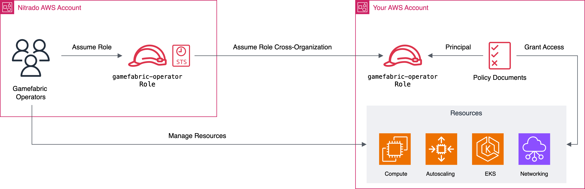

# Configuring your cloud provider

This document describes the steps required to set up your Cloud provider for use with GameFabric.
This setup is also known as <span class="nbsp">Bring Your Own Cloud</span> (BYOC), where GameFabric manages resources within your Cloud provider account.

Currently supported Cloud providers are Google Cloud (GCP), Azure, and Amazon Web Services (AWS).

::: tip Pre-requisites
Make sure you understand the [hosting models](/multiplayer-servers/architecture/identifying-your-hosting-model) and have your [environment set up](/multiplayer-servers/getting-started/setup-your-environment) before configuring cloud capacity.
:::

## Google Cloud

### GCP prerequisites

* You **must** already have an existing Google Cloud organization
* You **must** possess the necessary permissions to manage principals and billing accounts in your organization

If any of those pre-requisites are not met, like if you don't yet have an organization, you must contact Nitrado as the steps are different from what is described below.

### Creating a Principal

* Visit the [Cloud Resource Manager](https://console.cloud.google.com/cloud-resource-manager) page
  * Click the _Create Folder_ button and name it _Nitrado_
  * You might have to press **F5** for the folder to become visible
* Select the _Nitrado_ folder
* Click the _Add Principal_ button
* Input `operations@gamefabric.com` as the value for _New Principal_

### Allowing project management

The Nitrado principal requires the permissions to manage all resources within the Nitrado folder.
**Everything else within your organization is invisible and inaccessible to Nitrado.**

Assign the following roles to the `operations@gamefabric.com` principal:

* Folder Admin
* Owner
* Project Creator

Now follow the same steps in the Organization page, but instead, assign the following role to our Principal:

* Organization Viewer

### Allowing billing management

In order to link your billing account to the projects managed by Nitrado, and to create Billing Reports, the Nitrado principal requires following the steps below:

* Visit the [billing configuration page](https://console.cloud.google.com/billing)
  * Select your billing account
  * Click the _Add Principal_ button
  * Assign the following roles
    * `Billing Account User`
    * `Billing Account Viewer`

### Confirming the GCP setup

After you have completed the steps above, please contact Nitrado to confirm that the setup is complete.

## Amazon Web Services

### AWS prerequisites

* You **must** already have an existing AWS account
* You **must** possess the necessary permissions to create IAM resources in your account

### Background

To access another organization or account, set up a chain of _roles_. [Roles](https://docs.aws.amazon.com/IAM/latest/UserGuide/id_roles.html) are AWS IAM identities that have specific permissions, defined by [Policies](https://docs.aws.amazon.com/IAM/latest/UserGuide/access_policies.html). Roles are intended to be *assumed* by other IAM entities like users, groups, or even other roles. By chaining those roles together (i.e., allowing a role to assume another role), GameFabric operators can access your organization/account. This setup allows delegating game server cluster management to GameFabric operators to provision and manage AWS resources _without having to grant broad access to their organization_.



In order to set this up, we recommend using a tool like [Terraform](https://developer.hashicorp.com/terraform) or [OpenTofu](https://opentofu.org/), as they allow to simply declare the desired resources. Particularly for configuring various policy documents, this is helpful.

### Set up account federation

In the AWS management console, navigate to `IAM > Roles`, and create a new IAM Role with a custom trust policy.

::: code-group

```json [Trust policy]
{
  "Version": "2012-10-17",
  "Statement": [
    {
      "Sid": "AllowGamefabricSAML",
      "Effect": "Allow",
      "Principal": {
        "Federated": "arn:aws:iam::339712714940:saml-provider/AWSSSO_5495e4acbcad9a8a_DO_NOT_DELETE"
      },
      "Action": [
        "sts:AssumeRoleWithSAML",
        "sts:TagSession"
      ],
      "Condition": {
        "StringEquals": {
          "SAML:aud": "https://signin.aws.amazon.com/saml"
        }
      }
    },
    {
      "Sid": "AllowGamefabricOperatorsRole",
      "Effect": "Allow",
      "Principal": {
        "AWS": "arn:aws:iam::339712714940:role/gamefabric-operators"
      },
      "Action": [
        "sts:AssumeRole",
        "sts:TagSession"
      ]
    }
  ]
}
```

```terraform
resource "aws_iam_role" "gamefabric_operators" {
  name               = "gamefabric-operators"
  assume_role_policy = data.aws_iam_policy_document.assume_role_policy.json

  tags = {
    role = "gamefabric-operators"
    provider = "gamefabric"
  }
}

# This document is what is required to grant Nitrado access to your org
data "aws_iam_policy_document" "assume_role_policy" {
  statement {
    effect = "Allow"
    actions = [
      "sts:AssumeRoleWithSAML",
      "sts:TagSession",
      "sts:AssumeRole"
    ]
    principals {
      type        = "Federated"
      identifiers = ["arn:aws:iam::339712714940:saml-provider/AWSSSO_5495e4acbcad9a8a_DO_NOT_DELETE"]
    }
    condition {
      test     = "StringEquals"
      variable = "SAML:aud"
      values   = ["https://signin.aws.amazon.com/saml"]
    }
  }
  statement {
    effect = "Allow"
    actions = [
      "sts:TagSession",
      "sts:AssumeRole"
    ]
    principals {
      type = "AWS"
      identifiers = ["arn:aws:iam::339712714940:role/gamefabric-operators"]
    }
  }
}
```

:::

The account ID `339712714940` belongs to the GameFabric organization.

In the role creation wizard, skip the permissions step. Name the role `gamefabric-operators`, and optionally add a description and tags for adding metadata, for example noting the purpose of the role and being linked to GameFabric.

Next, create one or more policies for the required permissions. The following policies explicitly list all permissions for the required AWS services. AWS restricts the size of these documents to 4KB per document. Adding all the permissions into one policy exceeds the limit for a single policy. We split them up logically such that they are grouped broadly by the resource types they grant access to.

::: code-group

```json [EKS]
{
  "Version": "2012-10-17",
  "Statement": [
    {
      "Sid": "EKS",
      "Effect": "Allow",
      "Resource": "*",
      "Action": [
        "eks:AccessKubernetesApi",
        "eks:AssociateAccessPolicy",
        "eks:CreateAccessEntry",
        "eks:CreateAddon",
        "eks:CreateCluster",
        "eks:CreateNodegroup",
        "eks:DeleteAccessEntry",
        "eks:DeleteAddon",
        "eks:DeleteCluster",
        "eks:DeleteNodegroup",
        "eks:DescribeAccessEntry",
        "eks:DescribeAddon",
        "eks:DescribeAddonConfiguration",
        "eks:DescribeAddonVersions",
        "eks:DescribeCluster",
        "eks:DescribeClusterVersions",
        "eks:DescribeNodegroup",
        "eks:DescribePodIdentityAssociation",
        "eks:DescribeUpdate",
        "eks:DisassociateAccessPolicy",
        "eks:ListAccessEntries",
        "eks:ListAddons",
        "eks:ListAssociatedAccessPolicies",
        "eks:ListClusters",
        "eks:ListNodegroups",
        "eks:ListUpdates",
        "eks:TagResource",
        "eks:UntagResource",
        "eks:UpdateAccessEntry",
        "eks:UpdateAddon",
        "eks:UpdateClusterVersion",
        "eks:UpdateNodegroupConfig",
        "eks:UpdateNodegroupVersion"
      ]
    }
  ]
}
```

```json [EC2]
{
  "Version": "2012-10-17",
  "Statement": [
    {
      "Sid": "EC2",
      "Effect": "Allow",
      "Resource": "*",
      "Action": [
        "ec2:AllocateAddress",
        "ec2:AssociateRouteTable",
        "ec2:AttachInternetGateway",
        "ec2:AuthorizeSecurityGroupEgress",
        "ec2:AuthorizeSecurityGroupIngress",
        "ec2:CreateInternetGateway",
        "ec2:CreateLaunchTemplate",
        "ec2:CreateLaunchTemplateVersion",
        "ec2:CreateNatGateway",
        "ec2:CreateNetworkAclEntry",
        "ec2:CreateRoute",
        "ec2:CreateRouteTable",
        "ec2:CreateSecurityGroup",
        "ec2:CreateSubnet",
        "ec2:CreateTags",
        "ec2:CreateVpc",
        "ec2:DeleteInternetGateway",
        "ec2:DeleteLaunchTemplate",
        "ec2:DeleteNatGateway",
        "ec2:DeleteNetworkAclEntry",
        "ec2:DeleteRoute",
        "ec2:DeleteRouteTable",
        "ec2:DeleteSecurityGroup",
        "ec2:DeleteSubnet",
        "ec2:DeleteTags",
        "ec2:DeleteVolume",
        "ec2:DeleteVpc",
        "ec2:DescribeAddresses",
        "ec2:DescribeAddressesAttribute",
        "ec2:DescribeAvailabilityZones",
        "ec2:DescribeImages",
        "ec2:DescribeInstances",
        "ec2:DescribeInstanceStatus",
        "ec2:DescribeInstanceTypes",
        "ec2:DescribeInternetGateways",
        "ec2:DescribeLaunchTemplates",
        "ec2:DescribeLaunchTemplateVersions",
        "ec2:DescribeNatGateways",
        "ec2:DescribeNetworkAcls",
        "ec2:DescribeNetworkInterfaces",
        "ec2:DescribePlacementGroups",
        "ec2:DescribeRouteTables",
        "ec2:DescribeSecurityGroupRules",
        "ec2:DescribeSecurityGroups",
        "ec2:DescribeSubnets",
        "ec2:DescribeTags",
        "ec2:DescribeVolumes",
        "ec2:DescribeVpcAttribute",
        "ec2:DescribeVpcs",
        "ec2:DetachInternetGateway",
        "ec2:DetachVolume",
        "ec2:DisassociateAddress",
        "ec2:DisassociateRouteTable",
        "ec2:GetEbsDefaultKmsKeyId",
        "ec2:GetEbsEncryptionByDefault",
        "ec2:GetInstanceMetadataDefaults",
        "ec2:GetInstanceTypesFromInstanceRequirements",
        "ec2:GetSecurityGroupsForVpc",
        "ec2:ModifyLaunchTemplate",
        "ec2:ModifySubnetAttribute",
        "ec2:ModifyVpcAttribute",
        "ec2:ReleaseAddress",
        "ec2:ReplaceRoute",
        "ec2:RevokeSecurityGroupEgress",
        "ec2:RevokeSecurityGroupIngress",
        "ec2:RunInstances",
        "ec2:StopInstances",
        "ec2:TerminateInstances"
      ]
    }
  ]
}
```

```json [Autoscaling]
{
  "Version": "2012-10-17",
  "Statement": [
    {
      "Sid": "Autoscaling",
      "Effect": "Allow",
      "Resource": "*",
      "Action": [
        "autoscaling:UpdateAutoScalingGroup",
        "autoscaling:DetachInstances",
        "autoscaling:DescribeTags",
        "autoscaling:DescribeScalingActivities",
        "autoscaling:DescribePolicies",
        "autoscaling:DescribeLaunchConfigurations",
        "autoscaling:DescribeAutoScalingInstances",
        "autoscaling:DescribeAutoScalingGroups",
        "autoscaling:DeletePolicy",
        "autoscaling:DeleteLaunchConfiguration",
        "autoscaling:DeleteAutoScalingGroup",
        "autoscaling:CreateLaunchConfiguration",
        "autoscaling:CreateAutoScalingGroup",
        "autoscaling:AttachInstances"
      ]
    }
  ]
}
```

```json [Auxiliary Permissions]
{
  "Version": "2012-10-17",
  "Statement": [
    {
      "Sid": "KeyManagementService",
      "Effect": "Allow",
      "Resource": "*",
      "Action": [
        "kms:CreateAlias",
        "kms:CreateGrant",
        "kms:CreateKey",
        "kms:DeleteAlias",
        "kms:EnableKeyRotation",
        "kms:ListAliases",
        "kms:ScheduleKeyDeletion",
        "kms:TagResource"
      ]
    },
    {
      "Sid": "IAM",
      "Effect": "Allow",
      "Resource": "*",
      "Action": [
        "iam:AttachRolePolicy",
        "iam:CreateOpenIDConnectProvider",
        "iam:CreatePolicy",
        "iam:CreateRole",
        "iam:CreateServiceLinkedRole",
        "iam:DeleteOpenIDConnectProvider",
        "iam:DeletePolicy",
        "iam:DeleteRole",
        "iam:DeleteRolePolicy",
        "iam:DetachRolePolicy",
        "iam:GetOpenIDConnectProvider",
        "iam:GetPolicy",
        "iam:GetPolicyVersion",
        "iam:GetRole",
        "iam:GetRolePolicy",
        "iam:ListAttachedRolePolicies",
        "iam:ListInstanceProfiles",
        "iam:ListInstanceProfilesForRole",
        "iam:ListOpenIDConnectProviders",
        "iam:ListPolicies",
        "iam:ListPolicyVersions",
        "iam:ListRolePolicies",
        "iam:ListRoles",
        "iam:PassRole",
        "iam:PutRolePolicy",
        "iam:TagOpenIDConnectProvider",
        "iam:TagPolicy",
        "iam:TagRole"
      ]
    },
    {
      "Sid": "CloudWatchLogs",
      "Effect": "Allow",
      "Resource": "*",
      "Action": [
        "logs:CreateLogGroup",
        "logs:DeleteLogGroup",
        "logs:DescribeLogGroups",
        "logs:ListTagsForResource",
        "logs:PutRetentionPolicy",
        "logs:TagResource"
      ]
    },
    {
      "Sid": "SSM",
      "Effect": "Allow",
      "Resource": ["arn:aws:ssm:*:*:parameter/aws/service/eks/optimized-ami/*"],
      "Action": [
        "ssm:GetParameter"
      ]
    }
  ]
}
```

```terraform
data "aws_iam_policy_document" "deployer_eks" {
  statement {
    effect = "Allow"
    actions = [
      "eks:AccessKubernetesApi",
      "eks:AssociateAccessPolicy",
      "eks:CreateAccessEntry",
      "eks:CreateAddon",
      "eks:CreateCluster",
      "eks:CreateNodegroup",
      "eks:DeleteAccessEntry",
      "eks:DeleteAddon",
      "eks:DeleteCluster",
      "eks:DeleteNodegroup",
      "eks:DescribeAccessEntry",
      "eks:DescribeAddon",
      "eks:DescribeAddonConfiguration",
      "eks:DescribeAddonVersions",
      "eks:DescribeCluster",
      "eks:DescribeClusterVersions",
      "eks:DescribeNodegroup",
      "eks:DescribePodIdentityAssociation",
      "eks:DescribeUpdate",
      "eks:DisassociateAccessPolicy",
      "eks:ListAccessEntries",
      "eks:ListAddons",
      "eks:ListAssociatedAccessPolicies",
      "eks:ListClusters",
      "eks:ListNodegroups",
      "eks:ListUpdates",
      "eks:TagResource",
      "eks:UntagResource",
      "eks:UpdateAccessEntry",
      "eks:UpdateAddon",
      "eks:UpdateClusterVersion",
      "eks:UpdateNodegroupConfig",
      "eks:UpdateNodegroupVersion",
    ]
    resources = ["*"]
  }
}

data "aws_iam_policy_document" "deployer_ec2" {
  statement {
    effect = "Allow"
    actions = [
      "ec2:AllocateAddress",
      "ec2:AssociateRouteTable",
      "ec2:AttachInternetGateway",
      "ec2:AuthorizeSecurityGroupEgress",
      "ec2:AuthorizeSecurityGroupIngress",
      "ec2:CreateInternetGateway",
      "ec2:CreateLaunchTemplate",
      "ec2:CreateLaunchTemplateVersion",
      "ec2:CreateNatGateway",
      "ec2:CreateNetworkAclEntry",
      "ec2:CreateRoute",
      "ec2:CreateRouteTable",
      "ec2:CreateSecurityGroup",
      "ec2:CreateSubnet",
      "ec2:CreateTags",
      "ec2:CreateVpc",
      "ec2:DeleteInternetGateway",
      "ec2:DeleteLaunchTemplate",
      "ec2:DeleteNatGateway",
      "ec2:DeleteNetworkAclEntry",
      "ec2:DeleteRoute",
      "ec2:DeleteRouteTable",
      "ec2:DeleteSecurityGroup",
      "ec2:DeleteSubnet",
      "ec2:DeleteTags",
      "ec2:DeleteVolume",
      "ec2:DeleteVpc",
      "ec2:DescribeAddresses",
      "ec2:DescribeAddressesAttribute",
      "ec2:DescribeAvailabilityZones",
      "ec2:DescribeImages",
      "ec2:DescribeInstances",
      "ec2:DescribeInstanceStatus",
      "ec2:DescribeInstanceTypes",
      "ec2:DescribeInternetGateways",
      "ec2:DescribeLaunchTemplates",
      "ec2:DescribeLaunchTemplateVersions",
      "ec2:DescribeNatGateways",
      "ec2:DescribeNetworkAcls",
      "ec2:DescribeNetworkInterfaces",
      "ec2:DescribePlacementGroups",
      "ec2:DescribeRouteTables",
      "ec2:DescribeSecurityGroupRules",
      "ec2:DescribeSecurityGroups",
      "ec2:DescribeSubnets",
      "ec2:DescribeTags",
      "ec2:DescribeVolumes",
      "ec2:DescribeVpcAttribute",
      "ec2:DescribeVpcs",
      "ec2:DetachInternetGateway",
      "ec2:DetachVolume",
      "ec2:DisassociateAddress",
      "ec2:DisassociateRouteTable",
      "ec2:GetEbsDefaultKmsKeyId",
      "ec2:GetEbsEncryptionByDefault",
      "ec2:GetInstanceMetadataDefaults",
      "ec2:GetInstanceTypesFromInstanceRequirements",
      "ec2:GetSecurityGroupsForVpc",
      "ec2:ModifyLaunchTemplate",
      "ec2:ModifySubnetAttribute",
      "ec2:ModifyVpcAttribute",
      "ec2:ReleaseAddress",
      "ec2:ReplaceRoute",
      "ec2:RevokeSecurityGroupEgress",
      "ec2:RevokeSecurityGroupIngress",
      "ec2:RunInstances",
      "ec2:StopInstances",
      "ec2:TerminateInstances",
    ]
    resources = ["*"]
  }
}

data "aws_iam_policy_document" "deployer_autoscaling" {
  statement {
    effect = "Allow"
    actions = [
      "autoscaling:UpdateAutoScalingGroup",
      "autoscaling:DetachInstances",
      "autoscaling:DescribeTags",
      "autoscaling:DescribeScalingActivities",
      "autoscaling:DescribePolicies",
      "autoscaling:DescribeLaunchConfigurations",
      "autoscaling:DescribeAutoScalingInstances",
      "autoscaling:DescribeAutoScalingGroups",
      "autoscaling:DeletePolicy",
      "autoscaling:DeleteLaunchConfiguration",
      "autoscaling:DeleteAutoScalingGroup",
      "autoscaling:CreateLaunchConfiguration",
      "autoscaling:CreateAutoScalingGroup",
      "autoscaling:AttachInstances"
    ]
    resources = ["*"]
  }
}

data "aws_iam_policy_document" "deployer_aux" {
  statement {
    effect = "Allow"
    actions = [
      "kms:CreateAlias",
      "kms:CreateGrant",
      "kms:CreateKey",
      "kms:DeleteAlias",
      "kms:EnableKeyRotation",
      "kms:ListAliases",
      "kms:ScheduleKeyDeletion",
      "kms:TagResource",
    ]
    resources = ["*"]
  }
  statement {
    effect = "Allow"
    actions = [
      "iam:AttachRolePolicy",
      "iam:CreateOpenIDConnectProvider",
      "iam:CreatePolicy",
      "iam:CreateRole",
      "iam:CreateServiceLinkedRole",
      "iam:DeleteOpenIDConnectProvider",
      "iam:DeletePolicy",
      "iam:DeleteRole",
      "iam:DeleteRolePolicy",
      "iam:DetachRolePolicy",
      "iam:GetOpenIDConnectProvider",
      "iam:GetPolicy",
      "iam:GetPolicyVersion",
      "iam:GetRole",
      "iam:GetRolePolicy",
      "iam:ListAttachedRolePolicies",
      "iam:ListInstanceProfiles",
      "iam:ListInstanceProfilesForRole",
      "iam:ListOpenIDConnectProviders",
      "iam:ListPolicies",
      "iam:ListPolicyVersions",
      "iam:ListRolePolicies",
      "iam:ListRoles",
      "iam:PassRole",
      "iam:PutRolePolicy",
      "iam:TagOpenIDConnectProvider",
      "iam:TagPolicy",
      "iam:TagRole",
    ]
    resources = ["*"]
  }
  statement {
    effect = "Allow"
    actions = [
      "logs:CreateLogGroup",
      "logs:DeleteLogGroup",
      "logs:DescribeLogGroups",
      "logs:ListTagsForResource",
      "logs:PutRetentionPolicy",
      "logs:TagResource",
    ]
    resources = ["*"]
  }
  statement {
    effect = "Allow"
    actions = [
      "ssm:GetParameter",
    ]
    resources = ["arn:aws:ssm:*:*:parameter/aws/service/eks/optimized-ami/*"]
  }
}

# Merge all policy docs together
data "aws_iam_policy_document" "combined_policy_documents" {
  source_policy_documents = [
    data.aws_iam_policy_document.deployer_eks.json,
    data.aws_iam_policy_document.deployer_ec2.json,
    data.aws_iam_policy_document.deployer_autoscaling.json,
    data.aws_iam_policy_document.deployer_aux.json
  ]
}

resource "aws_iam_role_policy" "gamefabric_operators" {
  name   = "gamefabric-operators"
  role   = aws_iam_role.gamefabric_operators.id
  policy = data.aws_iam_policy_document.combined_policy_documents.json
}
```

:::

::: info Using wildcard permissions in policies
It is possible to use wildcards in the statements instead of lists of explicit permissions, e.g. `eks:*` or `ec2:*`. Using a wildcard may grant additional permissions to the role that are not needed but can create highly-privileged principals. From a security perspective, we recommend granting the explicit permissions.

You may take steps to add constraints and permission boundaries, but note that this can impact our ability to provision, maintain, or deprovision your cloud clusters.
:::

After creating the policies, attach them to the created role. Navigate to the Role, select the `Permissions` tab, and click `Add permissions > Attach policies`. Select the newly created policies, and confirm with `Add permissions`.

### Confirming the delegation setup

After completing the steps above, contact Nitrado and provide us with the ARN of the role you created. We need it to validate the setup and access your account.

## Microsoft Azure

### Azure prerequisites

You must have:

* An existing Azure subscription to delegate to GameFabric.
* Access to the Microsoft Entra tenant that owns the subscription.
* The Owner role, or equivalent permissions to read, create, and delete Azure
  role assignments, on the subscription.
* Azure CLI and either [OpenTofu](https://opentofu.org/) or
  [Terraform](https://developer.hashicorp.com/terraform) installed.

### Background

Azure Lighthouse lets GameFabric manage Azure resources in your subscription
without requiring an account in your tenant or long-lived customer
credentials. You retain ownership of the subscription and can inspect
management operations in the Azure Activity Log.

The Terraform configuration below creates an Azure Lighthouse registration
definition and registration assignment at the subscription scope. It does not
create an Azure Kubernetes Service (AKS) cluster or any other workload
resources.

### Configure Azure Lighthouse

Create a `main.tf` file with the following configuration. Replace the
subscription ID in the `terraform plan` and `terraform apply` commands with
the ID of the Azure subscription that you want to delegate:

```terraform
terraform {
  required_version = "< 2.0.0"

  required_providers {
    azurerm = {
      source  = "hashicorp/azurerm"
      version = ">= 4.81.0, < 6.0.0"
    }
  }
}

provider "azurerm" {
  subscription_id = var.customer_subscription_id

  features {}
}

variable "customer_subscription_id" {
  type        = string
  description = "Azure subscription delegated to GameFabric"
}

locals {
  managing_tenant_id     = "c7ff4d31-7936-4020-b12a-2fb109b9a648"
  automation_principal_id = "586320e9-01cb-4abd-bf24-1cd257afb600"

  offer_name        = "GameFabric BYOC AKS"
  offer_description = "Provisioning and lifecycle management of GameFabric BYOC AKS clusters"

  managed_identity_role_names = toset([
    "Network Contributor",
  ])

  reader_principals = {}

  operator_principals = {
    "5cb21f2d-1d6d-44fc-afa8-1f4465629825" = "GameFabric AKS operators"
  }
}

data "azurerm_subscription" "customer" {
  subscription_id = var.customer_subscription_id
}

data "azurerm_role_definition" "contributor" {
  name  = "Contributor"
  scope = data.azurerm_subscription.customer.id
}

data "azurerm_role_definition" "reader" {
  name  = "Reader"
  scope = data.azurerm_subscription.customer.id
}

data "azurerm_role_definition" "user_access_administrator" {
  name  = "User Access Administrator"
  scope = data.azurerm_subscription.customer.id
}

data "azurerm_role_definition" "managed_identity" {
  for_each = local.managed_identity_role_names

  name  = each.value
  scope = data.azurerm_subscription.customer.id
}

resource "azurerm_lighthouse_definition" "gamefabric" {
  name               = local.offer_name
  description        = local.offer_description
  managing_tenant_id = local.managing_tenant_id
  scope              = data.azurerm_subscription.customer.id

  authorization {
    principal_id           = local.automation_principal_id
    principal_display_name = "GameFabric AKS automation"
    role_definition_id     = data.azurerm_role_definition.contributor.role_definition_id
  }

  authorization {
    principal_id                  = local.automation_principal_id
    principal_display_name        = "GameFabric AKS managed identity authorization"
    role_definition_id            = data.azurerm_role_definition.user_access_administrator.role_definition_id
    delegated_role_definition_ids = [for role_definition in data.azurerm_role_definition.managed_identity : role_definition.role_definition_id]
  }

  dynamic "authorization" {
    for_each = local.reader_principals

    content {
      principal_id           = authorization.key
      principal_display_name = authorization.value
      role_definition_id     = data.azurerm_role_definition.reader.role_definition_id
    }
  }

  dynamic "authorization" {
    for_each = local.operator_principals

    content {
      principal_id           = authorization.key
      principal_display_name = authorization.value
      role_definition_id     = data.azurerm_role_definition.contributor.role_definition_id
    }
  }
}

resource "azurerm_lighthouse_assignment" "gamefabric" {
  scope                    = data.azurerm_subscription.customer.id
  lighthouse_definition_id = azurerm_lighthouse_definition.gamefabric.id
}

output "lighthouse_definition_id" {
  description = "Resource ID of the Azure Lighthouse registration definition"
  value       = azurerm_lighthouse_definition.gamefabric.id
}

output "lighthouse_assignment_id" {
  description = "Resource ID of the Azure Lighthouse registration assignment"
  value       = azurerm_lighthouse_assignment.gamefabric.id
}
```

The `locals` block contains the GameFabric IDs and the default offer settings.
To use different operator or reader principals, edit
`operator_principals` or `reader_principals` there. You can also change the
offer description and the roles that the automation principal may assign to
managed identities. Use only built-in roles supported by Azure Lighthouse.

Authenticate with Azure CLI, then initialize and review the deployment:

```shell
az login
```

Choose either OpenTofu or Terraform and use the same tool for both deployment
and removal.

With OpenTofu:

```shell
tofu init
tofu plan -var="customer_subscription_id=00000000-0000-0000-0000-000000000000"
tofu apply -var="customer_subscription_id=00000000-0000-0000-0000-000000000000"
```

With Terraform:

```shell
terraform init
terraform plan -var="customer_subscription_id=00000000-0000-0000-0000-000000000000"
terraform apply -var="customer_subscription_id=00000000-0000-0000-0000-000000000000"
```

### Delegated roles

The registration includes these authorizations:

| Principal | Role | Purpose |
| --- | --- | --- |
| GameFabric automation principal | Contributor | Creates and manages AKS clusters, resource groups, managed identities, virtual networks, subnets, network security rules, and related Azure resources. Contributor cannot grant Azure role-based access control (RBAC) access. |
| GameFabric automation principal | User Access Administrator | Assigns only the roles listed in `managed_identity_role_names`, and only to managed identities in your tenant. This is the restricted Azure Lighthouse form of the role. |
| Principals in `operator_principals`, when supplied | Contributor | Lets named GameFabric operator groups manage cluster resources. |
| Principals in `reader_principals`, when supplied | Reader | Lets named GameFabric groups or principals inspect Azure resources without modifying them. |

By default, `managed_identity_role_names` contains `Network Contributor`.
Because the deployment supplies its own virtual network and subnets, the AKS
control-plane managed identity needs this role on the relevant network scope.
Network Contributor is not granted directly to the GameFabric automation
principal.

Azure Lighthouse delegates Azure Resource Manager management-plane access. It
does not automatically grant access to the Kubernetes API, Key Vault secret
values, storage data, or other service data planes. Azure Lighthouse also does
not support Owner, custom roles, or most roles containing `DataActions`.

### Verify the delegation

After applying the configuration, verify the registration resources:

```shell
az managedservices definition list --output table
az managedservices assignment list --output table
```

You can also open **Service providers** in the Azure portal and review
**Service provider offers**. Portal visibility can take several minutes to
update.