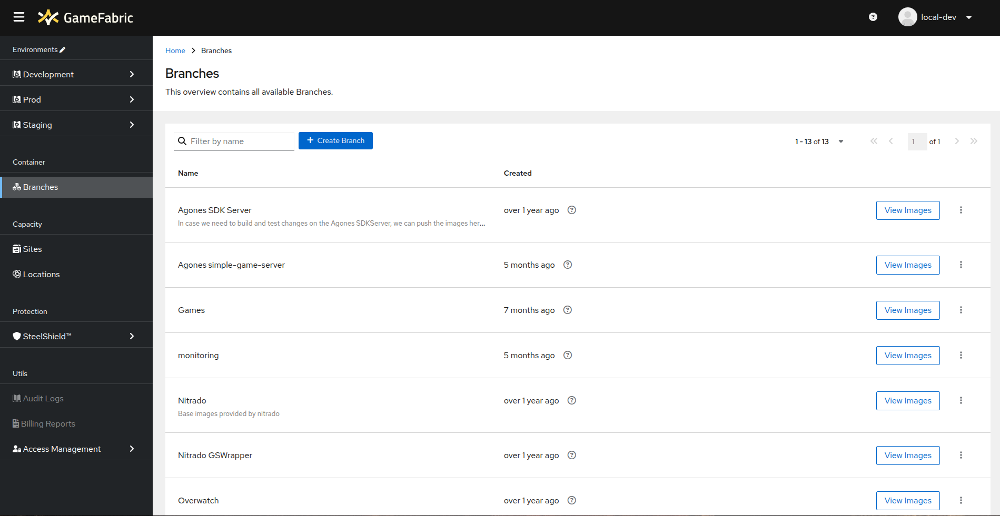

# Deleting Container Images

In this section, you will learn different methods for deleting container images.

## Prerequisites

Before following this guide, ensure that you have already [pushed container images](pushing-container-images.md).

1. Navigate to the **Branches** section in the GameFabric UI. 

2. Click **View Images** to open the branch detail view, which displays all images associated with that branch.

::: warning
Images that are actively in use cannot be deleted!
:::

## Delete a Single Tag

To delete a single tag:

1. Click the dropdown for the desired image.
2. Select **Delete Tag**.

3. A confirmation pop-up will appear. Verify that you have selected the correct image.
4. Click **Delete** to confirm or **Cancel** to abort.

## Delete Multiple Images

You can also delete multiple images or tags simultaneously:

1. Select the images by checking the boxes for each desired row **OR** Use the dropdown above the table to select the entire page or all items at once.

2. Click **Delete Images** at the bottom of the screen. A confirmation pop-up will appear.
3. Click **Delete** to confirm or **Cancel** to abort.

## Delete All Tags of an Image

If you want to delete all tags of an image at once:

1. Select the **Delete Image (all Tags)** option in the dropdown on the right side of the image row.

2. A confirmation pop-up will appear. Click **Delete** to confirm or **Cancel** to abort.
