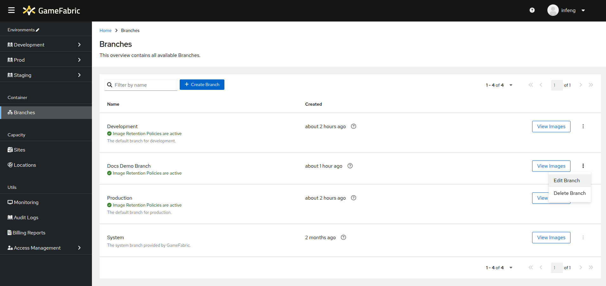
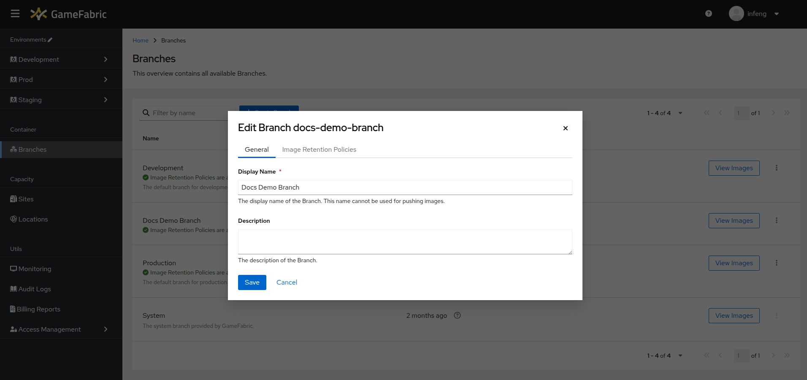
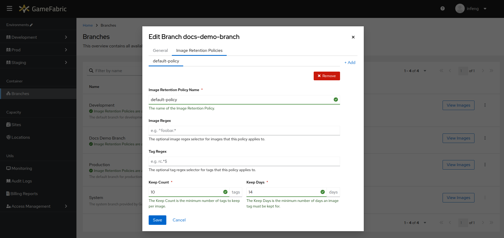
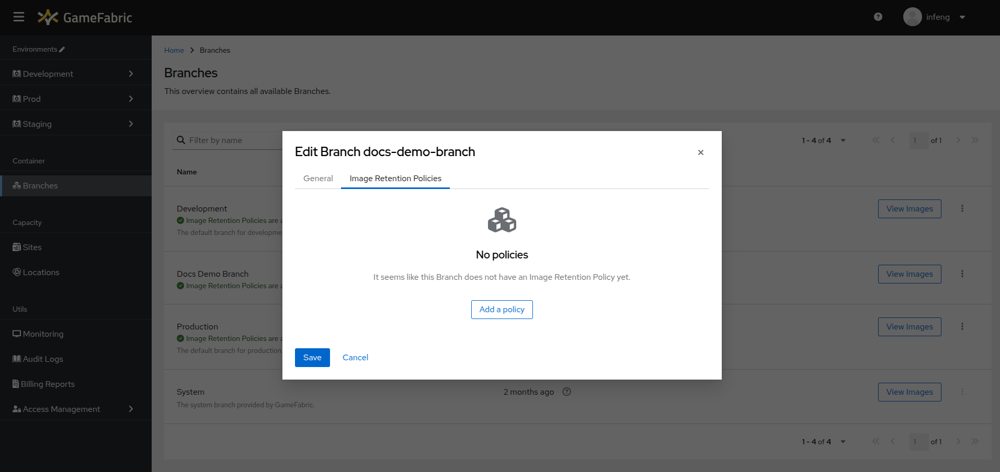
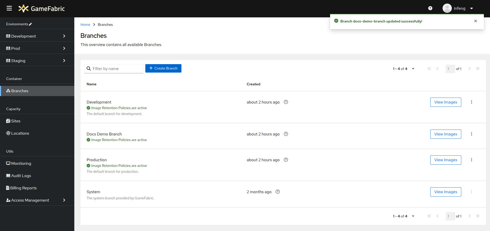

# Edit a Branch
In this section you will learn how to edit a branch.

## Prerequisites
Before you can edit a branch, you need to have created one. If you haven't done so yet, please refer to the [Create a Branch](pushing-container-images.md#create-a-branch) section.

## Editing
To edit a branch:

1. Navigate to the **Branches** section in the GameFabric UI.
2. Click the dropdown in the row of the branch you want to edit.
3. Select **Edit Branch**.

4. A new modal will open, allowing you to edit the branch.

5. To edit the Image Retention Policies, click the corresponding tab.

6. (optional) If there are no Image Retention Policies defined, you can add one by clicking the **Add a policy** button.

7. A new policy with default values will be created, feel free to edit the values as you see fit.

8. Click **Save** to save your changes or **Cancel** to abort.

