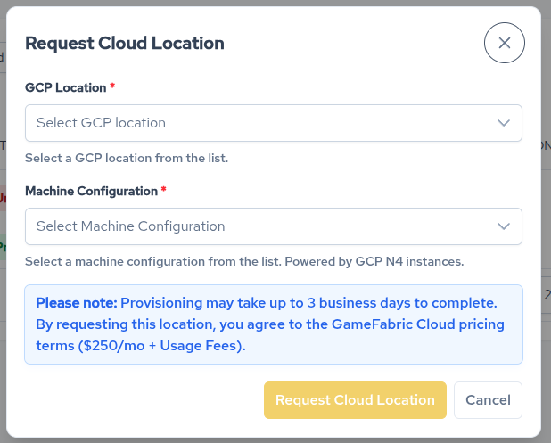
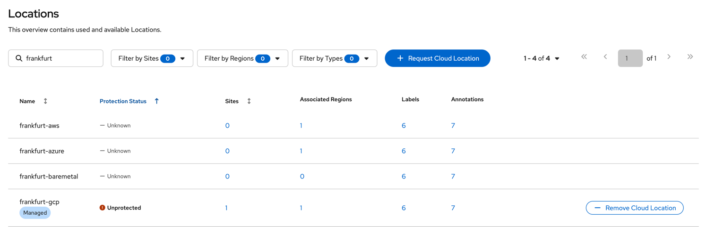
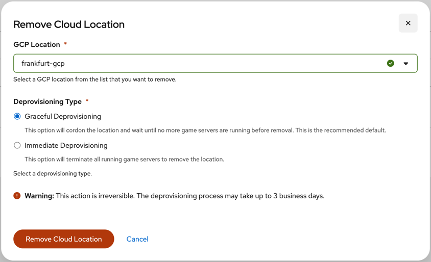
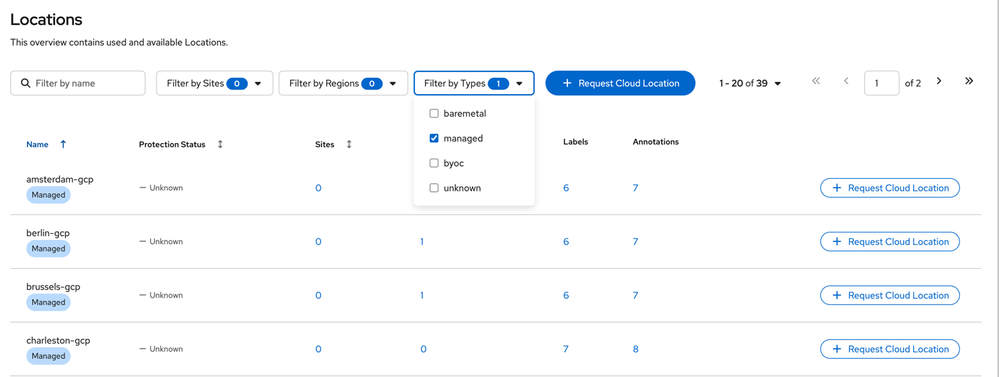
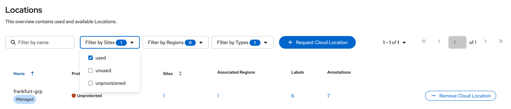

# GameFabric Cloud

GameFabric Cloud lets you provision (and deprovision) Cloud [Locations](glossary#location) straight from GameFabric, boosting your server capacity.

## Key Features

- **Integrated management**: Manage your cloud capacity directly in GameFabric.
- **Automated scaling**: Automatically scale your game servers into the newly provisioned Cloud Locations.
- **Simplified billing**: There's no need to manage a separate cloud provider subscription because is it handled for you by the GameFabric billing system.

## Limitations

- **Supported providers**: Currently, GameFabric Cloud only supports [Google Cloud Platform](https://cloud.google.com/) (GCP).
- **Resource types**: Only certain types of cloud capacity can be provisioned through GameFabric Cloud.
- **BYOC restrictions**: You cannot add cloud capacity at Locations that you have added using Bring Your Own Cloud (BYOC).

## Introduction

GameFabric Cloud lets you provision server capacity at specific, predefined Cloud Locations.
As described in [Setup your Environment](./setup-your-environment#create-a-region), you should have defined [Regions](glossary#region) that cover multiple Locations,
including inactive Cloud Locations.

When you provision cloud capacity at a specific location, the overall capacity in the corresponding region increases,
and game servers can automatically start scaling into the newly provisioned location.

## Provision Cloud Location

To provision a Cloud Location, navigate to the Locations dashboard. It is located under Capacity » Locations in the GameFabric sidebar.

1. Click the "Request Cloud Location" button:
   
   
   
2. Select a GCP Location and Machine Configuration:
   
   
3. Read the provided disclaimer about implied costs and estimated provisioning time.
   The details may differ from those shown in the screenshot.
4. Confirm the dialog.

::: tip
If the "Request Cloud Location" button is disabled, you lack the necessary permissions. Contact our Customer Success Management team for assistance.
:::

Once the Cloud Location has been provisioned, you can see the assigned number of [Sites](glossary#site) (usually one) in the Locations dashboard.
Make sure your Regions have been updated to include the Cloud Location so you can seamlessly make use of the new capacity once it has been provisioned.

::: tip
The API exposes the status of Cloud Locations. The `provisioning/v1beta1` API returns the current status of the requested Location.
The `core/v1` API shows the assigned Sites once the Location has been successfully provisioned.
:::

To avoid unnecessary costs, remember to deprovision unused Cloud Locations.

## Deprovision Cloud Location

To deprovision a Cloud Location, navigate to the Locations dashboard. It is located under Capacity » Locations in the GameFabric sidebar.

1. [Find the Cloud Location you want to deprovision.](#find-managed-cloud-locations)
2. Click the "Remove Cloud Location" button in the respective row.
   
   
3. Select the deprovisioning type:
   - **Graceful**: Deprovision the Location by cordoning its Sites. This option waits until no more game servers are running before removal. (Recommended)
   - **Forceful**: Immediately deprovision the Location. Any running game servers are forcefully terminated.
   
   
4. Read the provided disclaimer about the estimated deprovisioning time and other possible consequences.
   The details may differ from those shown in the screenshot.
5. Confirm the dialog.

## Find Managed Cloud Locations

The Locations dashboard shows all locations, including bare metal and cloud, and regardless of whether they have Sites,
but by default, the overview is filtered to show only Locations with Sites.

To find Managed Cloud Locations, choose "managed" from the "Filter by Types" dropdown, and eventually de-select other filters:

To find only your Managed Cloud Locations, additionally choose "used" from the "Filter by Sites" dropdown:

## Important Configuration

### Configure Regions (required)

Your provisioned Cloud Location must be part of a Region for your Armadas and Vessels to use it.

It is generally advised to distribute most of the available Locations to your Regions setup so that in the event that a Location is provisioned, it is automatically used.

### Configure Region Types and Priority (recommended)

Region Types divide a Region into logical subsets, such as bare metal and cloud.
This allows you to set priorities. Bare metal is often preferable to cloud for cost optimization.

Lower priority numbers indicate a higher priority (`0` is used first, `1` is used second, and so on).
