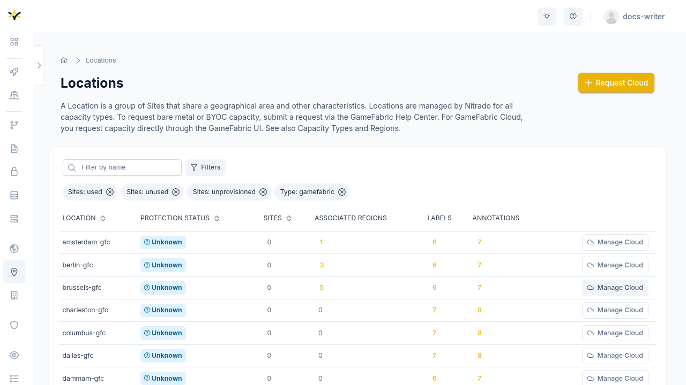
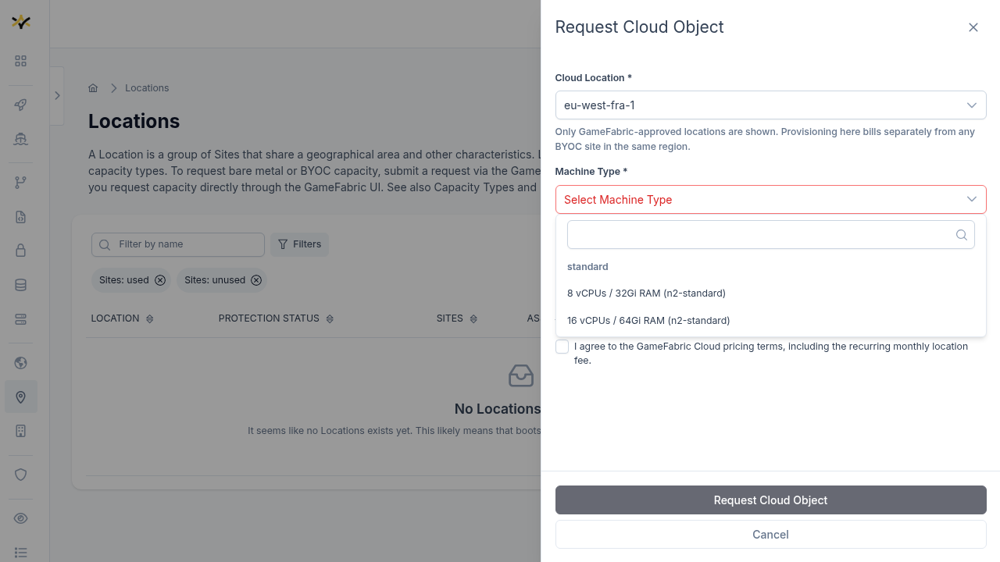
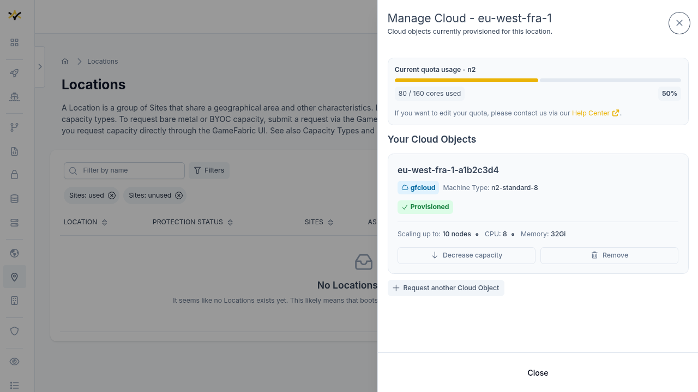
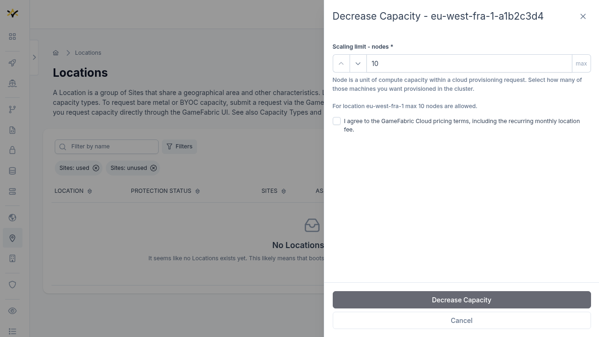
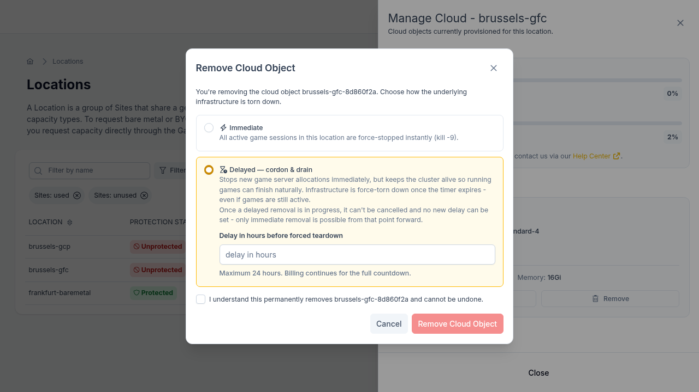
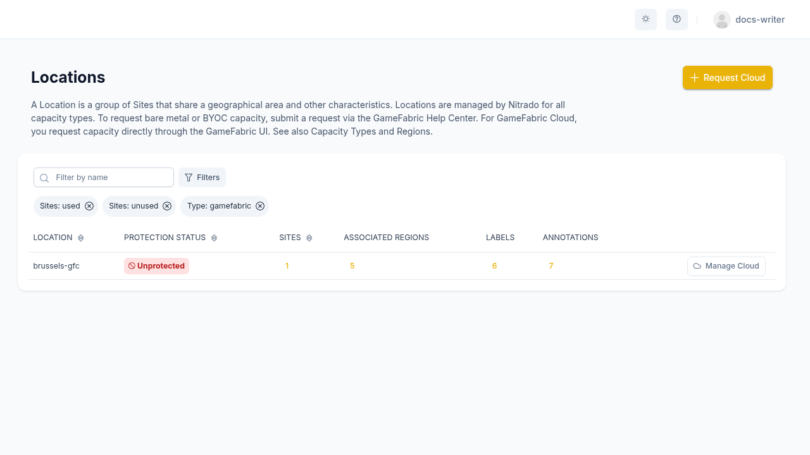

# GameFabric Cloud

GameFabric Cloud enables self-service provisioning and deprovisioning of cloud capacity at specific [Locations](glossary#location) directly from GameFabric, without requiring operator involvement. All costs are transparently displayed and delivered through the GameFabric billing system.

## Provision a Cloud Location

Cloud capacity is requested per Location. Each request specifies a machine type and a node count (the scaling limit).

Navigate to **Capacity » Locations** and either:

- Click **Request Cloud** in the page header, or
- [Find a GameFabric Cloud Location](#find-managed-cloud-locations) and click **Manage Cloud** in its row.

Fill in the form:

- **Cloud Location** — the GameFabric Cloud Location to provision into.
- **Machine Type** — the hardware configuration (vCPU and memory) of each node.
- **Scaling limit — nodes** — the maximum number of nodes to provision.

If a desired Location or Machine Type is not available, or when a Scaling Limit is not sufficient, contact the Help Center to request a quota change.
See also [Quotas and other limitations](#quotas-and-other-limitations).

Review the pricing terms, check the acknowledgement checkbox, and click **Request Cloud Location**.

The Cloud Location appears in the drawer and moves through the following states:

| State            | Meaning                                                             |
|------------------|---------------------------------------------------------------------|
| `Pending`        | The request has been submitted and is queued                        |
| `Provisioning`   | Infrastructure is being created                                     |
| `Provisioned`    | Capacity is live and available for game server scheduling           |
| `Deprovisioning` | Removal is in progress                                              |
| `Error`          | Provisioning failed; the reason is shown on the Cloud Location card |

Once `Provisioned`, Sites appear under the Location. Open **Manage Cloud** on a Location at any time to see all Cloud Locations as cards with their current state, machine type details, and scaling limit.

::: tip
Ensure your Regions include the cloud Location so that newly provisioned capacity is used by your Armadas and Vessels automatically. See [Regions, Sites & Locations](/multiplayer-servers/architecture/regions-sites-and-locations).
:::

## Resize a Cloud Location

You can reduce the node count of a `Provisioned` Cloud Location without removing it:

1. Open **Manage Cloud** for the Location.
2. Click **Decrease capacity** on the Cloud Location card.
3. Enter the new node count. It must be lower than the current count and at least 1.
4. Accept the pricing terms checkbox.
5. Click **Decrease Capacity**.

Editing to increase the node count is not supported, as capacity is already bound to an existing cluster and additional capacity may not fit there. 
To get more capacity of the same machine type at a Location, request an additional Cloud Location at the same Location.

::: warning
Downsizing is blocked while a deprovisioning is scheduled for the Cloud Location.
:::

## Deprovision a Cloud Location

To remove a Cloud Location and deprovision the underlying infrastructure:

1. Open **Manage Cloud** for the Location.
2. Click **Remove** on the Cloud Location card.
3. Choose a [deprovisioning mode](#deprovision-modes) (explained below).
4. Accept the consent checkbox confirming the removal is permanent.
5. Click **Remove Cloud Location**.

::: warning
Billing continues for the full duration of the delay countdown.
Once a delayed removal is in progress it cannot be cancelled.
Only **Immediate** removal remains available from that point forward.

:::

The Cloud Location transitions to `Deprovisioning` state. Once complete, it disappears from the drawer and the associated Sites are removed.

### Deprovision modes

**Immediate** — Active game sessions using this Cloud Location's capacity are force-stopped and the infrastructure is torn down right away. 
Use this when you need to release capacity immediately and no active players are using this Cloud Location.

**Delayed (cordon & drain)** — New game server allocations stop immediately, but the cluster stays alive so running sessions can finish naturally. Set a delay of up to 24 hours. Once the timer expires, infrastructure is force-torn down even if game servers are still running.

## Find managed Cloud Locations

The Locations dashboard opens with default filters that exclude unprovisioned and unassigned Locations.

To find all managed Cloud Locations, clear the default filters, then select **gamefabric** from the **Filter by Types** dropdown. 
To narrow to only Locations with active capacity, also select **used** from the **Filter by Sites** dropdown.

## Quotas and other limitations

Quotas apply per Location and per machine type family, controlling how much compute can be provisioned at any given time. 
Cloud Locations come with a predefined set of available machine types, quota limits, and supported regions. 
If these do not meet your requirements, contact the Help Center to request different quotas, machine types, or in exceptional cases also locations.

GameFabric Cloud only supports [Google Cloud Platform](https://cloud.google.com/) (GCP).

## Required permissions

To provision a Cloud Location, a user must have `post` capability on the `clouds` resource in the `provisioning/v1beta2` API group.
To resize or deprovision a Cloud Location, `patch` and `put` capabilities are required, where as deprovision also requires `delete` capability.

If the **Manage Cloud** button is not clickable on a Location row, your Role does not include the necessary capabilities.
