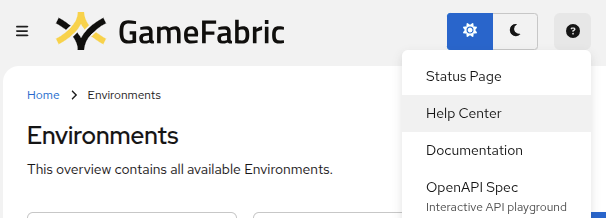

# Glossary

In GameFabric, there are multiple objects you need to be aware of, that are referenced throughout the documentation.
Their names and description are detailed in this section in alphabetical order.

## Allocation Sidecar

The `Allocation Sidecar` is a [Sidecar](#sidecar) provided by Nitrado for easy integration with the [Allocator](#allocator).

## Allocator

The Allocator is an extra product feature that lets you register your game servers against it so that your matchmaker can choose the best available server.

See also [docs for using the Allocation Sidecar](/multiplayer-servers/multiplayer-services/server-allocation/automatically-registering-game-servers).

## API

API stands for Application Programming Interface. GameFabric offers API access to every feature.
Please see our dedicated [GameFabric API Guide](/multiplayer-servers/api/guide) for more information.

## Armada

An Armada is a collection of Fleets, distributed across multiple [Sites](#site) within one [Region](#region).
It can have multiple [revisions](/multiplayer-servers/getting-started/glossary#revision), which are essentially different versions of the same Armada, as it gets updated.

Revisions are kept track of in order to allow you to roll back to a previous revision, as well as manage multiple revisions running in parallel (for example during a rollout upgrade)

See also [hosting model](/multiplayer-servers/architecture/identifying-your-hosting-model).

## ArmadaSet

An ArmadaSet is the configuration for a set of Armadas that share the same Fleet template and automatic scaling strategy.

See also [hosting model](/multiplayer-servers/architecture/identifying-your-hosting-model).

## Branch

GameFabric runs its own internal Container registry proxy, which is where you should push your game server images to in order to have them available in Fleets.
Those images are scoped by branch. For example, a standard use case would be to have a development branch and a production branch.
The development branch would contain dev images to be used by a development Armada, while the production branch would only contain releases of the game server that make it to production.

## BYOC

BYOC (Bring Your Own Cloud) is a capacity type where GameFabric manages resources within a customer's own cloud provider account (GCP, AWS, or Azure). The customer grants Nitrado access to create and manage Locations in their cloud infrastructure, while maintaining their own cloud subscription and billing relationship.

See also [Configuring your Cloud Provider](/multiplayer-servers/getting-started/cloud-provider-setup) and [Capacity Types](/multiplayer-servers/getting-started/capacity-types).

## CCU

CCU stands for Concurrent Users. It is a key metric that represents the total number of players who are actively playing on a game server at the same time.

See [Using the Agones SDK](/multiplayer-servers/getting-started/using-the-agones-sdk.md#player-count-and-capacity-tracking)

## Cluster

A cluster refers to a group of bare metal or cloud servers located in the same location.
In the context of GameFabric, clusters are implemented as [sites](/multiplayer-servers/getting-started/glossary#site).
While a "Cluster" refers to the physical or virtual grouping of servers, a "Site" represents the GameFabric-specific abstraction used to manage and interact with these clusters.

## Cordoned

When a [Site](#site) is marked as cordoned, it becomes unschedulable. Allocated game servers continue to run until they shut down, but no new game servers get scheduled on that Site.

## Degraded

A synchronization state indicating that configuration could not be deployed to one or more [Sites](#site). This can occur when Sites are unavailable, experiencing connectivity issues, or when all capacity in a Location has been deprovisioned.

Objects that can be Degraded: [Armada](#armada), [ArmadaSet](#armadaset), [Formation](#formation), Secret, ConfigFile, Protocol, Gateway Policy.

See also [Troubleshooting](/multiplayer-servers/getting-started/troubleshooting).

## Environment

Environments are a mechanism for isolating groups of resources. Resource names must be unique within each environment, but not across environments.
They can therefore be used to separate production, staging, testing, and any other environments and ensure that they don't interfere.
Alongside the [RBAC](#rbac) features, it also allows limiting the access to certain environments from users.

Capacity is managed on a per Environment basis via [Regions](#region).

## Fleet

A Fleet is a set of warm GameServers that are available to be allocated from.
It is an Agones object, which you can find [described in more details in their documentation reference](https://agones.dev/site/docs/reference/fleet/).
This resource is always managed by an Armada, and can't be configured through the UI any other way than by configuring the relevant Armada's Fleet Template.

## Formation

A Formation acts as a template for individual game servers (Vessels) spawned within it.
Vessels inherit all properties from their respective Formation, but environment variables and command line arguments can be overridden on a per-vessel basis.

See also [hosting model](/multiplayer-servers/architecture/identifying-your-hosting-model).

## GameFabric Cloud

GameFabric Cloud enables provisioning and deprovisioning of cloud [Locations](#location) directly from GameFabric, increasing available server capacity without requiring a separate cloud provider subscription.

See also [GameFabric Cloud](/multiplayer-servers/getting-started/gamefabric-cloud).

## GameFabric Help Center

The GameFabric Help Center is the central place for all self-service feature requests, orders, and cancellations. It is accessible from within the GameFabric UI via the "?" menu in the top navigation bar.

## Gateway Policies

See also [SteelShield docs](/steelshield/gamefabric/gamefabric#gateway-policies).

## Group

See [Editing Permissions](/multiplayer-servers/getting-started/editing-permissions#group).

## Location

A Location is a group of [Sites](#site) that share a geographical area and other characteristics.

Locations are managed by Nitrado for all capacity types. To request bare metal or [BYOC](#byoc) capacity, submit a request via the [GameFabric Help Center](#gamefabric-help-center). For [GameFabric Cloud](#gamefabric-cloud), you request capacity directly through the GameFabric UI.

See also [Capacity Types](/multiplayer-servers/getting-started/capacity-types) and [Region](#region).

## Mitigation

See also [SteelShield docs](/steelshield/gamefabric/gamefabric#mitigations).

## User

See [Editing Permissions](/multiplayer-servers/getting-started/editing-permissions#user).

## Permission

See [Editing Permissions](/multiplayer-servers/getting-started/editing-permissions).

## RBAC

Role-Based Access Control (RBAC) is the system used in the GameFabric to manage your team's access to the platform.

See also [Editing Permissions](/multiplayer-servers/getting-started/editing-permissions).

## Region

A Region is typically a geographic area made up of one or more [Locations](#location) where resources can be hosted.

It has to be defined on a per-[environment](#environment) basis.

While defining, you can assign a custom priority to each location. This priority determines which location will be filled first.

## Replica

A Replica is an individual game server instance within an [Armada](#armada).
Each Replica is functionally identical to others in the same Armada and cannot be configured independently.
Replicas are dynamically created and terminated by the Armada’s automated scaling logic.

## Revision

A revision is a discrete configuration of either an [ArmadaSet](#armadaset), [Armada](#armada) or [Formation](#formation).
They are numbered consecutively starting from 1.
Revisions are kept to allow you to roll back to a previous configuration, as well as manage multiple revisions running in parallel (for example during a rollout upgrade).

::: info
The rollback button in the UI is only available for [Armadas](#armada).
:::

::: info
The revision of an Armada in an ArmadaSet is independent from the revision of its controlling ArmadaSet.

E.g: Due to its flexible nature, an ArmadaSet can be revision 12 and control Armadas
* "a" revision 12
* "b" revision 12
* "c" revision 8
:::

## Role

See [Editing Permissions](/multiplayer-servers/getting-started/editing-permissions#role).

## Secret

See [Secrets](/multiplayer-servers/getting-started/secrets).

## Sidecar

A sidecar is a container that runs alongside your game server container, providing additional functionality.
For example, Nitrado provides an allocator sidecar which can handle the allocation process for you.
You could also run your own sidecars for monitoring or other purposes.

## Shutdown Hints

See [Vessel Shutdown Behavior](/multiplayer-servers/getting-started/terminating-game-servers#vessel-shutdown-behavior).

## Site

A Site is the capacity (cluster of bare metal or cloud servers) that belongs to a [Location](#location).

Sites are managed by Nitrado. For [GameFabric Cloud](#gamefabric-cloud) Locations, Sites are automatically created when provisioning capacity through the UI.

A Site can be marked as cordoned, making it unschedulable. Allocated game servers continue to run until they shut down, but no new game servers get scheduled on that Site.

This can be the case, for example, when a Site has just been provisioned to prevent premature allocations, or when a Site is being prepared for deprovisioning.

## Service Account

An account used for accessing GameFabric programmatically, please refer to the documentation under [Authentication](/multiplayer-servers/getting-started/authentication#managing-service-accounts).

## SteelShield™

SteelShield is a DDoS protection system designed for the specific purpose of protecting game servers from large scale DDoS attacks.

See also [SteelShield docs](/steelshield/gamefabric/introduction).

## Terraform provider

GameFabric offers its own Terraform provider to interact with the platform. Please see the dedicated documentation under [Terraform provider](/multiplayer-servers/integration/your-backend#terraform-provider-support).

## Protection Status

Status of the [SteelShield](#steelshieldtm) protection status for each [Site](#site) on the Sites overview in the GameFabric UI.

See also [SteelShield docs](/steelshield/gamefabric/gamefabric#protection-status).

## Protection Protocol

See also [SteelShield docs](/steelshield/gamefabric/gamefabric#managing-protocols).

## Vessel

A Vessel is a single **named** game server instance. It can, but doesn't have to be part of a [Formation](#formation).
Each Vessel can be configured completely independently.

See also [hosting model](/multiplayer-servers/architecture/identifying-your-hosting-model).

## Wrapper

A wrapper can be used to call your game server binary in order to provide additional functionality.

We provide a wrapper called [Game Server Wrapper](/multiplayer-servers/multiplayer-services/game-server-wrapper).

You could also write your own wrapper.
