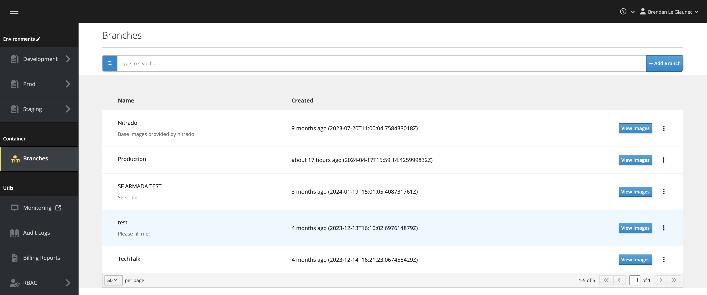
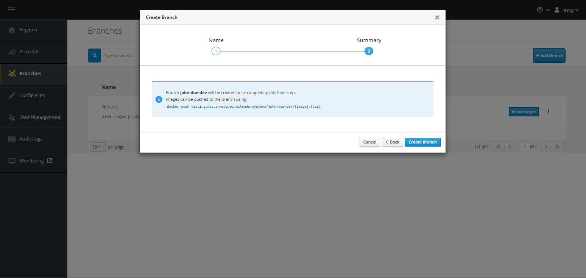
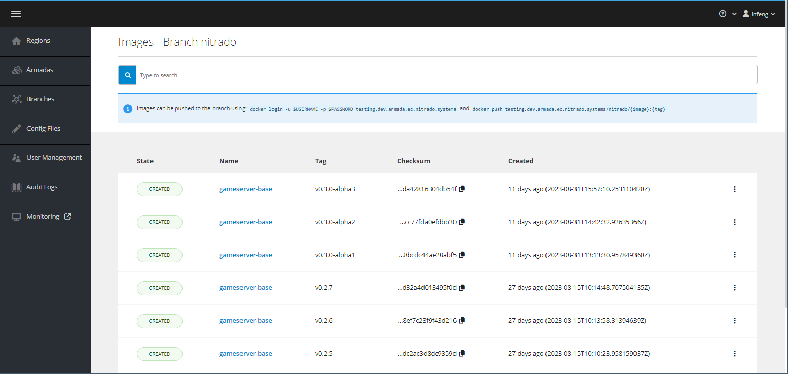

# Pushing Container Images

In this section you will learn how to make a container image available to
GameFabric for subsequent deployment.

## Prerequisites

In order to follow this guide, make sure you have the following:

* User credentials to access your GameFabric UI and environment of choice
* API user credentials to push images to the GameFabric Container Registry
* A [container image of your game server binary](building-a-container-image.md)

Log into the GameFabric UI before proceeding.

## Create a Branch

If you do not already have a branch in which to push images, you need to create one.

First, visit the "Branches" section of the UI to view the existing ones.



If none are relevant for your case, create one by pressing the "Add Branch" button, at the top right of the interface.


Give it a name that makes it easy for other users to identify its purpose, then click the "Next" button.



Before creating your branch, the UI shows you the URL at which you will be able to push Docker images, to make them a part of this branch. Make note of that URL, as you will need it in the next step.

Once the branch is created, you can find that URL again by clicking the "View Images" button in the row for your branch. This leads you to the branch details page, which displays the relevant URL at the top of the interface, in the blue information box.

## Push the game server image

Now, login to the GameFabric Container Registry by running the following command:

```bash
$ docker login -u ${USERNAME} -p ${PASSWORD} $URL
```

::: info
If you encounter issues with your credentials, contact the administrator of your GameFabric installation.
:::

Once you are logged in, tag your image against the registry, and push it.
Do not forget to include the branch name after the registry URL.

```bash
$ docker tag my-game:v1.2.3 ${URL}/${BRANCH}/my-game:v1.2.3
$ docker push ${URL}/${BRANCH}/my-game:v1.2.3
```

You should now see the game image listed in the branch detail view.

:::warning
Due an open bug in `podman`, using `podman` is currently not supported.
:::



This means you can now select that image when creating an Armada.
