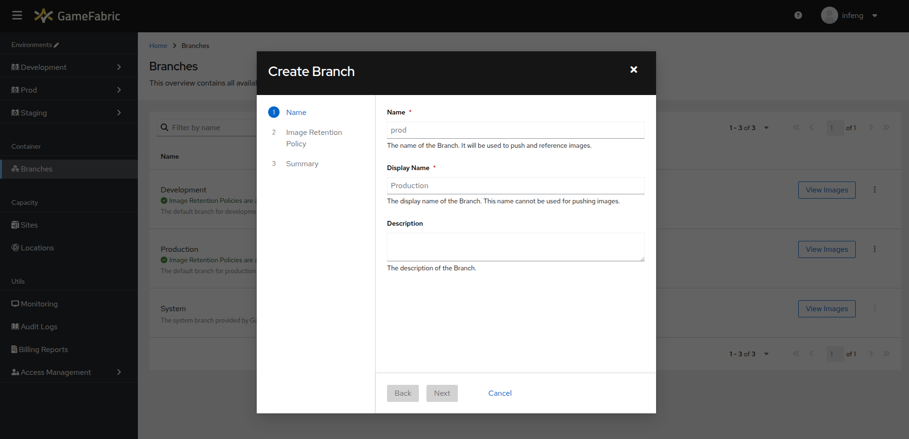

# Pushing container images

In this section, you will learn how to make a container image available to GameFabric for subsequent deployment.

::: tip Workflow

This guide is part of the container workflow:

1. [Build your container image](/multiplayer-servers/getting-started/building-a-container-image)
2. **Push it to the registry** (this guide)
3. [Run your game server](/multiplayer-servers/getting-started/running-your-game-server)
:::

## Prerequisites

In order to follow this guide, make sure you have the following:

* User credentials to access your GameFabric UI and environment of choice
* API user credentials to push images to the GameFabric Container Registry (see [Authentication](/multiplayer-servers/authentication/authentication))
* A [container image of your game server binary](building-a-container-image.md)

Log into the GameFabric UI before proceeding.

## Create a branch

If you do not already have a branch in which to push images, you need to create one.
In case you haven't already done so, there are two options available to you:

* **Add default Branches**: This will create two branches, "Production" and "Development", with default Image Retention Policies. Don't worry - you can always change the display names and policies later. See how to [edit a branch](edit-a-branch.md).
* **Create Branch**: This will allow you to create a custom branch with a name and an Image Retention Policy of your choice.

When creating a custom branch, please adhere to the following naming conventions:

* Branch names must only contain lowercase letters, numbers, hyphens (-), and periods (.).
* Branch names must begin and end with a lowercase letter.

::: warning Image Retention Policy
The Image Retention Policy defines how long images are stored in the registry and how many tags are retained.
The default settings for the **Production** branch are 30 days and 10 tags. **Development** and **Custom** branches have default settings of **14 days** and **10 tags**. _These default settings can be adjusted for any branch._

For example, with **Keep Days** set to 14 and **Keep Count** set to 10, images older than 14 days will be deleted, but the process stops if removing an image would leave fewer than 10 images.

_Note: Either **Keep Days** or **Keep Count** (or both) must be >0. Setting **Keep Days** or **Keep Count** to _0_ means that specific rule will be ignored._
:::

### Add default branches

::: info
This option is only available if you have not created any branches yet.
:::

1. Navigate to the **Branches** section in the GameFabric UI.

2. Click the **Add Default Branches** button.
3. A confirmation pop-up will appear. Click **Create** to confirm or **Cancel** to abort.

4. The default branches are created. You can now see them in the branches overview.


### Create custom branch

You can also create custom branches with a name and an Image Retention Policy of your choice.

1. Click the **Create Branch** button in the branches overview.
2. A new window will open, allowing you to create a custom branch.

3. Give it a name that makes it easy for other users to identify its purpose, then click the **Next** button.
4. Create the Image Retention Policy. You can define a policy by the **Image Retention Policy Name**, an **Image Regex**, a **Tag Regex**, as well as **Keep Count** and **Keep Days**. You can also add multiple policies through the **+ Add** Button, or remove policies through the **Remove** Button.

5. (Optional) If you don't wish to define an Image Retention Policy, you can toggle the switch - **but please be aware that this is not recommended**.

6. Before creating your branch, the UI shows you the URL at which you will be able to push Docker images, to make them a part of this branch. **Make note of that URL, as you will need it in the next step.**

7. Click the **Create Branch** button to finish the process. The newly created branch will now be visible in the branches overview.

Once the branch is created, you can find that URL again by clicking the **View Images** button in the row for your branch. This leads you to the branch details page, which displays the relevant URL at the top of the interface, in the blue information box.


## Push the game server image

Now, login to the GameFabric Container Registry by running the following command:

```bash
docker login -u ${USERNAME} -p ${PASSWORD} $URL
```

::: info
If you encounter issues with your credentials, contact the administrator of your GameFabric installation.
:::

Once you are logged in, tag your image against the registry, and push it.
Do not forget to include the branch name after the registry URL.

```bash
docker tag gameserver:v1.0.0       ${URL}/${BRANCH}/gameserver:v1.0.0
docker push --platform linux/amd64 ${URL}/${BRANCH}/gameserver:v1.0.0
```

You should now see the game image listed in the branch detail view.

::: info
We currently can not guarantee that all features work with `podman` due to an open bug related to a [non standard behaviour](https://github.com/containers/podman/issues/15187).
With that being said we support the full feature set of docker CLI and test its functionality with each release.
:::


This means you can now select that image when creating an Armada.
