# Running your Game Server

In this section, you will learn how to run your first game server.

::: tip Understanding Hosting Models
Before proceeding, consider reviewing the [hosting models guide](/multiplayer-servers/hosting-models/identifying-your-hosting-model) to understand the difference between Vessels (long-running servers) and Armadas (session-based servers), and choose the right approach for your needs.
:::

## Prerequisites

In order to follow this guide, make sure you have the following:

* User credentials to access your GameFabric UI and environment of choice
* A container image that has been [pushed to a branch in the registry](pushing-container-images)
* Basic understanding of [Agones SDK integration](/multiplayer-servers/getting-started/using-the-agones-sdk) for proper game server lifecycle

Log into the GameFabric UI before proceeding.

## Create Configuration Files (optional)

If your game server requires configuration files, you should add those before creating your first game server.

Visit the "Config Files" section in the navigation bar on the left of the interface, and click the "Add File" button.

You may give a name and description to the file, as you did with branches. Then, simply write the contents of your file,
press "Next", verify that the configuration file is correct, and click "Create ConfigFile".

## Create a Vessel

Visit the Formations section of the UI, and click on the blue "Add" button, on the top right of the interface.

### Kind

You are now given the choice between creating a Formation and an individual Vessel. Pick "Vessel".

Vessels allow you to spin up individual game servers and to define a unique configuration for each of them, which is ideal for a first integration.
Later, you will use concepts like Formations, Armadas and ArmadaSets to efficiently manage large numbers of game servers at once.

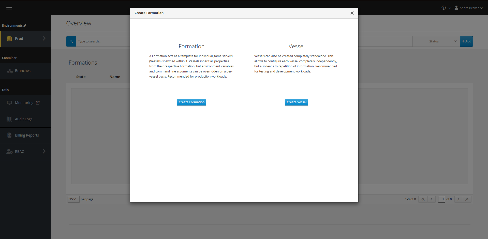

### General

In this step, specify a unique name for your Vessel.
You can also assign a description as a reminder what this Vessel is used for.

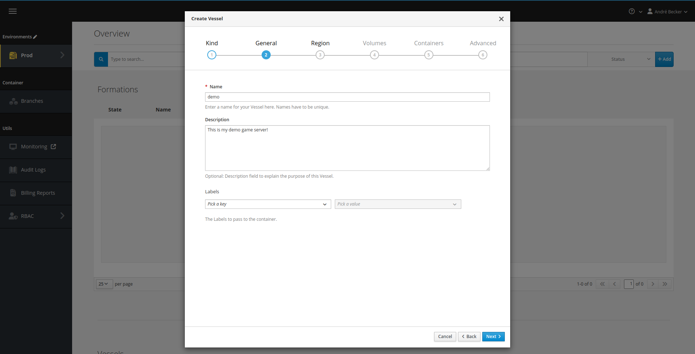

### Region

Select the Region that this Vessel should run in.
Please note that you do not need to specify the type of capacity within the Region (i.e. Bare Metal vs. Cloud).
This scheduling decision is performed automatically and adjusts dynamically when capacity changes.

### Volumes

Volumes are an advanced mechanism to share data between multiple containers within the same pod. Skip it for now.

### Containers

The Containers section contains the majority of your game server configuration.

#### Image

The first thing to do is select the image you previously pushed to your branch.
This makes the game server container use that image.

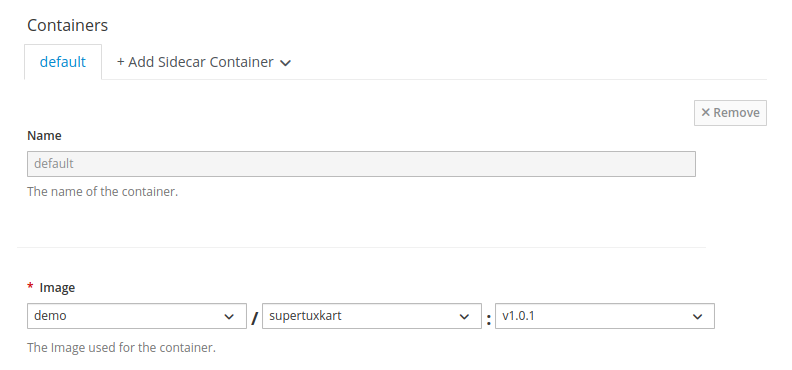

:::warning
If you select `latest (auto update)`, pushing a new version of your game server image immediately triggers an automatic rollout.
This can be very convenient for development purposes, as it avoids you having to edit the Vessel whenever you push a new version.
:::

#### Environment Variables

Environment variables are a convenient way of exposing configuration options to the game server without defining a full configuration file.
You can define them as static key/value pairs, or, by selecting the "Pod Field" type, expose metadata about the deployed game server,
such as the name of the region the game server is deployed to or the version of the image in use.

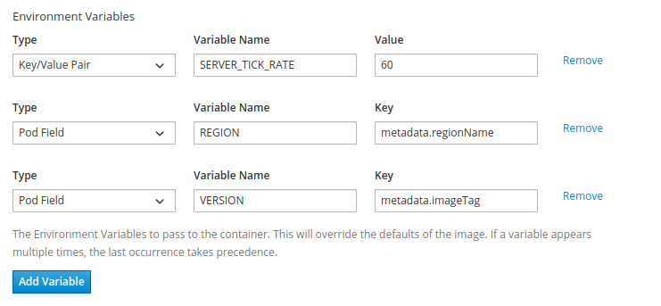

Supported pod fields are:

| Pod field                     | Description                                                        | Resolved by                 |
|-------------------------------|--------------------------------------------------------------------|-----------------------------|
| `metadata.name`               | Name of the game server, usually referring to the unique pod name. | Kubernetes                  |
| `metadata.labels['<KEY>']`    | Accessor to the game server labels.                                | Kubernetes                  |
| `metadata.armadaName`         | Name of the associated Armada.                                     | GameFabric (Armada only)    |
| `metadata.vesselName`         | Name of the associated Vessel.                                     | GameFabric (Formation only) |
| `metadata.regionName`         | Name of the region.                                                | GameFabric (any)            |
| `metadata.regionTypeName`     | Name of the region type.                                           | GameFabric (any)            |
| `metadata.regionTypePriority` | Priority of the region type.                                       | GameFabric (any)            |
| `metadata.siteName`           | Name of the site.                                                  | GameFabric (any)            |
| `metadata.imageBranch`        | Name of the image branch of the used game server image.            | GameFabric (any)            |
| `metadata.imageName`          | Name of the used game server image.                                | GameFabric (any)            |
| `metadata.imageTag`           | Tag name of the used game server image.                            | GameFabric (any)            |

For more information, see the [full list of supported Kubernetes fields](https://kubernetes.io/docs/concepts/workloads/pods/downward-api/#downwardapi-fieldRef).

#### Ports

Ports determine how your game server can be reached from the outside world.
Game servers live behind Network Address Translation (NAT), that means the public IP and ports differ from the IP and ports that the game server binds to locally.

There are two types of ports you can configure:

* **Dynamic** is the preferred default. The game server locally binds to a predetermined port (such as `7777`) and
  at runtime, a random public port is chosen that game clients can then use to reach the game server. If the game server
  needs to communicate its public IP and ports to an outside system, such as a server list, the game server needs to
  query this data from the Agones SDK.
* **Passthrough** may be required if a game server requires public and local port to be the same (Steam's A2S query
  being a notable example). The public port is randomly chosen at runtime, and the game server then has to locally
  bind to that specific port after retrieving it from the Agones SDK. Passthrough should only be used when required.

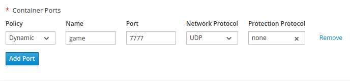

Below are some port name conventions and what they are typically used for:

| Port Name | Usage                                                                              |
|-----------|------------------------------------------------------------------------------------|
| game      | Primary game traffic port, often UDP.                                              |
| query     | Port to retrieve meta data about the server, such as current number of players.    |
| rcon      | Any remote control endpoint that can be used to manage the game server at runtime. |
| allocator | Callback endpoint for a server allocation mechanism.                               |

#### Command and Arguments

You can also override the command run by the container, as well as CLI arguments your game server starts with.

If left empty, the game server starts with the default arguments defined in the container's Dockerfile for the
properties CMD and ARGS, respectively.

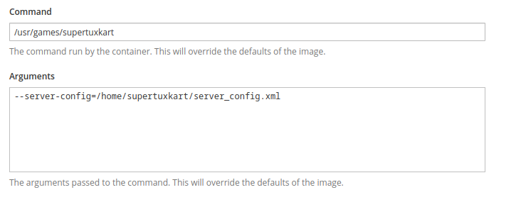

#### Volumes

In this section, you can point previously specified volumes to specific paths in your container.
Since you likely have not set up a volume for this first game server, skip this for now.

#### ConfigFiles

In the next section, you may mount the volumes previously configured, as well as any [configuration files
previously defined](#create-configuration-files-optional) within your environment.

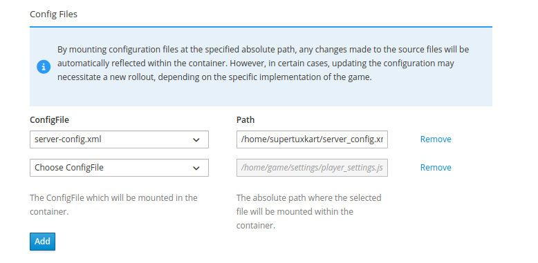

#### Resources

Resources are the CPU and memory required by your game server. This definition comes in two parts:

* **Requests** (Mandatory): These are the resources that are guaranteed to your game server, and should be set to values
  that realistically resemble the resource consumption of an average game server that is in use. These requested values
  are used for scheduling decisions, which means that the game server is only started on a node that is guaranteed to
  still have these resources available.
* **Limits** (Optional): Additionally, hard limits can be set for the resources the game server is allowed to use. If the
  game server exceeds its memory limits, it will be terminated, and if it exceeds its CPU limits, it will be throttled.
  It is generally recommended to set the memory limit to a threshold that would indicate a memory leak that warrants
  termination, and to not apply CPU limits, unless negative effects have been observed.

::: tip Resource Configuration
For detailed guidance on setting CPU and memory resources, see the [Resource Management guide](/multiplayer-servers/multiplayer-services/resource-management), which provides best practices for optimizing performance and costs.
:::

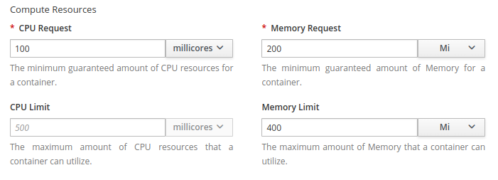

#### Sidecars

Once you are done configuring your game server container, you may go back to the top of the page to add a sidecar
container if you want to use one. The selector allows you to directly create an Allocator sidecar, or to create a
new arbitrary container from scratch.

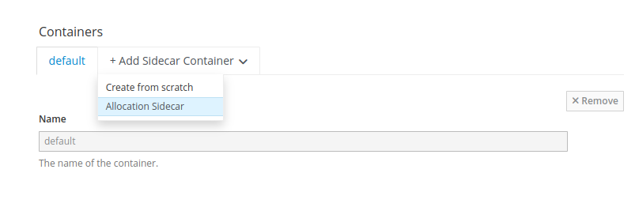

### Advanced Options

In this last section you can adjust advanced options like enabling profiling, configuring health checks, and defining
grace periods for game server termination.

#### Profiling

GameFabric Mutliplayer Servers has built-in support for eBPF-based CPU performances profiling using [Grafana Pryroscope](https://grafana.com/oss/pyroscope/).
This feature has an expected CPU performance impact of just 2-3%, so in most cases it is safe to be enabled.

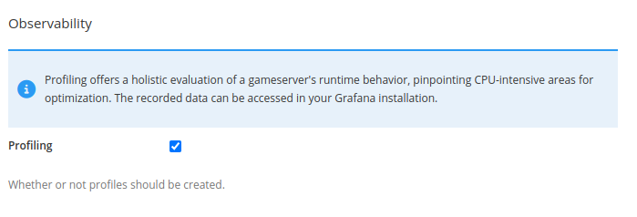

#### Health Checks

If a game server fails to call `agones.Health()`, it will be considered unhealthy and terminated.
The thresholds for that process can be configured here. The default values are usually okay to use.

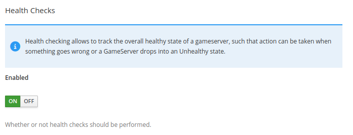

:::warning Disabling Health Checks
Health checks should only be disabled in testing and troubleshooting scenarios, for example when testing your Agones
SDK integration. For production usage health checks should always be enabled, otherwise game servers that are in an
unresponsive state cannot be automatically detected and cleaned up.
:::

#### Termination Grace Periods

Game servers may receive [*Shutdown Hints*](terminating-game-servers.md), observable via the Agones SDK.
These hints are used when game servers need to shut down within a specific time frame due to an external reason.

The reasons for a server to be told it should shut down are:

* **Maintenance**: The Site the game server is running on is being put into maintenance and needs to be emptied.
* **Spec Change**: The game server configuration was updated (such as a new version being available), and the game
  server needs to shut down so that the new configuration can be applied.
* **User Initiated**: A suspension or restart was triggered by a user through the GameFabric UI or API.

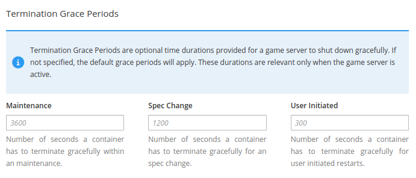

The configured grace period is the time that the game server can use to gracefully shut down, for example,
by informing the players to disconnect and shutting down when all players have left.
When the game server has not shut down before the grace period has passed, it is forcefully terminated.

## Visualize and Configure

Now that the Vessel has been successfully created, it should become visible in the "Vessels" section.
If the game server starts up as expected and completes its `agones.Ready()` call, the state of the Vessel should switch to "RUNNING".

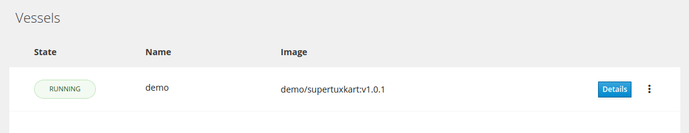

You may click on the "Details" button to see more information.

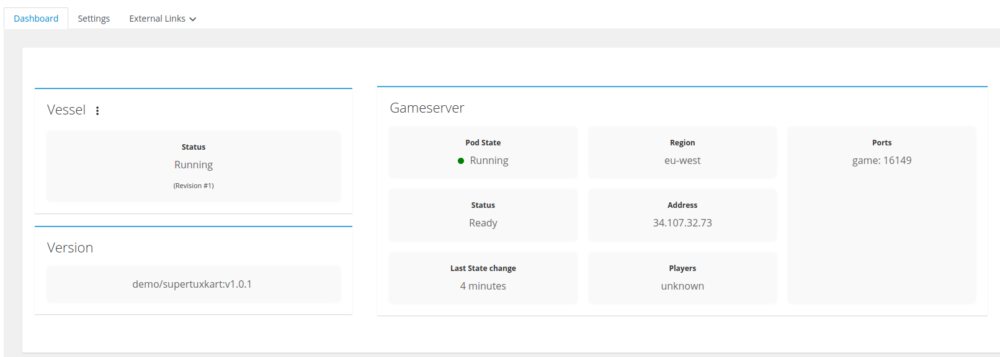

In this view, you see the most important information about your game server, such as its public IP and ports.
You can now use this information to perform a test connection to your game server.

On the same page, you can also inspect the logs of your game server, to troubleshoot any issues that occur.

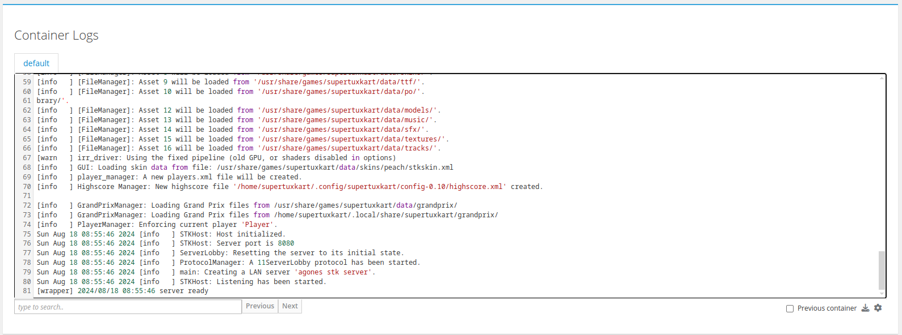
