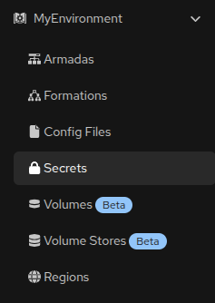
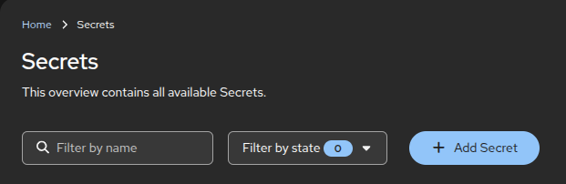
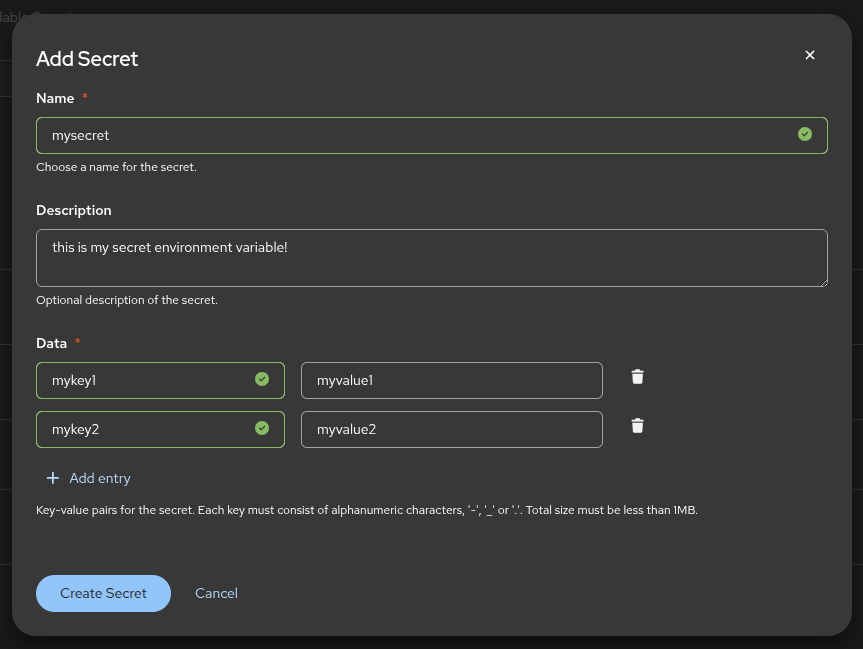
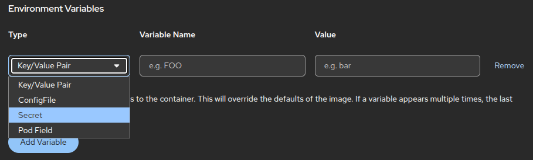
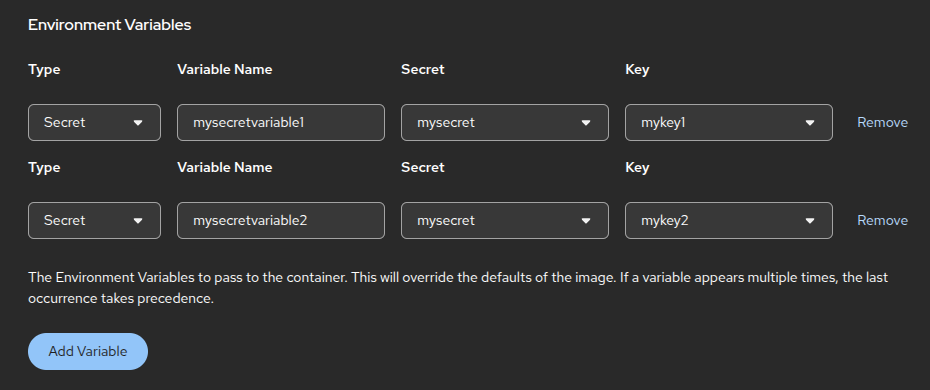
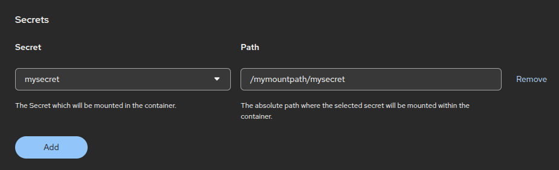

# Secrets
A `Secret` is a secure placeholder for sensitive data (e.g. passwords, API keys, or tokens). It prevents sensitive values from being exposed by holding a reference to the data which the system uses to only inject the real secret value when & where it is needed.

# Management & Configuration

Secrets are specific to a given environment and can be managed in the associated “Secrets” view therein.  

## Create a Secret

To create a Secret, click on the “Add Secret” button.

In the Create view, it is possible to define the name of the secret, provide a description (optional) for future reference, and insert the K/V pair(s). A secret can contain one or more K/V pairs.

**IMPORTANT**
The `Value` part of the Data can only be seen during the creation process. Once saved, the value will never be displayed again! Remember to securely save it elsewhere if needed for other purposes.

# Use a Secret
Secrets can be used for ArmadaSets, Armadas, Formations, and Vessels.
They can be either provided as an environment variable or mounted to a specific path.

## As an Environment Variable
To setup a secret as an environment variable for a game server, open the Armada(Set) or Formation/Vessel dashboard, and navigate to `Settings > Containers > Environment Variables`.

Create a new environment variable of type `Secret`, and select which `Secret` & `Key` should be associated with the variable.

### Note 
When a secret contains multiple K/V pairs, each key needs to be provided as its own environment variable.  

## Direct Mount
To mount a secret to a game server, open the Armada(Set) or Formation/Vessel dashboard, and navigate to `Settings > Containers > Secrets`.

Specify the Secret to be mounted and the absolute path  `Secret` to which it is to be mounted.

The `Secret` is mounted as a folder in which each K/V pair is presented as an individual file. The file name matches the Key and the Value is contained in the file.
