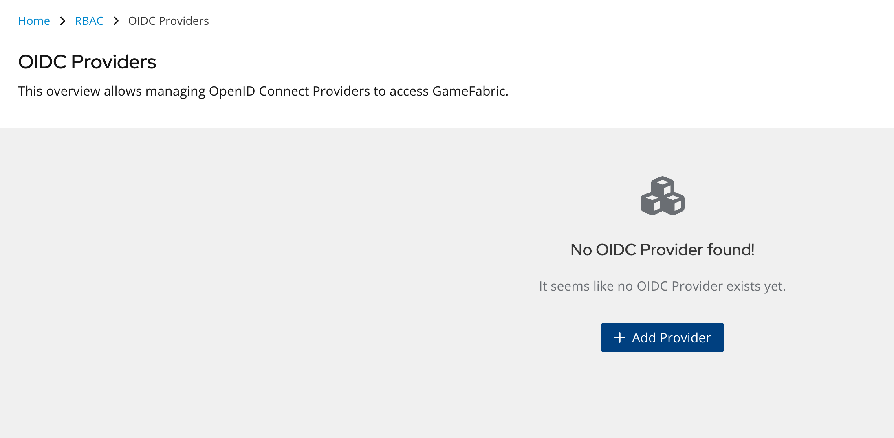
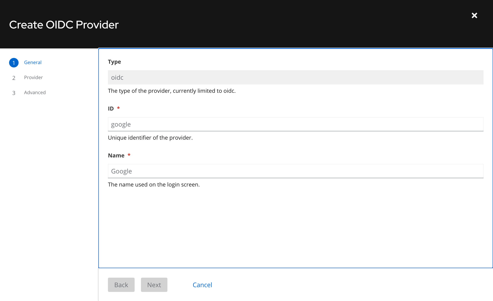
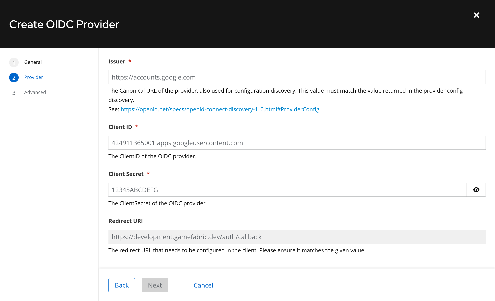
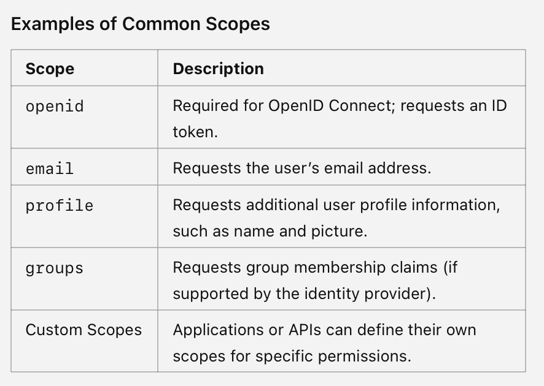
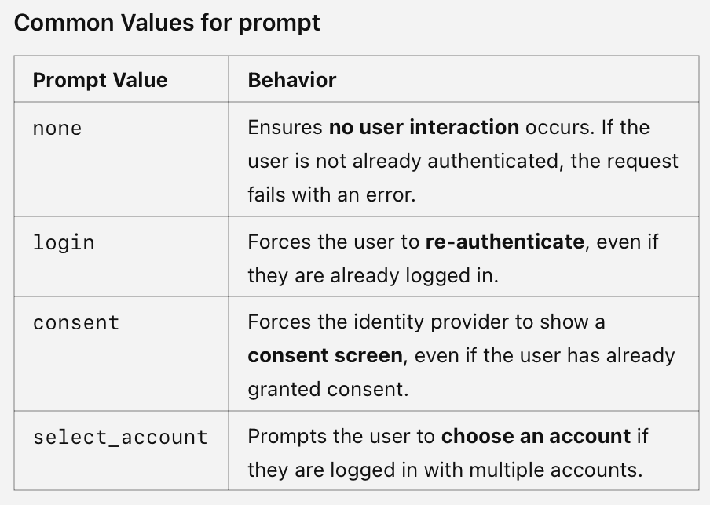

# GameFabric: Setting Up Third-Party OAuth Integration

## Overview
GameFabric is designed to separate concepts and concerns, providing users with enhanced flexibility, security, and sustainability. 

One key feature is **Authentication**. GameFabric enables seamless integration with external authentication providers, allowing users to execute their own authentication flows without GameFabric accessing or storing sensitive authentication data.

## Prerequisites
Before setting up a third-party OAuth provider, ensure the following:

- An active GameFabric installation with access through the default user.
- An OIDC (OpenID Connect) provider, including a **Client ID** and **Client Secret**.

## What Is OIDC?
**OIDC (OpenID Connect)** is an identity layer built on OAuth 2.0. It enables secure user authentication and identity information exchange between a client application, such as GameFabric, and an external identity provider.

## Setting Up Third-Party OAuth in GameFabric
Delegating authentication to an external provider is straightforward with GameFabric. Follow the steps below to configure a new OIDC provider.

### Step 1: Add a New Provider
1. Navigate to the [OIDC Providers page](https://development.gamefabric.dev/ui/rbac/providers/oidc).
2. Click **Add Provider**.

3. Enter a desired **Display ID** and **Display Name** for your new provider.

### Step 2: Configure Issuer and Credentials
1. Specify the **Issuer URL** provided by your OIDC provider.
2. Enter the **Client ID** and **Client Secret** issued by the provider.

### Step 3.1: Define Claim Configurations
1. Configure the claims to request from the OIDC provider using the **Scopes** textbox. Common scopes include:

2. Define the following mappings:
   - **UserID Key**: Maps the OIDC provider’s claim to the **User ID** in GameFabric (default: `sub`).
   - **UserName Key**: Maps the OIDC provider’s claim to the **UserName** in GameFabric (default: `name`).

3. Specify the **Prompt** parameter to control user interaction during authentication. The default value is `consent`. Available prompt options include:

### Step 3.2: Claim Mapping
Some OIDC providers return non-standard claims. Use the **Claim Mapping** section to align these with standardized claims in GameFabric.

### Step 3.3: Provider Discovery Override
GameFabric performs a discovery pre-flight to fetch required configuration details from the OIDC provider. If necessary, override the default values for:
- **Token URL**
- **Auth URL**
- **JWKs URL**

This customization ensures compatibility with providers returning non-standard discovery responses.

## Summary
By following these steps, you can configure a third-party OAuth integration in GameFabric, enhancing security and maintaining control over your authentication flows. For further assistance, refer to GameFabric’s support resources or consult your OIDC provider documentation.
