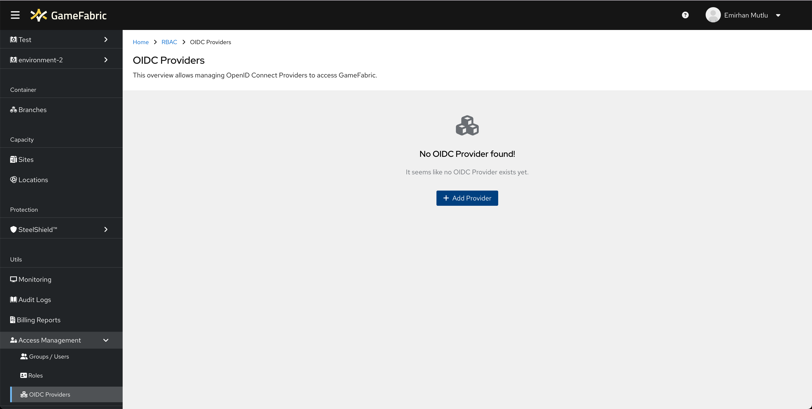
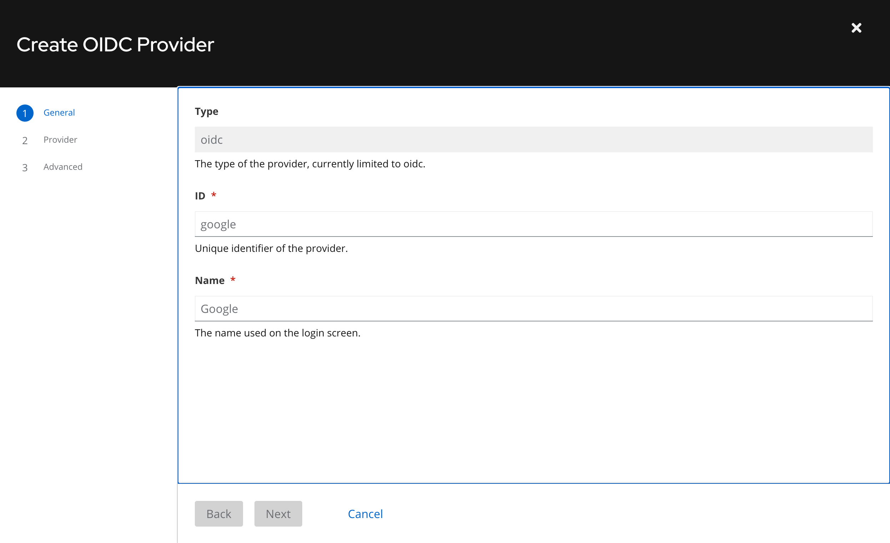
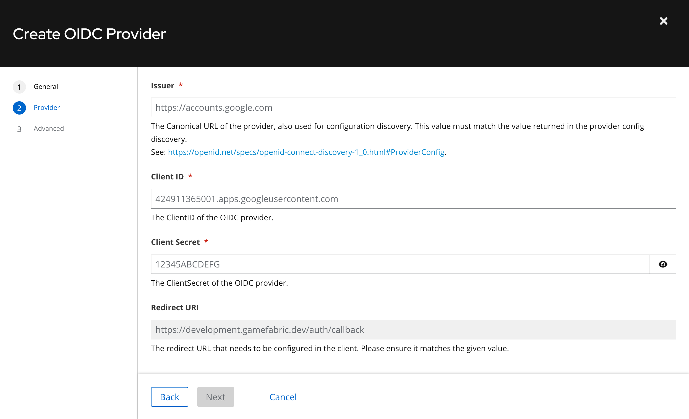
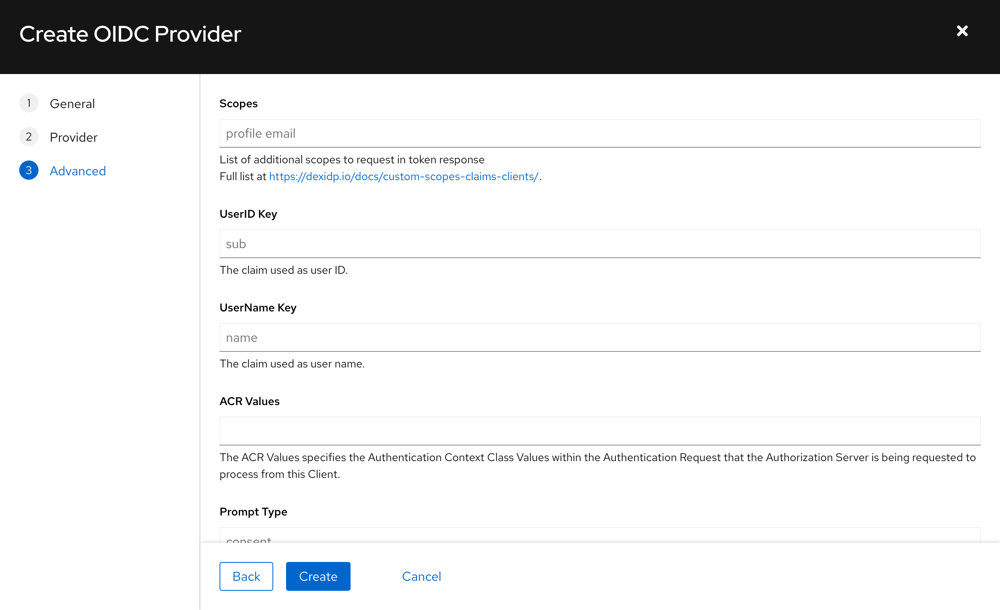
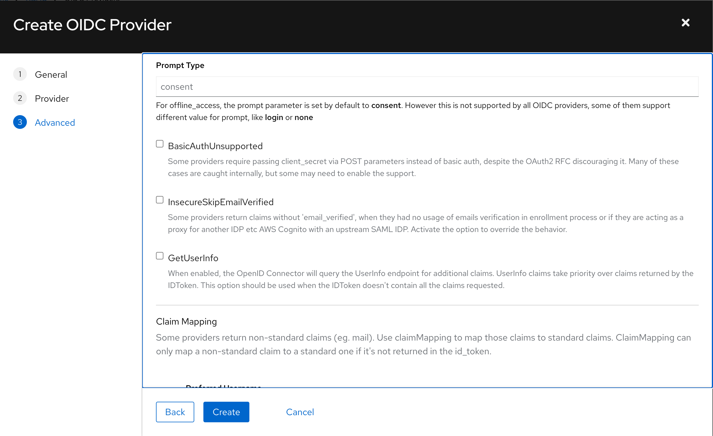
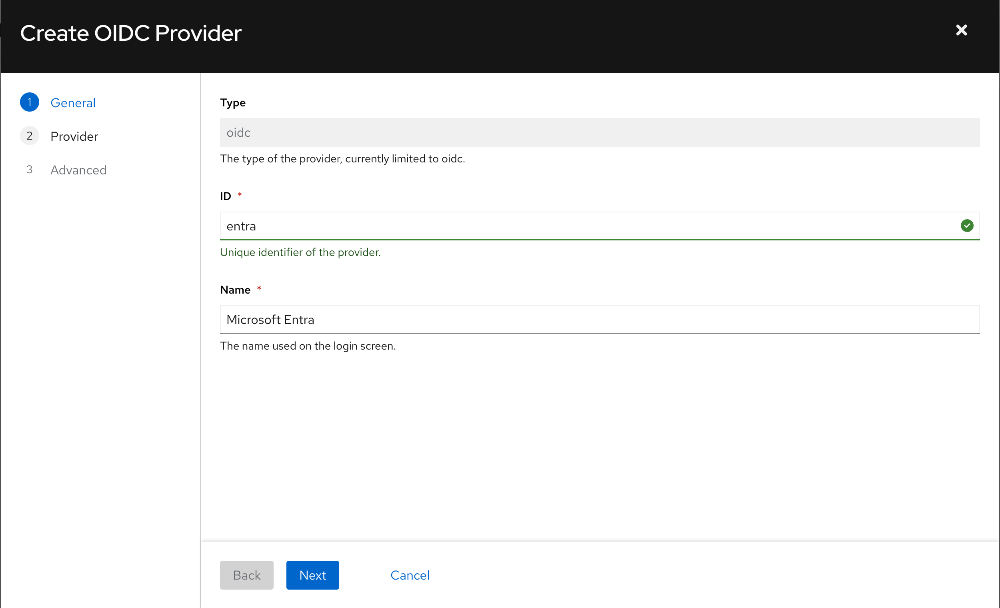
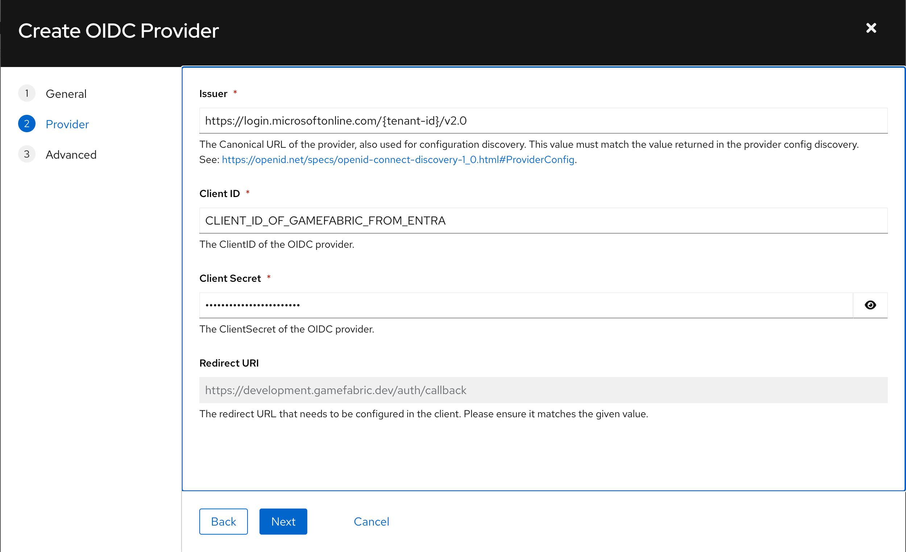

# Setup Third-Party OAuth Integration

## Overview

GameFabric supports Third-Party OAuth Integration with every OAuth-compatible Identiy Provider, allowing you to reuse your existing authentication flows, without giving GameFabric access to your sensitive authentication data.

## Prerequisites

Before setting up a Third-Party OIDC Provider, ensure the following conditions are met:

- You have access to an active GameFabric installation with permissions to modify OAuth Providers or the default user. 
- You have an OIDC ([OpenID Connect](https://openid.net/developers/how-connect-works/)) provider, including a **Client ID** and **Client Secret**.

## Setting up a new OIDC Provider

Navigate to the "Access Management" section from the Sidebar Menu, and then into the "OIDC Providers" page. You may add a new OIDC Provider via the **Add Provider** button.

For providers such as Microsoft ENTRA or Google Identity Platform; following instructions in [Preliminary Configurations](#preliminary-configurations) are sufficient to complete the integration.

If you are using a non-standardized OIDC Provider, or would like to further customize the authentication flow (modifying prompt behaviour of your OIDC Provider, etc.) please refer to [Advanced Configurations](#advanced-configurations).

### Preliminary configurations

On the "General" step, enter a desired **ID** and **Display Name** for your provider. The OIDC Provider you are about to add will be saved under this **ID** and **Display Name** on GameFabric.

On the "Provider" step, you need to specify the **Issuer URL** of your OIDC provider. This URL points to the OIDC Discovery Document of that particular provider, and GameFabric uses this Discovery Document for integrating with that provider.

**Issuer URL** must only point to the exact discovery endpoint, similar to the examples below; and must NOT include any trailing path (such as "/.well-known/openid-configuration" etc.)

Some **Issuer URL**s are:

| Provider                 | IssuerURL                                               |
|--------------------------|---------------------------------------------------------|
| Microsoft ENTRA          | https://login.microsoftonline.com/{tenantID}/v2.0       |
| Google Identity Platform | https://accounts.google.com                             |
| Okta                     | https://{yourOktaDomain}/oauth2/default                 |
| Auth0                    | https://{yourTenant}.auth0.com/                         |
| Amazon Cognito           | https://cognito-idp.{region}.amazonaws.com/{userPoolId} |

GameFabric must be configured as an external application in the OIDC Provider in order for the provider to assign the [Client ID & Secret](https://www.oauth.com/oauth2-servers/client-registration/client-id-secret/) for GameFabric.

Fill in the **Client ID & Secret** to their respective text inputs, and click "Next".

For OIDC Providers with standard behaviour no further configuration is necessary and you may click "Create" button to finish adding your provider.

### Advanced Configurations

This section allows configuration of **Scopes & Claims**, **Prompt**, **Claim Mapping** and **Provider Discovery Override**.

#### Scopes & Claims

GameFabric requests additional data about the authenticated user using **Scopes & Claims**.

For example, you may want to use a different email field as the users display email on GameFabric, or a different username than the one your provider forwards you by default.

This is accomplished via requesting **Scopes** ([OpenID Scopes](https://auth0.com/docs/get-started/apis/scopes/openid-connect-scopes)) from the OIDC Provider.

As a result, OIDC Provider will return **Claims** that contains information about the authenticated user.

**Scopes** text input can be used for requesting these claims during the authentication process. GameFabric will request these **Scopes** from the OIDC Provider.

 Common scopes include:

| Scope         | Description                                                               |
|---------------|---------------------------------------------------------------------------|
| openid        | Required for OpenID Connect; requests and ID token                        |
| email         | Requests the user's email address                                         |
| profile       | Requests additional user profile information, such as name and picture    |
| groups        | Requests group membership claims (if supported by the identity provider)  |
| custom scopes | Applications or APIs can define their own scopes for specific permissions |

By default the claim `sub` is mapped to **UserID** and `name` is mapped to **UserName**. It is, however, possible to use different **Claims** to be configured onto **UserID** and **UserName**.

**UserID Key** text input allows an incoming **Claim** to be mapped onto **UserID** field and **UserName Key** text input allows an incoming **Claim** to be mapped onto **UserName** field.

#### Prompt

OIDC Providers execute authentication via displaying a prompt to the user. This behaviour of the provider may be configured via forwarding the **Prompt** parameter with the authentication request. The default value will be `consent` if not configured.

Possible **Prompt** values are:

| Prompt         | Description                                                                                                        |
|----------------|--------------------------------------------------------------------------------------------------------------------|
| none           | Ensures **no user interaction** occurs. If the user is not already authenticated, the request fails with an error. |
| login          | Forces the user to **re-authenticate**, even if they are already logged in.                                        |
| consent        | Forces the identity provider to show a consent screen, even if the user has already granted consent.               |
| select_account | Prompts the user to choose an account if they are logged in with multiple accounts.                                |

#### Claim Mapping

Some OIDC providers return non-standard claims. **Claim Mapping** section allows mapping these claims into standardized claims in GameFabric.

Some of the non-standard claims, and how would they map to GameFabric claims:

| Non-standard Claim  | Corresponding GameFabric Claim | Description                                                                    |
|---------------------|--------------------------------|--------------------------------------------------------------------------------|
| login_name          | preferred_username             | The username used for login purposes, which might differ from the display name |
| alias               | preferred_username             | An alternative username or alias for the user                                  |
| normalized_username | preferred_username             | Lowercased username                                                            |
| secondary_email     | email                          | Secondary email, that might be wished to map to the principal "email"          |

#### Provider Discovery Override

GameFabric performs a preparatory request to the OIDC Provider to fetch required configuration details. If this query returns incorrect information, you can override these values:

- **Token URL**
- **Auth URL**
- **JWKs URL**

This customization ensures compatibility with providers returning non-standard discovery responses.

## Examples

### Microsoft ENTRA

#### Prerequisites

Before configuring ENTRA as a new OIDC Provider on GameFabric, it's required to ensure that GameFabric is configured as an application on ENTRA.

About further information on how to accomplish this, please refer to: https://learn.microsoft.com/en-us/entra/identity-platform/v2-protocols-oidc#enable-id-tokens ("Enable ID Tokens" Section)

#### Add ENTRA as a provider

On "Create OIDC Provider" page, fill in ID and Name for Entra:

On the next step:

- Fill in the "Issuer URL" of ENTRA

  For ENTRA this is "https://login.microsoftonline.com/{tenant-id}/v2.0" 

- Fill in the ClientID & Secret you have obtained from ENTRA for GameFabric

  Client ID & Secret should be presented to you by ENTRA when GameFabric is configured as an Application on ENTRA following the steps mentioned in prerequisites

No additional details are required as ENTRA returns all necessary claims and information. You can now start using ENTRA to authenticate users with GameFabric.

