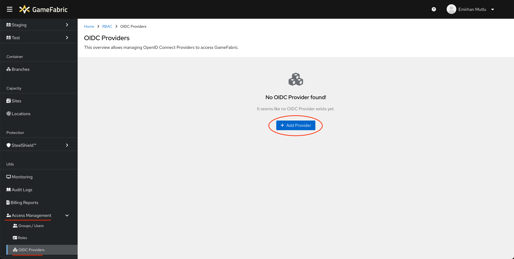
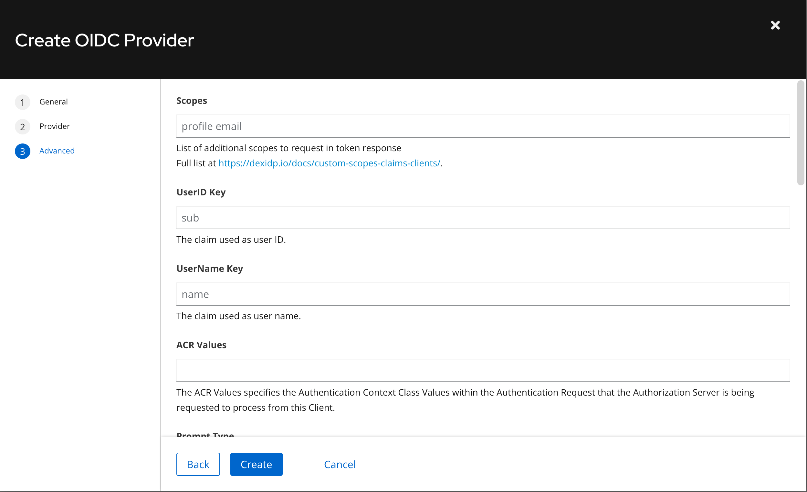
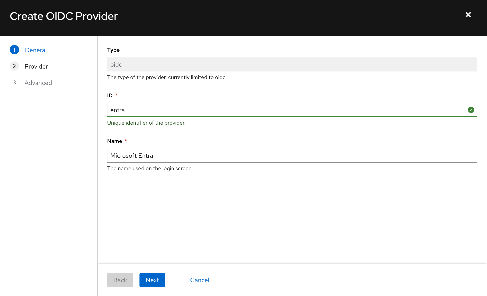
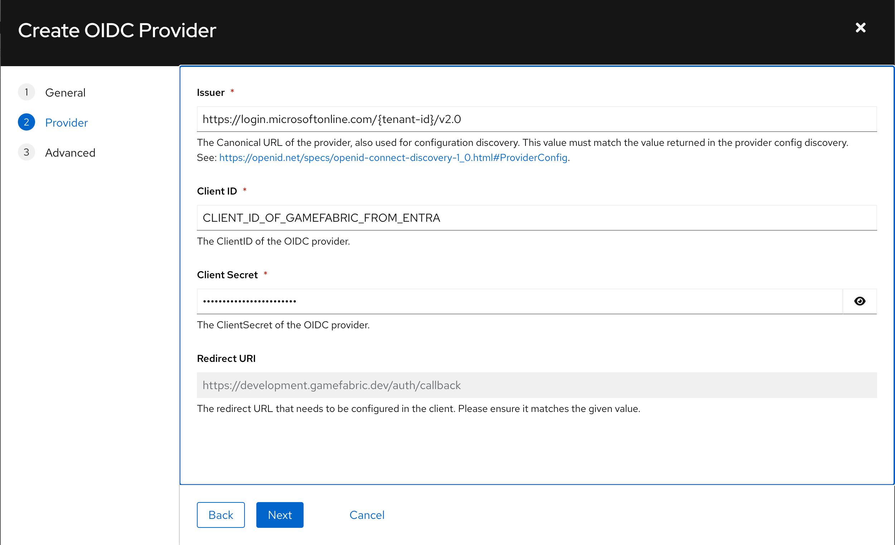

# Setting Up Third-Party OAuth Integration

## Overview

GameFabric supports 3rd party OAuth Integration with every OAuth-compatible Identiy Provider, allowing you to reuse your existing authentication flows, without giving GameFabric access to your sensitive authentication data.

## Prerequisites

Before setting up a third-party OIDC Provider, ensure the following conditions are met:

- You have access to an active GameFabric installation with access through the default user.
- You have an OIDC ([OpenID Connect](https://openid.net/developers/how-connect-works/)) provider, including a **Client ID** and **Client Secret**.

## Setting up a new OIDC Provider

### Step 1: Add a New Provider

1. Navigate to the OIDC Providers page (From Sidebar -> Access Management -> OIDC Providers).
2. Click **Add Provider**.

3. Enter a desired **Display ID** and **Display Name** for your new provider.

### Step 2: Configure Issuer and Credentials

1. Specify the **Issuer URL** of your OIDC provider.
2. Enter the **Client ID** and **Client Secret** issued by the provider.

### Step 3: Advanced Details

#### Define Claim Configurations

1. Configure the claims to request from the OIDC provider using the **Scopes** text input.

 Common scopes include:

| Scope         | Description                                                               |
|---------------|---------------------------------------------------------------------------|
| openid        | Required for OpenID Connect; requests and ID token                        |
| email         | Requests the user's email address                                         |
| profile       | Requests additional user profile information, such as name and picture    |
| groups        | Requests group membership claims (if supported by the identity provider)  |
| custom scopes | Applications or APIs can define their own scopes for specific permissions |

2. Define the following mappings:
   - **UserID Key**: Maps the OIDC provider’s claim to the **User ID** in GameFabric (default: `sub`).
   - **UserName Key**: Maps the OIDC provider’s claim to the **UserName** in GameFabric (default: `name`).

3. Specify the **Prompt** parameter to control user interaction during authentication. The default value is `consent`. Available prompt options include:

| Prompt         | Description                                                                                                        |
|----------------|--------------------------------------------------------------------------------------------------------------------|
| none           | Ensures **no user interaction** occurs. If the user is not already authenticated, the request fails with an error. |
| login          | Forces the user to **re-authenticate**, even if they are already logged in.                                        |
| consent        | Forces the identity provider to show a consent screen, even if the user has already granted consent.               |
| select_account | Prompts the user to choose an account if they are logged in with multiple accounts.                                |

#### Claim Mapping

Some OIDC providers return non-standard claims. Use the **Claim Mapping** section to align these with standardized claims in GameFabric.

Some of the non-standard claims, and how would they map to GameFabric claims:

| Non-standard Claim  | Corresponding GameFabric Claim | Description                                                                    |
|---------------------|--------------------------------|--------------------------------------------------------------------------------|
| login_name          | preferred_username             | The username used for login purposes, which might differ from the display name |
| alias               | preferred_username             | An alternative username or alias for the user                                  |
| normalized_username | preferred_username             | Lowercased username                                                            |
| secondary_email     | email                          | Secondary email, that might be wished to map to the principal "email"          |

#### Provider Discovery Override

GameFabric performs a preparatory request to the OIDC Provider to fetch required configuration details. If necessary, override the default values for:

- **Token URL**
- **Auth URL**
- **JWKs URL**

This customization ensures compatibility with providers returning non-standard discovery responses.

## Examples

### Microsoft ENTRA

#### Prerequisites

Before configuring ENTRA as a new OIDC Provider on GameFabric, it's required to ensure that GameFabric is configured as an application on ENTRA.

About further information on how to accomplish this, please refer to: https://learn.microsoft.com/en-us/entra/identity/enterprise-apps/add-application-portal

#### Add ENTRA as a provider

On "Create OIDC Provider" page, fill in ID and Name for Entra:

On the next step:

- Fill in the "Issuer URL" of ENTRA

  For ENTRA this is "https://login.microsoftonline.com/{tenant-id}/v2.0" 

- Fill in the ClientID & Secret you have obtained from ENTRA for GameFabric

  Client ID & Secret should be presented to you by ENTRA when GameFabric is configured as an Application on ENTRA following the steps mentioned in prerequisites

### Advanced Details

Third Step (Advanced) is up to preference with ENTRA, since it already sends expected claims.

