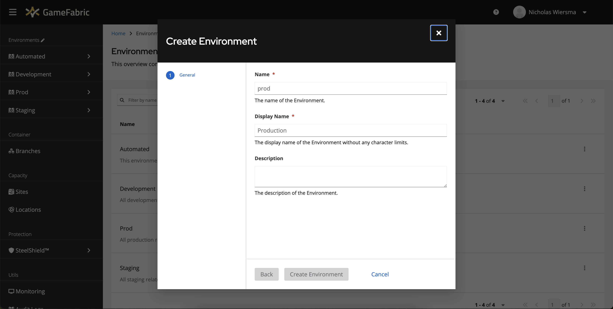

# Setup your Environment

In this section, you will learn how to setup an Environment and a Region in that Environment.

::: tip Key Concepts
Before proceeding, review the [Glossary](/multiplayer-servers/getting-started/glossary) to understand key concepts like Environments, Regions, Locations, and Sites.
:::

## Prerequisites

In order to follow this guide, make sure you have credentials to access your GameFabric UI with permissions to create Environments and Regions.

Log into the GameFabric UI before proceeding.

::: tip Next steps
After setting up your environment and region, you'll need to:

1. [Authenticate and create a service account](/multiplayer-servers/getting-started/authentication)
2. [Build and push your container image](/multiplayer-servers/getting-started/building-a-container-image)
3. [Deploy your game servers](/multiplayer-servers/getting-started/running-your-game-server)
:::

## Create an Environment

Environments are a mechanism for isolating groups of resources.
They can therefore be used to separate production, staging, testing, and any other environments and ensure that they don't interfere with each other.

First, visit the "Environments" section of the UI by clicking the pencil next to Environments in the sidebar menu.

Create a new Environment by clicking the "Create Environment" button.

The name of the Environment uniquely identifies it and is restricted to a maximum of 4 letters (see [Quotas](../multiplayer-services/quotas.md#environment-name-length) for details).
Common names are "prod", "stge" and "dev".
The display name is the human-readable name, and the description optionally notes the uses of the Environment.
Click the "Create Environment" when the form is filled out.

Once the Environment is created, it appears in the list, and in the menu.

## Create a Region

Regions group Locations where resources are hosted, typically geographically.

First, visit the "Regions" section in the Environment you wish to create a Region in.

Create a new Region by clicking the "Create Region" button.

Give it a name that makes its purpose explicit and a display name to match, then click the "Next" button.

Types prioritize how game servers are distributed across the Locations of the Region.
For instance, to prioritize Nitrado hosting capacity over more expensive cloud hosting capacity.
Each Type can also contain Environment Variables that are set on all game servers.

Give the Type a name and priority (lower priorities come first) and select the Locations for that type.
Optionally, set any Environment Variables to add to game servers deployed to the selected Locations.

Click "Create Region" to finish creating the Region. The Region can now be used to deploy your game servers.
