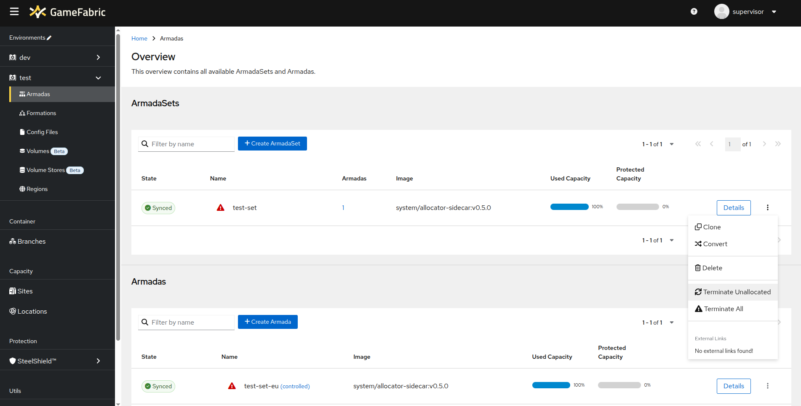
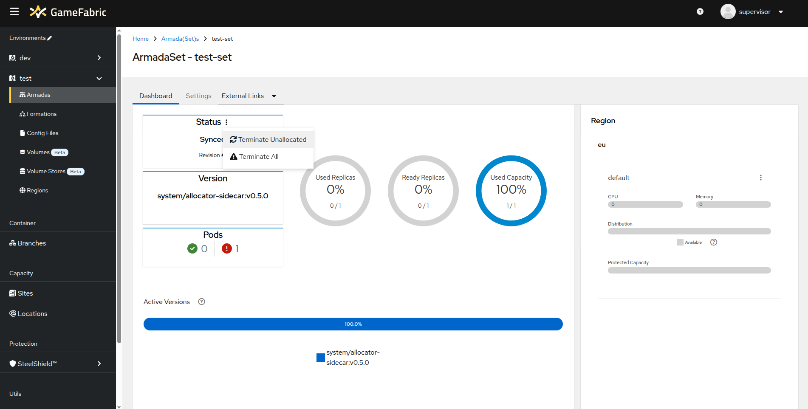
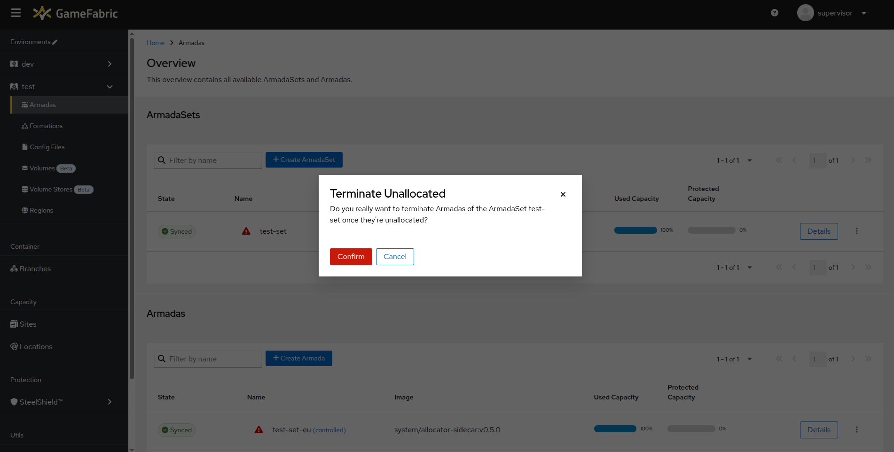

# Terminating ArmadaSets

## Overview

GameFabric allows you to gracefully or forcefully terminate ArmadaSets.

::: tip Understanding ArmadaSets
For more information about ArmadaSets and how they work, see the [Glossary](/multiplayer-servers/getting-started/glossary#armadaset) and [Hosting Models](/multiplayer-servers/architecture/identifying-your-hosting-model#armadas).
:::

The GameFabric UI offers two options:

* **Terminate Unallocated**
* **Terminate All**

These options are available in the Armada Overview:

As well as in the respective details view:

When you click the **Terminate** button, a pop-up appears asking you to confirm the termination:

::: info
Please note that terminating an ArmadaSet does not delete it. It only terminates running game servers in the ArmadaSet.
The Armada System then automatically restarts everything implicitly once it detects the discrepancy between the existing capacity and the expected capacity.
:::

## Terminate unallocated

The **Terminate Unallocated** option performs a **graceful** termination of all game servers in the ArmadaSet that are not currently allocated.
This means that any game servers actively being played on remain untouched, while those not in use are restarted.

For more information about how allocation is tracked, see the [Using the Agones SDK](using-the-agones-sdk.md) section.

## Terminate all

The **Terminate All** option performs a **forceful** termination of all game servers in the ArmadaSet, regardless of whether they are allocated or not.
This means that all running game servers are restarted, even if they are actively in use by players.
