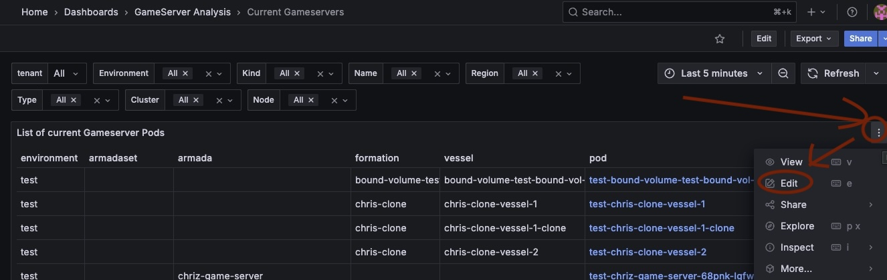
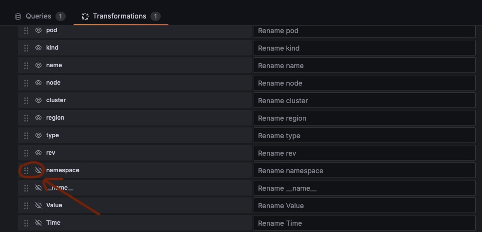
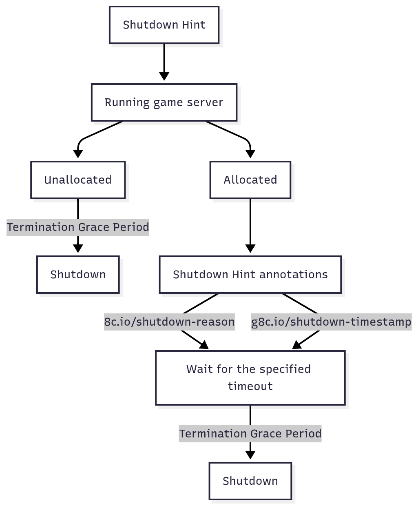

# Terminating game servers

## Armadas

### Summary

If the game server is not [integrated properly](./using-the-agones-sdk.md) or if bugs or other issues occur, it may lead to a situation where a manual shutdown is required. This part of the document describes the process.

### Requirements

To manually shut down a game server, you must know its Site name, and Pod name.

### How & where

#### Via GameFabric UI

The GameFabric panel offers a direct interface for managing game servers. Navigate to the "Armadas" section. In the list of game server deployments, locate the desired instance. Click on the three vertical dots positioned just after the "Details" button for that specific game server. From the dropdown menu, select the "Terminate game server" option. Enter the Site Name and Pod Name of the game server to terminate.

#### Via GameFabric API
This endpoint allows for the termination of a specific game server instance within a given site. The `{ns}` placeholder represents the site name, and `{name}` represents the unique identifier of the game server to be terminated. Successful execution removes the specified game server from active deployment.

`DELETE /api/core/v1/sites/{ns}/gameservers/{name}`

### Identifying the Site and Pod name

Determining the specific Pod name for termination requires checking pods that are actively running. Unlike the static site name, Pod names are generated dynamically and can change.

There are multiple ways to determine the Pod's name, but the following sections describe the simplest one.

#### Using Grafana

This method uses the GameFabric monitoring system.

The monitoring service (Grafana) is accessible via the GameFabric installation, located at the `/monitoring` path.

Within the "GameServer Analysis" section, under "Current Gameservers," users can find detailed information about active game server instances.
This interface displays the Pod name along with other relevant operational data.
The name of the site is a concatenation of cluster and namespace.

Example:

- cluster name: ni-dev-defra-gcp02
- namespace: testing
- site name: ni-dev-defra-gcp02-testing

The namespace is not visible by default, it has to be enabled manually, as shown below.

First, edit the panel by clicking on the title and selecting "Edit".

Then, in the "Transform" tab, add a new "Organize fields" transformation.

Finally, enable the "namespace" field to be displayed.

## Vessels

To perform maintenance on long-running vessels without interfering with active game servers, the game server should respond to shutdown hints provided via annotations.

### Allocated vessels

If shutdown or restart is required for an already allocated Vessel, the following two annotations are added to each affected Vessel:

`g8c.io/shutdown-reason` with one of the following reasons:

* `UserInitiated` (e.g. restart/shutdown request via the GameFabric UI)
* `SpecChange`    (e.g. changes to vessel or region configuration)
* `Maintenance`   (e.g. request from SRE to perform maintenance on a node)

and

`g8c.io/shutdown-timestamp` with a timestamp in the [RFC-3339 format](https://datatracker.ietf.org/doc/html/rfc3339) (e.g. "2006-01-02T15:04:05Z07:00").

Timestamps are set to the current time, plus the time configured for each reason via: `Settings`->`Advanced`->`Shutdown Notification`.

::: info Multiple shutdown reasons
* The annotations are set once and never updated
* They disappear with the shutdown of the game server

If there is a `SpecChange` with a higher wait period than a following `UserInitiated` shutdown, GameFabric still waits the full `SpecChange period` before shutting the server down.

It can however be shutdown early by the game server itself responding to the annotations or leaving `Allocated` after all players left.
:::

### Non-allocated vessels

Non-allocated Vessels are shut down immediately, in accordance with the `Termination Grace Period` (under `Settings`->`Advanced`).

### Diagram

