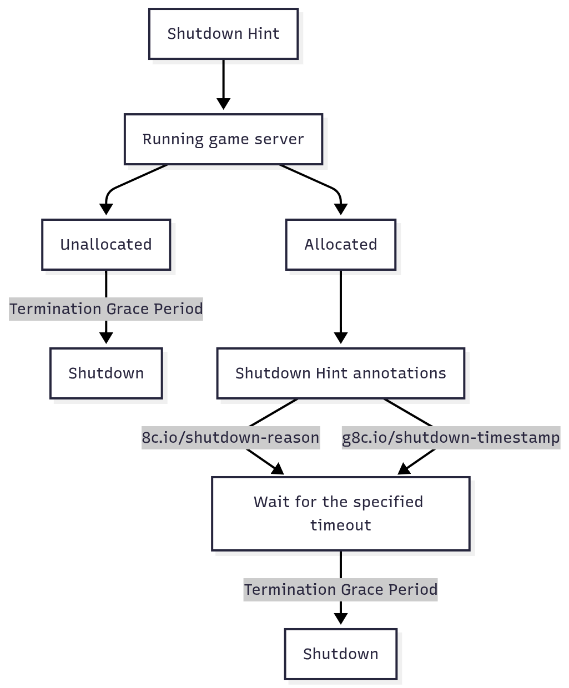

# Terminating game servers

## Armadas

### Summary

If the game server is not [integrated properly](/multiplayer-servers/integration/your-game-server) or if bugs or other issues occur, it may lead to a situation where a manual shutdown is required. This part of the document describes the process.

### Requirements

To manually shut down a game server, you must know its Site name, and pod name.

### How & where

#### Via GameFabric UI

The GameFabric panel offers a direct interface for managing game servers. Navigate to the "Armadas" section. In the list of game server deployments, locate the desired instance. Click on the three vertical dots positioned just after the "Details" button for that specific game server. From the dropdown menu, select the "Terminate game server" option. Enter the Site Name and pod Name of the game server to terminate.****

#### Via GameFabric API
This endpoint allows for the termination of a specific game server instance within a given site. The `{ns}` placeholder represents the site name, and `{name}` represents the unique identifier of the game server to be terminated. Successful execution removes the specified game server from active deployment.

`DELETE /api/core/v1/sites/{ns}/gameservers/{name}`

### Identifying the Site and Pod Name

Determining the specific pod name for termination requires checking pods that are actively running. Unlike the static site name, pod names are generated dynamically and can change.

There are multiple ways to determine the pod's name, but the following sections describe the simplest one.

#### Using Grafana

This method uses Grafana, GameFabric's monitoring system.

Grafana is accessible via the "Monitoring" link in the sidebar of your GameFabric installation or by adding the `/monitoring` path to the hostname of your GameFabric installation.

In Grafana you can find the "Running Gameservers" dashboard in the "GameServer Analysis" folder which offers detailed information about running game servers.
The table panel displays the pod name along with other relevant data for every running game server at that point in time (usually now). You can use the filters at the top of the dashboard to narrow down the list of game servers to find the one you want to terminate. Once you've located the desired game server, copy the pod name from the "pod" column and the site name from the "site" column (you can use the "Copy to Clipboard" button when hovering over the cell and clicking on the eye icon) to paste them into the termination dialogue in the GameFabric UI or your GameFabric API call.

## Vessels

To perform maintenance on long-running vessels without interfering with active game servers, the game server should respond to shutdown hints provided via annotations.

### Allocated vessels

If shutdown or restart is required for an already allocated Vessel, the following two annotations are added to each affected Vessel:

`g8c.io/shutdown-reason` with one of the following reasons:

* `UserInitiated` (e.g. restart/shutdown request via the GameFabric UI)
* `SpecChange`    (e.g. changes to vessel or region configuration)
* `Maintenance`   (e.g. request from SRE to perform maintenance on a node)

and

`g8c.io/shutdown-timestamp` with a timestamp in the [RFC-3339 format](https://datatracker.ietf.org/doc/html/rfc3339) (e.g. "2006-01-02T15:04:05Z07:00").

Timestamps are set to the current time, plus the time configured for each reason via: `Settings`->`Advanced`->`Shutdown Notification`.

Implementation expectation for game servers:

1. Observe `g8c.io/shutdown-timestamp` on the Agones GameServer object.
1. Treat the timestamp as a shutdown deadline and start graceful shutdown handling as soon as it appears.
1. Exit the game server process before the deadline is reached.

To reduce player impact, stop accepting new matches and notify connected players with an in-game countdown until shutdown.

::: info Multiple shutdown reasons
* The annotations are set once and never updated
* They disappear with the shutdown of the game server

If there is a `SpecChange` with a higher wait period than a following `UserInitiated` shutdown, GameFabric still waits the full `SpecChange period` before shutting the server down.

It can however be shutdown early by the game server itself responding to the annotations or leaving `Allocated` after all players left.
:::

### Non-allocated vessels

Non-allocated Vessels are shut down immediately, in accordance with the `Termination Grace Period` (under `Settings`->`Advanced`).

### Diagram

