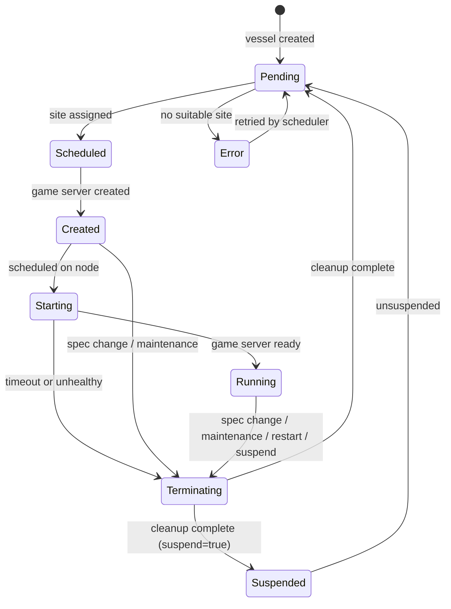

# Vessel states

A vessel's `status.state` field describes where it is in its infrastructure lifecycle. This state is visible in the GameFabric UI, returned by the API, and exposed as a Prometheus metric. Understanding each state helps you diagnose why a vessel is not running or why it is restarting.

::: tip Related reference
For the game server states exposed by the Agones SDK (`Ready`, `Allocated`, and so on), see [Game server lifecycle](/multiplayer-servers/integration/game-server-lifecycle).
:::

## State reference

The following table describes all vessel states.

| State | Meaning | What to expect |
|---|---|---|
| `Pending` | The vessel is not yet assigned to a site. | The scheduler is searching for a suitable site in the requested region. The vessel moves to `Scheduled` once a site is found, or to `Error` if none is available. |
| `Scheduled` | A site has been selected. | The game server resource is being created on the assigned site. The vessel moves to `Created` shortly after. |
| `Created` | The game server resource exists on the site, but has not been placed on a node yet. | Kubernetes is scheduling the game server pod. No action is needed unless this state persists unexpectedly. |
| `Starting` | The game server is initializing on a node but has not yet signaled ready. | The game server process is starting up. If Starting lasts more than 10 minutes, GameFabric automatically reschedules the vessel to a different site. See [Starting timeout](#starting-timeout). |
| `Running` | The game server is ready to accept players or is actively serving them. | This is the healthy steady state. The game server has called `Ready()`, `Allocate()`, or reached an equivalent ready condition. |
| `Terminating` | The game server is being shut down. | GameFabric is waiting for the game server to stop before moving the vessel back to `Pending` (or `Suspended`). Triggers include a spec change, site maintenance, a user-initiated restart, or suspension. |
| `Error` | The scheduler could not place the vessel. | The vessel is automatically retried with rate limiting. Check `status.reason` for the specific cause — the most common value is `"No suitable site found"`, which means no site in the region has enough capacity. |
| `Suspended` | The vessel has been suspended. No game server is running. | The vessel remains in this state until suspension is lifted. When unsuspended, it moves back to `Pending` and the normal startup flow begins again. |

## State transitions

The following diagram shows all possible state transitions for a vessel.

### Normal startup

A freshly created vessel follows this path:

1. `Pending` — scheduler assigns a site.
1. `Scheduled` — game server resource is created on the site.
1. `Created` — game server pod is placed on a node.
1. `Starting` — game server process is running and initializing.
1. `Running` — game server calls `Ready()` and is available for players.

### Restart and reconfiguration

When a spec change is detected, a site is cordoned for maintenance, or a restart is triggered by a user, the vessel enters `Terminating`. GameFabric sends a shutdown hint to the game server and waits for it to exit. Once cleanup is complete, the vessel returns to `Pending` and the startup flow begins again.

### Suspension

Setting `suspend: true` on a vessel causes it to follow the same graceful shutdown path as a restart. Once the game server exits, the vessel moves to `Suspended` instead of `Pending`. Clearing `suspend` returns the vessel to `Pending`.

### Starting timeout

If a vessel stays in `Starting` for more than 10 minutes without the game server signaling ready, GameFabric treats the current site as unsuitable:

1. The game server is deleted (`Terminating`).
1. The site is temporarily excluded from scheduling for this vessel.
1. The vessel returns to `Pending` and is rescheduled to a different site.

If repeated scheduling attempts all fail, the vessel moves to `Error` with a reason visible in `status.reason`.

## The `status.reason` field

When a vessel is in `Error` or `Terminating`, the `status.reason` field provides additional context. Common values include:

- `"No suitable site found"` — the scheduler could not find a site with enough capacity in the region.
- `"SpecChange"` — the vessel spec changed and the game server is being replaced.
- `"Maintenance"` — the site was cordoned or a relocation was required.
- `"UserInitiated"` — a restart was requested manually.

You can read this field from the API or see it displayed in the GameFabric UI next to the state label.

## Related pages

- [Terminating game servers](/multiplayer-servers/getting-started/terminating-game-servers) — how shutdown hints and grace periods work for vessels.
- [Game server lifecycle](/multiplayer-servers/integration/game-server-lifecycle) — the Agones SDK states your game server reports (`Ready`, `Allocated`, `Shutdown`).
- [Vessel (glossary)](/multiplayer-servers/getting-started/glossary#vessel) — definition and context.

