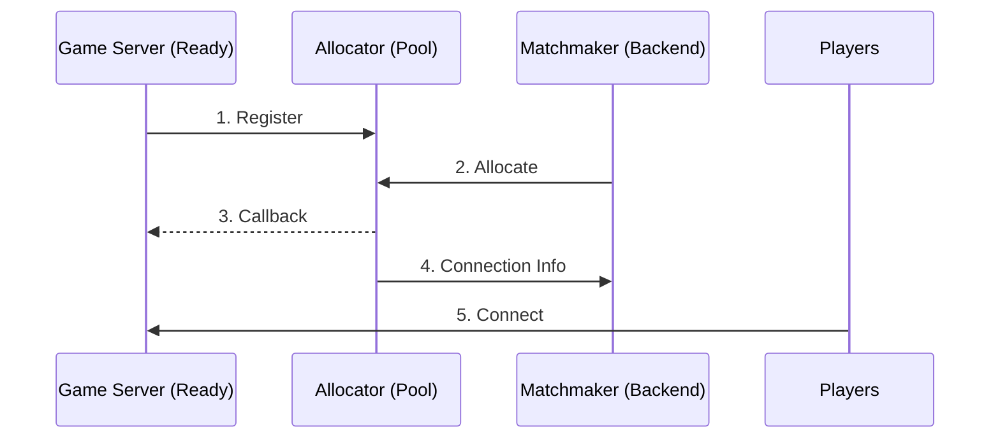

# Server Allocation Overview

This page explains when the GameFabric Allocator is needed and how to choose the right integration approach.

## What is server allocation?

Server allocation is the process of assigning a ready-to-use game server to a group of players.

When using Armadas, GameFabric keeps a pool of game servers running and ready. When your matchmaker
decides a group of players should play together, it asks for one of them. Because the server was
already started, players connect immediately rather than waiting for one to boot.

The service that brokers this is the **Allocator**. For what an Allocator is as a resource, how it
is attached to a Region and the environment variables it injects, see
[Allocators](/multiplayer-servers/concepts/allocators). This page covers when you need one and how
to integrate with it.

::: warning Allocator availability
The Allocator is not included by default with GameFabric. It is a service that must be ordered
separately.
:::

This is different from traditional server hosting where players browse a server list and choose which server to join. For that use case, see [Formations](/multiplayer-servers/concepts/hosting-models#formations).

## When is the Allocator needed?

### Use the Allocator when:

- **The game uses matchmaking** — Players are grouped by a matchmaker (skill-based, casual, ranked) and then assigned to a server
- **Sessions are short-lived** — Matches last minutes to hours, then the server becomes available for the next group
- **Players don't choose their server** — The matchmaker decides which server players connect to
- **Per-match configuration is needed** — Each match requires specific settings (map, mode, player list) passed at allocation time

**Examples:** Battle royales, competitive shooters, multiplayer online battle arenas (MOBAs), party games, quick-play modes.

### Skip the Allocator when:

- **Players browse a server list** — Players choose which server to join based on name, player count, or game mode
- **Servers are persistent** — The same server runs for days/weeks with player progression tied to it
- **Server lifecycle is managed externally** — The backend creates and destroys servers directly via the GameFabric API

**Examples:** Games with persistent worlds, massively multiplayer online (MMO) servers, community-hosted servers, dedicated clan servers.

### Decision guide

The following table summarizes when to use each approach:

| Server selection model                        | Recommended approach                                     |
|-----------------------------------------------|----------------------------------------------------------|
| Matchmaker assigns players to matches         | Armadas + Allocator                                      |
| Server browser / server list                  | Formations (Vessels)                                     |
| Both modes (e.g., ranked + community servers) | Armadas + Allocator for ranked, Formations for community |
| Custom backend managing server lifecycle      | Armadas or Formations without Allocator                  |

## How it works

The allocation flow has five main steps:

1. **Register:** When a game server starts and is ready to accept players, it registers with the Allocator and enters the pool of available servers.
2. **Allocate:** The matchmaker calls the Allocator's `/allocate` endpoint, specifying a region and optional custom payload (match settings, expected players, etc.).
3. **Callback:** The Allocator selects a server and sends a callback notification to it, including any payload from the matchmaker.
4. **Connection Info:** The Allocator returns the server's connection details (IP, port) to the matchmaker.
5. **Connect:** The matchmaker sends the connection info to the players, who connect to the game server.

::: info Authentication tokens
Registration (step 1) and allocation (step 2) use separate authentication tokens. For each Allocator you order, you receive a **Registry Token** for game server registration and an **Allocator Token** for calling `/allocate`. See [ALLOC_TOKEN](automatically-registering-game-servers#alloc_token-string) for details.
:::

After the match ends, the game server shuts down, and the Armada automatically starts a new server to replace it in the pool.

## Choosing an integration approach

GameFabric offers two ways to integrate with the Allocator, plus an option when you do not use the Allocator.

Start from this table, then read the section that matches your answer.

| If | Choose |
|---|---|
| Your game server uses the Agones SDK and registration is standard | The allocation sidecar |
| You cannot add a sidecar container, or need custom registration logic | Manual integration |
| Your backend already tracks server state and picks servers itself | No Allocator |

The sidecar is the default choice. Manual integration means owning retries, race conditions and
error recovery yourself, which is real work that the sidecar has already done.

### Allocation sidecar (recommended)

The **Allocation Sidecar** is a container provided by GameFabric that runs alongside the game server. It handles registration, keep-alive, and allocation callbacks automatically.

**This option is ideal for:**

- Simple integration requirements
- Game servers using the Agones SDK for lifecycle management
- Standard registration workflows without custom logic

**The game server only needs to:**

- Call `agones.Ready()` when ready to accept players
- Watch for the "Allocated" state change
- Read the payload from annotations or a file

See [Automatically Registering Game Servers](automatically-registering-game-servers) for setup instructions.

### Manual integration

With manual integration, the game server code directly communicates with the Allocator's REST API.

**This option is ideal for:**

- Full control over the registration process
- Custom requirements that the sidecar doesn't support
- Integration with an existing server framework

**The game server needs to:**

- Register with the Allocator via HTTP
- Send keep-alive requests periodically
- Handle allocation callbacks on an HTTP endpoint
- Deregister when shutting down

See [Manually Registering Game Servers](manually-registering-game-servers) for implementation details.

::: info
Manual integration requires careful handling of edge cases such as race conditions, retries, and error recovery. Consider using the sidecar approach unless specific requirements demand direct API integration.
:::

### No Allocator

Armadas can be used without the Allocator when the backend manages server selection directly.

**This approach applies when:**

- An existing backend already queries server state
- Custom server selection logic is required
- Migration from another platform with existing allocation code is underway

**The backend needs to:**

- Query Armada state via the GameFabric API
- Select servers based on custom criteria
- Communicate directly with game servers

## What's next?

- [Allocating from Armadas](allocating-from-armadas) — API details for the allocation process
- [Automatically Registering Game Servers](automatically-registering-game-servers) — Sidecar setup guide
- [Manually Registering Game Servers](manually-registering-game-servers) — Code-level integration
- [GameLift integration examples](integration-examples/gamelift)
- [FlexMatch integration examples](integration-examples/flexmatch)
