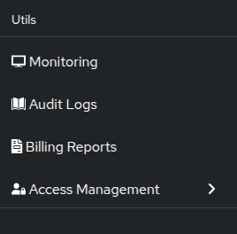

# Audit logs

Audit logs record every action taken in your GameFabric installation, including who made the change, which resource was affected, and whether the operation succeeded. Use audit logs to investigate incidents, satisfy compliance requirements, or track configuration drift.

::: info Data availability
Audit logs may be delayed by a couple of minutes due to collection and processing pipelines.
:::

To access audit logs, click **Audit Logs** in the sidebar.

## Permissions

To access audit logs, a user must belong to a `group` with a `role` that has the `GET` permission for the `logs` resource.
See the [Editing Permissions](/multiplayer-servers/authentication/editing-permissions) guide for more information.

## Filtering and searching

The audit log view provides several ways to narrow results. Use the toolbar to:

- Search by **Entity ID** or **Editor**.
- Filter by **Operation** (`create`, `delete`, `update`, `partial update`), **Environment**, or **Entity type**.
- Select a **time range** with the time range picker.
- Toggle **Include automated** to show or hide events from automated system actors.
- Change the **sort direction** to view oldest or newest events first.

Click any event row to expand it and view the full request and response payload.

## Exporting audit logs

GameFabric can continuously push audit logs to an external S3-compatible storage location. This enables long-term retention and integration with external compliance or analytics tools.

For setup and configuration instructions, see [Audit log exports](/multiplayer-servers/monitoring/audit-log-exports).
