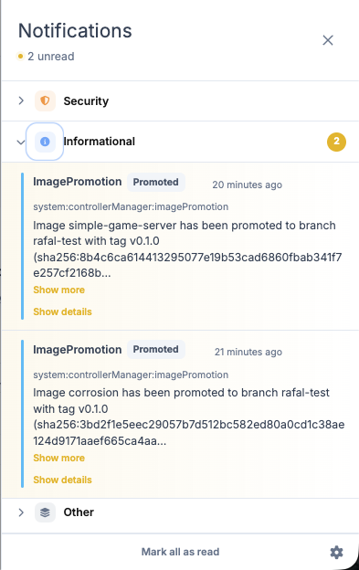
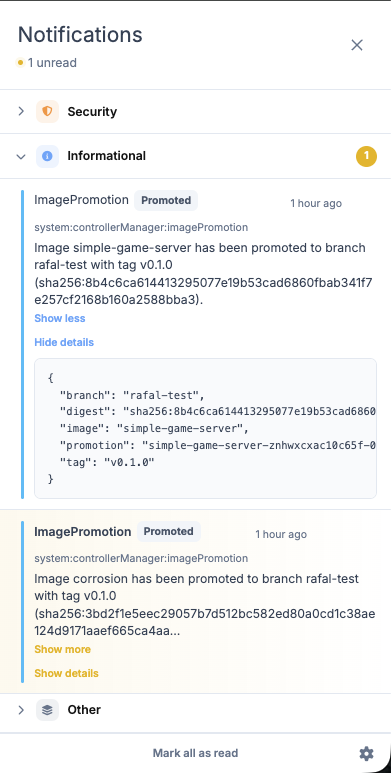
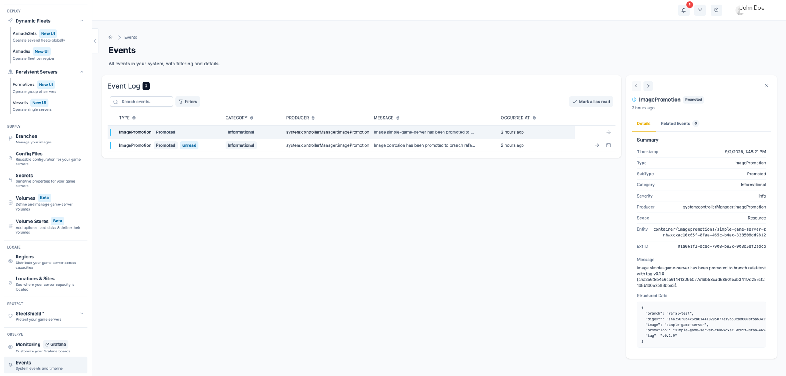

# Events

Events are remarkable situations reported by internal and external producers — such as security detections, infrastructure changes, or integration callbacks.

GameFabric surfaces events in two places:

- **The bell icon** in the top-right corner of every page — a quick-access panel showing recent events
- **The Events page** — a fully searchable and filterable log, accessible from the sidebar

## Permissions

To view events, a user must belong to a `group` with a `role` that has at least `GET` permission for the `events` resource in the `event` API group.

::: tip Access control
For more information on managing permissions, see [Editing Permissions](/multiplayer-servers/authentication/editing-permissions).
:::

## Event categories

Events are grouped into three categories:

| Category | Description |
|---|---|
| **Security** | Events related to security detections and threats. |
| **Informational** | General system events such as image promotions or configuration changes. |
| **Other** | Events that do not belong to a known category. Shown as `Unknown` on the Events page. |

## The bell panel

Click the bell icon in the header to open the events panel. Events are grouped by category; click a category header to expand or collapse it.

Each event shows its type, subtype, producer, time, and message. Click **Show more** to read the full message, and **Show details** to expand structured data attached by the producer.

### Marking events as read

Click an event to mark it as read, or click **Mark all as read** in the panel footer to clear all unread markers at once. Unread state is stored in your browser and is not shared with other users.

### In-app toasts

To receive a brief pop-up alert when a new event arrives, open the settings in the panel footer and turn on **Show in-app toasts**. This is off by default.

## The Events page

The Events page provides a fully searchable and filterable log of all events in your system. Open it by clicking **Events** in the sidebar.

Use the search box to filter across **Producer**, **Type**, **SubType**, and **Message** simultaneously. Use the filter dropdowns to narrow by **Category**, **Severity**, or **Producer**.

Click any row to open the detail panel, which shows the full event breakdown including Scope, Entity, Ext ID, and Structured Data. Use the navigation arrows to step through events without closing the panel.

Click **Related Events** in the detail panel to see a timeline of all events sharing the same external ID — useful for tracing a sequence such as a DDoS detection followed by mitigation start and end.
