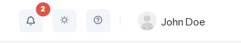

# Notifications

The bell icon in the top-right corner of every page provides quick access to your most recent events — remarkable situations reported by internal and external producers such as security detections, infrastructure changes, or integration callbacks. A red badge shows the count of unread events.

Click the bell to open the Notifications panel. The header shows the total number of unread events, or **No unread notifications** when everything has been read.

## Permissions

To view notifications, a user must belong to a `group` with a `role` that has at least `GET` permission for the `events` resource in the `event` API group.

::: tip Access control
For more information on managing permissions, see [Editing Permissions](/multiplayer-servers/authentication/editing-permissions).
:::

## Event groups

Events are grouped into three fixed categories displayed as an accordion. One category is open at a time; click a category header to expand or collapse it.

| Category | Description |
|---|---|
| **Security** | Events related to security detections and threats. |
| **Informational** | General system events such as image promotions or configuration changes. |
| **Other** | Events that do not belong to a known category. Shown as `Unknown` on the Events page. |

A badge on the category header shows the count of unread events in that group. When there are no unread events, the badge shows the total count instead.

## Reading a notification

Each notification shows:

- **Title** — the event type, with a subtype badge alongside it when present
- **Time** — how long ago the event occurred; hover to see the exact timestamp
- **Producer** — the system that reported the event
- **Message** — the event message, truncated at 140 characters

Click **Show more** to reveal the full message; click **Show less** to collapse it again.

If the producer attached structured data, a **Show details** link appears below the message. Click it to expand a JSON block inline; click **Hide details** to collapse it.

Unread notifications have a highlighted background and bold title.

## Marking as read

Click any unread notification to mark it as read. To mark a single item without opening it, click the envelope button.

To clear all unread markers at once, click **Mark all as read** in the panel footer.

Unread state is stored locally in your browser and is not shared with other users.

## Viewing on the Events page

To open a notification's full detail and see related events, hover over the notification and click the arrow icon. This navigates to the Events page with the Related Events tab open for that event.

The Events page provides a fully searchable and filterable log of all events in your system.

The Event Log table lists all events sorted newest first.

| Column | Description |
|---|---|
| *(severity bar)* | Color-coded severity indicator: blue for Info, red for Critical. |
| **Type** | The event type, specific to the producer. A SubType tag appears alongside it when present. An **unread** tag marks events you have not viewed yet. |
| **Category** | Groups similar events: `Security`, `Informational`, or `Unknown`. |
| **Producer** | The system or integration that reported the event. |
| **Message** | A short human-readable description of the event. |
| **Occurred At** | How long ago the event occurred; hover to see the exact timestamp. |

Use the search box to filter across **Producer**, **Type**, **SubType**, and **Message** simultaneously. Use the filter dropdowns to narrow by **Category**, **Severity**, or **Producer**.

Click any row to open the detail panel on the right, which shows the full event breakdown including Scope, Entity, Ext ID, and Structured Data. Use the **◀ ▶** arrows to step through events without closing the panel.

Click **Related Events** in the detail panel to see a timeline of all events sharing the same external ID — useful for tracing a sequence such as a DDoS detection followed by mitigation start and end.

## In-app toasts

By default, new events do not trigger pop-up alerts. To enable brief toast notifications for incoming events, click the **settings** icon (cog) in the panel footer and turn on **Show in-app toasts**.
