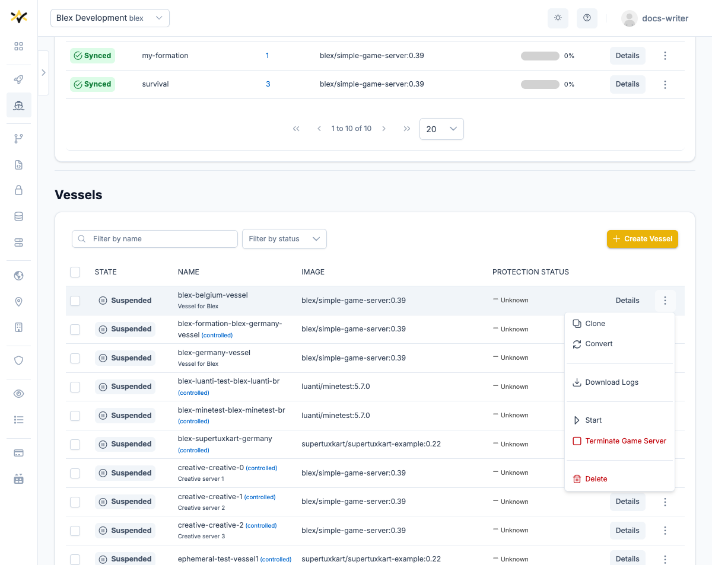
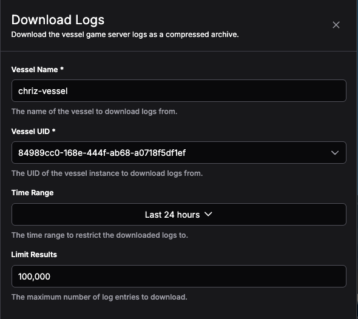

# Game server logs

GameFabric lets you download game server logs as a compressed archive.
Logs are retrieved from the platform's log aggregation service and delivered as a `.log.gz` file directly to your browser. GameFabric provides them for Vessels and Armadas and they are slightly different to retrieve.

## Vessel logs

Because a Vessel can be restarted over its lifetime, logs are scoped to a specific **instance** identified by a UID.
The download drawer lets you select which instance to download from, including previous ones.

To open the log download drawer, navigate to **Persistent Servers → Vessels**, open the row menu (⋮) for the Vessel you are interested in, and select **Download Logs**.



The drawer opens with the Vessel Name and UID pre-filled from the Vessel you selected. You can adjust the UID to target a previous instance, and optionally narrow the results by time range or entry count.



### Permissions

To download Vessel logs, a user must belong to a `group` with a `role` that has at least `GET` permission for the `vessels/log` resource in the `formation` API group.

::: tip Access Control
For more information on managing permissions, see [Editing Permissions](/multiplayer-servers/getting-started/editing-permissions).
:::

### Form fields

| Field | Required | Description |
|---|---|---|
| **Vessel Name** | Yes | Pre-filled with the name of the Vessel you selected. |
| **Vessel UID** | Yes | Pre-filled with the UID of the Vessel's currently running instance. Use the dropdown to select a different (e.g. previous) instance. |
| **Time Range** | No | Restricts logs to a specific time window. Supports up to 30 days of history. Leave empty to include all available logs for the selected instance. |
| **Limit Results** | No | Maximum number of log entries to download. Defaults to 100,000. |

### Downloading logs from a previous instance

Each time a Vessel restarts it is assigned a new pod UID, and logs from the previous run are retained under the old pod UID.

To download logs from a previous Vessel instance:

1. Open the **Vessel UID** dropdown in the drawer.
2. Select the UID of the instance you want.

The available list of instance UIDs to pick from is populated automatically when the drawer opens. If the list cannot be loaded, the dropdown falls back to the current instance's UID.

If no UIDs appear in the dropdown, the Vessel likely has no logs yet. If you know the UID you want, you can type it directly into the field.

### Downloading

Click **Download**. Once the request completes, your browser saves the file as `<vessel-name>.log.gz`.

If there are no logs an empty file is downloaded.

## Armada logs

Navigate to **Dynamic Fleets → Armadas**, open the row menu (⋮) for the Armada you are interested in, and select **Download Logs**.

Armadas can run many game server pods simultaneously, so you must provide the name of the specific pod you want logs from. The UI does not list available pods, so you need to [find the pod name](#finding-a-pod-name) yourself.

### Permissions

To download Armada logs, a user must belong to a `group` with a `role` that has at least `GET` permission for the `armadas/log` resource in the `armada` API group.

::: tip Access Control
For more information on managing permissions, see [Editing Permissions](/multiplayer-servers/getting-started/editing-permissions).
:::

### Form fields

| Field | Required | Description |
|---|---|---|
| **Armada Name** | Yes | Pre-filled with the name of the Armada you selected. You can edit it to download logs from a different Armada without reopening the drawer. |
| **Pod Name** | Yes | The name of the game server pod whose logs you want. Must be obtained outside the UI — see [Finding a pod name](#finding-a-pod-name) below. |
| **Time Range** | No | Restricts logs to a specific time window. Supports up to 30 days of history. Leave empty to include all available logs. |
| **Limit Results** | No | Maximum number of log entries to download. Defaults to 100,000. |

### Finding a pod name

An Armada can run thousands of game server pods simultaneously, and the GameFabric UI does not list individual pod names. You need to obtain the pod name from outside the UI. Common sources include:

- **Your game server process** — configure your Armada or Vessel to inject the pod name into the container at runtime using `valueFrom.fieldRef`. Your game server can then log or expose this value on startup so your operations team can retrieve it when needed.
- **Your matchmaker or allocation system** — if your matchmaker records which pod handled a session, the pod name will be in those records.

#### Injecting the pod name via fieldRef

Add the following to the `env` array of the container in your Armada or Vessel spec:

```json
{
  "name": "POD_NAME",
  "valueFrom": {
    "fieldRef": {
      "fieldPath": "metadata.name"
    }
  }
}
```

At runtime, `POD_NAME` contains the full pod name (e.g. `my-armada-site-abc123-xyz`). The `fieldRef` mechanism also exposes other useful fields, including `metadata.armadaName`, `metadata.regionName`, `metadata.siteName`, `metadata.imageName`, and `metadata.imageTag`.

