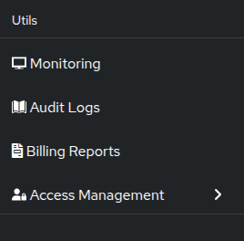

# Monitoring & Logs

Each GameFabric installation comes with its own dedicated monitoring solution.
This setup includes a personal Grafana installation.
This Grafana instance provides visibility into the systems performance and operations.
The Grafana dashboard allows you to monitor all metrics generated by the platform and related services and provides access to all your game server logs from one central location.

::: info Data Availability
Logs and metrics may be delayed by up to 2 minutes due to collection and processing pipelines.
:::

To access it, click on "Monitoring".

::: tip Using Monitoring
The monitoring dashboards are especially useful for:

- Tracking [CCU (Concurrent Users)](/multiplayer-servers/getting-started/using-the-agones-sdk#player-count-and-capacity-tracking)
- Optimizing [resource requests](/multiplayer-servers/multiplayer-services/resource-management) based on actual usage
- Viewing game server logs for debugging
:::

## Permissions

To access monitoring, a user must belong to a `group` with a `role` that has at least `GET` permission for the `monitoring` resource.

Users with `POST` permission can create custom dashboards and alerts.

::: tip Access Control
For more information on managing permissions, see [Editing Permissions](/multiplayer-servers/getting-started/editing-permissions).
:::

## Metrics

There are metrics for every feature of the product.
There are a lot of predefined dashboards under "Dashboards".

## Logs

Everything that the game server prints to either `stdout` or `stderr` is automatically collected.

::: info Logging Quotas
Logging is limited to *100 lines per second per game server with a 500 lines burst size* and
globally to *10 megabytes per second with a 50 megabyte burst size*.
If you require different limits, contact GameFabric support.
:::
