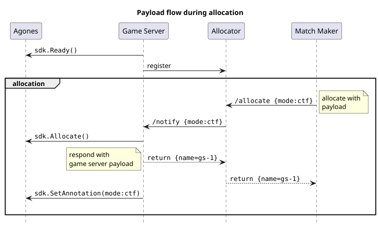

# Allocating from Armadas

Allocation requests are typically performed by a Matchmaker.

Before a game server can be allocated, it first needs to be entered into the pool of currently available game servers.
This registration process can be performed [from within your game server code](manually-registering-game-servers.md) or through a [sidecar](automatically-registering-game-servers.md) provided by Nitrado.

In order for the server to then get allocated, a `POST` request must be sent to the Allocator service, on its
[`/allocate`](/api/multiplayer-servers/allocation-allocator.html#tag/Allocator) endpoint.

The `region` to allocate from is a mandatory parameter. The request can also include a set of additional `attributes`
that the game server needs to have, as defined during its registration. Optionally, you may specify a `payload`
to be sent to the game server as part of the allocation callback.

Then, when the Allocator picks your game server, it notifies the game server by sending an HTTP query to the allocation callback
endpoint. Similar to the registration process, this callback is either handled by the sidecar or directly within the
game server software. The callback itself is authenticated via a token in the `Authorization` header that was passed by
the game server during its registration process.

Any `payload` given to the `/allocate` call is forwarded to the game server as part of the callback request body.
If the callback endpoint returns a JSON response body, it gets embedded under the `payload` field in the response
to the `/allocate` call. This is especially useful to transmit identifiers that are important for matching telemetry,
such as host names.

In addition to this custom data, the response to `/allocate` also includes the `token` that was used for
authentication towards the callback endpoint. This establishes a common identifier for the allocation between the
game server and the matchmaker, and may be used to authorize players connecting to the server.

If the Allocator does not receive a response to the callback within an appropriate timespan, it retries the
process with another game server in the pool.
