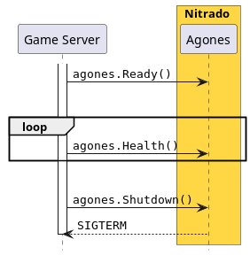

# Automatically Registering Game Servers

This guide describes how to enable and configure the automatic game server registration and the associated
allocation handling. The goal is to enable your matchmaker to select game servers using Nitrado Allocator.

## Pre-requisites



Your game server needs to support a minimal Agones SDK integration:

- Send `Health` reports regularly,
- Transitions into state `Ready` when ready,
- Transitions into state `Shutdown` when done.

Please check [Using the Agones SDK](../../getting-started/using-the-agones-sdk) 
for details.

<br style="clear:right"/>

## Automatic Registration

When a matchmaker requests a game server from the allocation service, the game server must not only be `Ready`, 
it must also be registered with the allocation service.
The transition to the ready state can only be determined by the game server itself, 
whereas the registration can be automated. 
The respective component is called Allocation Sidecar or Allocator Sidecar. 
The service waits for the game server to become `Ready` and then registers it with the allocation service.
It also ensures that when the game server stops that its registration gets removed.

It is not enabled by default.
For details how to enable it, see section [Configuration](#configuration).

The allocation service is usually pre-configured and connects your Formation, Vessel, Armada Set
or Armada with an allocation service within the same region where it is deployed.
This means that your game servers are automatically registered in the correct region and 
will be selected for matches of the respective region.

## Allocation

When the matchmaker requests a game server from the allocation service, the allocation service notifies the game server
about the imminent allocation. This callback has several advantages:

- The game server status is automatically set to `Allocated` which protects the game server from being shutdown by Agones.
  A game server can be shutdown for various reasons, such as downscaling of the cluster, assumed unhealthiness, excess of the
  configured lifetime etc.

- The callback can pass payloads from your matchmaker to your game server, e.g. the expected player IDs,
  desired game mode etc.
  For details on how to pass a payload see [API Specs - Allocation: Allocator](../../../api/multiplayer-servers/allocation-allocator.md).

## Attributes

Attributes are a way to filter game servers during the allocation process.
Each attribute consists of a unique key and a value.
If your matchmaker requests a game server for allocation, it can pass attributes. 
Only game servers, where the passed attributes are a sub-set of their own attributes, are selected for allocation.

::: info
Passing no attributes for allocation matches every game server,
as the empty set of attributes is always a sub-set of any other attributes. 
To gain more control over filtering you can configure [required game server attributes](#alloc-required-attrs-string).
:::

## Configuration

To enable the automatic game server registration and allocation handling, edit your Formation, Vessel, Armada Set or Armada, 
and add a sidecar container. Select **Allocation Sidecar**, so that your new sidecar container is preconfigured.
As stated earlier, the allocation service is pre-configured.

If you want to create the sidecar container from scratch select **Create from scratch**. 
It requires you to select the image, which is provided under the `system` branch, 
and a `Passthrough` port, using `TCP` protocol, named `allocator`.
This is so that the allocation service can reach the Allocation Sidecar.

::: warning
The port name `allocator` must not be changed, otherwise it is not recognized by the Allocation Sidecar.
Also do not use `UDP/TCP`, as this results in a different naming scheme.
:::

**Optional**: If you want use [attributes](#attributes), add one or more label prefixed with `allocator.nitrado.net/`, e.g.
`allocator.nitrado.net/env=prod` so your matchmaker can filter for them.

That's it. The Allocation Sidecar watches for the state change `Ready`, registers the game server to the pre-configured
allocation service, and when allocated, transitions the state to `Allocated`.

## Game Server Integration

With the registration and allocation handling automated, 
your game server needs to be extended to support watching for the `Allocated` state change.

Example code:

```go
_ = agones.WatchGameServer(func (gs *sdk.GameServer) {
	if gs.State != "Allocated" {
		return
	}
	
	// ..
})
```

See [Agones Game Server Client SDKs](https://agones.dev/site/docs/guides/client-sdks/) 
for language or game engine specific implementation details.

Payloads can be sent to your game server via either annotations or a file. 
They can allow you to specify any kind of information to the allocated game server, such as player IDs, game modes and so on.
If payloads are irrelevant to you, ignore the sections below.

### Write payload to annotations

In order to automatically store the payload from the matchmaker and make it accessible via game server annotations,
[add the environment variable `ALLOC_PAYLOAD_ANNOTATION`](#alloc-payload-annotation-string) to the Allocation Sidecar container.
This enables and specifies the annotation prefixes used to store the annotations.

Each payload key generates one annotation, which is prefixed by Agones and with your chosen key.
To access the annotations extend your existing watch of the state change:

```go
const (
	agonesPrefix = "agones.dev/sdk-"
	customPrefix = "payload-" // ALLOC_PAYLOAD_ANNOTATION
)

_ = agones.WatchGameServer(func (gs *sdk.GameServer) {
	if gs.State != "Allocated" {
		return
	}
	
	if gs.Annotations == nil { 
		return 
	}
	
	myKey, found := gs.Annotations[agonesPrefix+customPrefix+"key"]
	if !found { 
		return 
	}
	
	// ..
})
```

::: info
Due to a limitation in the Agones SDK, annotations are not applied in a single call. For this reason a 
[configurable annotation `ALLOC_PAYLOAD_ANNOTATION_LAST_APPLIED_NAME`](#alloc_payload_annotation_last_applied_name-stringlast-applied)
is applied last to indicate that all annotations have been applied. Any code needing multiple annotations
should wait for this annotation to be applied before proceeding.
:::

Be advised that the annotation keys are not only prefixed, but sanitized to adhere to certain format and length restrictions
imposed by Kubernetes. The key case is however maintained. See [`ALLOC_PAYLOAD_ANNOTATION`](#alloc-payload-annotation-string) for an example
on how the payload is mapped to annotations.

### Write payload to a file

In order to automatically store the payload from the matchmaker and make it accessible via file,
you need to add environment variables to the Allocation Sidecar container, which runs alongside your game server:

- `ALLOC_PAYLOAD_FILE` – Enables and specifies the file name used to store the payload.
- `ALLOC_PAYLOAD_FILE_TEMPLATE` – [File format template](#templating). Defaults to the JSON representation of your payload.

Both environment variables are also explained with examples in the [Advanced Configuration](#alloc-payload-file-string) section.

::: warning Shared volume required
The newly created file must be accessible to your game server, 
which can only be achieved with a shared volume, mounted into both containers.
This has to be done manually.
:::

### Return a payload to the Allocator

In order to return information about the game server to the process calling `/allocate` 
[add the environment variable `ALLOC_CALLBACK_PAYLOAD_ANNOTATION`](#alloc-callback-payload-annotation-string) on the Allocation Sidecar container.
The Allocation Sidecar will read the annotations of the game server, and those prefixed with the given string will be compiled
into a payload that will be sent to the Allocator when the game server is allocated.

:::info
The annotations must be set on the game server before notifying the Agones SDK that the game server is
ready, otherwise there is no guarantee that the Allocation Sidecar will see all the annotations, and
a partial payload may be sent.
:::

Static payload variables can also be sent by [adding the environment variable `ALLOC_CALLBACK_PAYLOAD_VARS`](#alloc-callback-payload-vars-string) on
the Allocation Sidecar container.

## Advanced Configuration

All environment variables described in this guide must be added to the Allocation Sidecar container, 
not to your game server container.
Any parent resource, such as Region Type or Site can also provide these environment variables, but is usually managed by Nitrado. 

#### `ALLOC_URL` (`string`)

The allocation service endpoint URL. Defaults to a regional allocator pre-configured for you.

#### `ALLOC_TOKEN` (`string`)

The authentication bearer for the allocation service endpoint.

#### `ALLOC_PRIORITY` (`int=0`)

The priority used for the registration. 

#### `ALLOC_NODE_NAME` (`string`)

The node name used to derive the numeric registration score for compaction. 
Can be automatically discovered by using pod field with `spec.nodeName`.

#### `ALLOC_PAYLOAD_ANNOTATION` (`string`)

Stores the payload as annotations.
By setting a non-empty value, stores the payload in game server annotations. 
The used string extends the existing Agones prefix that is used for annotations. 
Setting it to e.g. `payload-` results in the final prefix being `agones.dev/sdk-payload-`.  
Multi-dimensional payload results in concatenated keys using the `.` as separator.  
Mutual exclusive to `ALLOC_PAYLOAD_FILE`.

Here is an example mapping:
```
{
  "key": "value",       // agones.dev/sdk-payload-key
  "my-other-key": [     //
    true,               // agones.dev/sdk-payload-my-other-key.0
    [                   //
      1,                // agones.dev/sdk-payload-my-other-key.1.0
      2                 // agones.dev/sdk-payload-my-other-key.1.1
    ],                  //
    {                   //
      "Sub": "value"    // agones.dev/sdk-payload-my-other-key.2.Sub
    }
  ]
}
```

#### `ALLOC_PAYLOAD_ANNOTATION_LAST_APPLIED_NAME` (`string=last-applied`)

Name of the supplementary, last applied annotation.
This is a helper annotation to indicate that applying the annotations –
which is technically not an atomic operation – has completed.

#### `ALLOC_PAYLOAD_FILE` (`string`)

Writes the payload into the given file.
By setting a non-empty value, stores the payload in the given file.
The parent directory is expected to be a shared volume mount, between the game server container and the Allocation Sidecar. 
The payload is written as JSON into the file, unless a different format is specified in `ALLOC_PAYLOAD_FILE_TEMPLATE`.  
Mutual exclusive to `ALLOC_ANNOTATION`.

#### `ALLOC_PAYLOAD_FILE_MODE` (`string=0660`)

File permissions being used to create the file.

#### `ALLOC_PAYLOAD_FILE_TEMPLATE` (`string`)

Template the content of the file.
Uses [Go Template syntax](https://pkg.go.dev/text/template). 
Expressions are usually surrounded by <span v-pre>`{{`</span> and <span v-pre>`}}`</span>.

Available variables are:
- `.payload` (`map`)
- `.token` (`string`)
- `.env` (`map`)
    
Available functions are:
- `toJSON` (`any`)
- [standard Go Template functions](https://pkg.go.dev/text/template#hdr-Functions)

Example:
```sh
ALLOC_FILE_TEMPLATE={
  "payload": {{ toJSON .payload }},
  "token": "{{ .token }}",
  "allocated": true
}
```

#### `ALLOC_PRIMARY_PORT_NAME` (`string=game`)

The name of the primary game port. The port must be added for the game server container.

#### `ALLOC_CALLBACK_PORT_NAME` (`string=allocator`)

The name of the allocator port. The port must be added for the Allocation Sidecar container.

#### `ALLOC_CALLBACK_PAYLOAD_VARS` (`string`)

A comma seperated list of environment variables to include in the response payload to the Allocator.

#### `ALLOC_CALLBACK_PAYLOAD_ANNOTATION` (`string`)

Uses annotations as the response payload to the Allocator.
By setting a non-empty value, string extends the existing Agones prefix that is used for annotations.
Setting it to e.g. `payload-` results in the final prefix being `agones.dev/sdk-payload-`.  
The annotation keys are split using '.' as a separator to create a complex payload.

Here is an example mapping:

Given the annotations:
```
"agones.dev/sdk-payload-foo.bar.baz": "test",
"agones.dev/sdk-payload-foo.bar.Bat": "test2",
"agones.dev/sdk-payload-key":         "value",
```
and a prefix of `payload-` the following payload will be sent to the allocator:

```
{
  "key": "value",
  "foo": {
    "bar": {
      "baz": "test",
      "Bat": "test2"
    }
  }
}
```

#### `ALLOC_REQUIRED_ATTRS` (`string`)

Sets the required attribute keys that must be provided to the allocation service in order to match the game server. 

When the allocation service is called with attributes, 
it checks if the attributes are a sub-set of what each game server specified.
Providing no attributes in the allocation call matches all game servers.
This is not always desired, so it is possible to specify required game server attributes. 
These keys can be added during the game server registration with `ALLOC_REQUIRED_ATTRS=<string>`.
The value must be the key, e.g. `env`. If you want to require more than one attribute, you can
do so using `,` as a separator.
