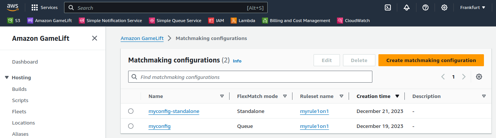
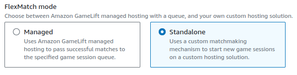
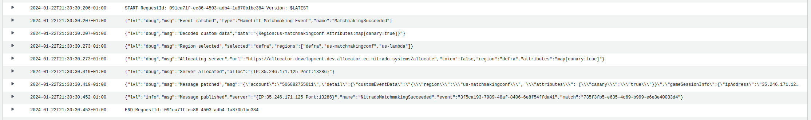

# Amazon GameLift FlexMatch Integration Documentation

## Introduction

This documentation serves as an integration guide for you, as an AWS GameLift customer, seeking to transition from a current
AWS-managed hosting solution to a hosting solution supported by Nitrado, leveraging the Nitrado Allocator.
This transition maintains compatibility with the AWS FlexMatch matchmaker.

Technically the transition is done by switching from the _managed_ to the _standalone_ mode of the matchmaker.
An AWS Lambda function acts as a drop-in replacement for the managed queues, allocating a game server and
attaching the connection information to a newly emitted event.

It is designed for minimal impact on game client and backend services (referred to here as "game service").
This is achieved by acting as if there were no changes at AWS at all, except for name changes,
which should result in configuration or variable adjustments, rather than code and logic changes.

::: tip Related Documentation
- For general allocation guidance, see [Allocating from Armadas](../allocating-from-armadas)
- For the Allocator API specification, see [Allocator API](/api/multiplayer-servers/allocation-allocator)
- For GameLift integration without FlexMatch, see [GameLift Integration](gamelift)
- For understanding hosting models, see [Hosting Models](/multiplayer-servers/hosting-models/identifying-your-hosting-model)
:::

Table of contents:
[[toc]]

## Prerequisites

### AWS Management Console

To manage AWS resources, it is essential to have access to the AWS Management Console.

### AWS FlexMatch with managed hosting

The matchmaking configuration is required to operate in _Queue_ mode, which is the _managed_ hosting solution before
transitioning.

This can be verified by checking the matchmaking configuration:



### Game service

::: info
The documentation summarizes game clients and game backend services as game services, due to the unfamiliarity about
implementation details.
:::

It is expected that the game services connect using `ip:port` rather than `host:port`.

This is relevant as the related event field `detail.gameSessionInfo.dnsName` can not be set using the Nitrado Allocator.

Enabling external hardware with AWS Anywhere Fleets are not subject of this integration.

### Nitrado Allocator

The Nitrado Allocator manages ready-to-play game servers and allows allocating them.
It is expected that your Nitrado contact has provided you access to the installation or installations.
If there are multiple matchmakers running in multiple AWS regions (e.g. Europe and US),
you most likely want one Nitrado Allocator nearby too.
For **each** Nitrado Allocator you need:

- Allocator URL
- Allocator Authentication token
- (optional) Default Nitrado region
- Allocator attributes

The Nitrado Allocator consists of two components, which need a brief introduction, together with a description of regions and attributes:

#### Registry service

The registry service of the Nitrado Allocator accepts game server registrations (on game server startup), keep-alives
(while idling) and de-registrations (on shutdown or when unhealthy).
On registration, a game server must provide its region, attributes, required attribute keys (optional) and priority (has a default).

Priority allows preferring one game server over another with similar configurations.
This can be useful to prefer baremetal over cloud.

#### Allocation service

The allocation service serves game servers that have registered to the registry to matchmakers.
This can be AWS FlexMatch, Googles Open Match or any custom matchmaker, while the focus in this documentation is on AWS FlexMatch.

The allocation request requires a region and attributes so that the allocation service is able to select a game server.

The first hard requirement is to match the requested region against the registered regions.
If registered servers have specified required keys (e.g. `canary`) the presence of these keys in the requested attributes is
enforced.
Additionally, all requested attributes must be a subset of the registered attributes, taking keys and values into account.

This means letting aside regions, a request with no attributes matches all game servers, except those that require certain
attribute keys.

Combined with priority and additional considerations, the allocation service is able to select a game server,
remove the game server from the registry, notify the game server about its allocation (optional), and return the game server to
the matchmaker.

### Fleet management

With the Nitrado Allocator in place, there must be a component that manages game server fleets.
Otherwise, the Nitrado Allocator would not be able to provide ready-to-play game servers.
This is usually done by the GameFabric. The GameFabric manages fleets with scale up and scale down depending on the demand.

### Nitrado Ping Discovery (optional)

To find the fastest game server for a match,
we recommend adding the latency between the client and the various Nitrado regions to matchmaking requests.


[See AWS Documentation on how to add latency to a player's matchmaking request](https://docs.aws.amazon.com/gamelift/latest/apireference/API_Player.html)

The Nitrado Ping Discovery offers ping targets for that matter, as well as various different protocols.

Without adding latency to matchmaking requests, the Nitrado Allocator is called with a default region, which
then serves a game server that may not be the fastest one available for the participants of a match.

The process of selecting a region is integrated into the AWS Lambda function, as detailed in the subsequent explanation.
It determines the region based on the highest frequency of occurrences and the lowest average.

::: warning
AWS game sessions are a managed by the _queue_, which is an important component when using the _managed_ solution.

If your game service relies on game sessions, it might not be possible to migrate.

Please contact us for alternatives.
:::

## Integration

Transitioning from AWS managed hosting involves duplicating all matchmaking configurations and configuring them for
_standalone_ operation instead of _managed_ mode.
To avoid disruptions to existing matchmaking, it is recommended to recreate resources rather than modifying them.
The change eliminates connection information to a new game server from matchmaking events.
To ease the migration effort, an AWS Lambda function is provided in this guide, to add the missing information in events.

### Changes in AWS

The following steps must be repeated on each AWS region and for each matchmaking configuration that you want to migrate.

#### AWS FlexMatch matchmaking configuration

The matchmaking configuration defines the player pool, rules and hosting mode.
It copies an existing configuration, but uses standalone mode and a separate event topic.
This disables Amazon's game server allocation mechanism, and allows you to use ours instead.

These are the necessary steps:

- **Select a matchmaking configuration for migration.**

  ::: info
  _Copy_ is meant to create an exact copy manually, unless there is a Clone or Copy option available.
  :::

- **Copy the AWS SNS topic** that is used by the matchmaking configuration.
  All configuration options should be the same.
  Subscriptions will be added later.

  

  [See AWS documentation how to create a SNS topic](https://docs.aws.amazon.com/sns/latest/dg/sns-create-topic.html)

  ::: info
  It is heavily recommended, unless you are confident you know exactly what you are doing, to create a new SNS topic.
  There can be cases where it is not necessary, such as when the game service applies subscription filter policies or manually
  filters,
  but if in doubt, do create a new topic.
  :::

- Now, **copy the AWS matchmaking configuration**.
  The referenced rule is expected to stay the same, whereas the following modifications are required:

    1. Choose _Standalone_ over _Managed_ for the FlexMatch mode:

       

    2. Choose the newly created SNS topic within the Event Notification Settings.
    3. Add or modify the _Custom Event Data_ within the Event Notification Settings.

       ```json
       {
         "region": "string", // Nitrado Default Region
         "attributes": {
            // Allocator attributes, e.g. "key": "value"
         }
       }
       ```

       The custom event data is attached to each event of matchmaking using this configuration.
       It is expected to be JSON, and must contain the following field values:

       | Field      | Type                | Description                                                                                                                  |
       |------------|---------------------|------------------------------------------------------------------------------------------------------------------------------|
       | `region`     | `string`            | The Nitrado Allocator default region, that is used when there are no player preferences (because they have precedence) |
       | `attributes` | `map[string]string` | The Nitrado Allocator attributes, which impact which game servers to choose.                                                 |

       ::: info
       If the custom event data is already used, the approach is to merge the new data, but ensure:

       - there is no field name collision,
       - all consumers are able to ignore unknown fields, and
       - (if the data format is not JSON) to replace the decoder in the soon-to-be-added AWS Lambda function.
       :::

       ::: info Matchmaking per Nitrado region
       If separating player pools by Nitrado region is required (in addition to the AWS region),
       the matchmaking ruleset has to be (copied, referenced and) extended with a rule for same player attributes and
       the player attributes must carry the Nitrado region.
       :::

- Depending on your **AWS IAM permission setup**, only new resources need to be added to existing policies.

- **Verify the new matchmaking configuration** by starting as many matchmaking requests as needed to form a new match.

  Here is an example. The expectation is that all tickets have their status `COMPLETED`.

    ```bash
    $ aws gamelift start-matchmaking \
       --configuration-name=myconfig-standalone \
       --players='[{"PlayerId":"Player1","LatencyInMs":{"custom-defra":50,"custom-uklon":100}}]' \
       --region eu-central-1
    
    $ aws gamelift start-matchmaking \
       --configuration-name=myconfig-standalone \
       --players='[{"PlayerId":"Player2","LatencyInMs":{"custom-defra":40,"custom-uklon":70}}]' \
       --region eu-central-1
    
    $ aws gamelift describe-matchmaking --ticket-ids <TICKET_ID_1, TICKET_ID_2> \
       | jq .TicketList[].Status
    "COMPLETED"
    "COMPLETED"
    ```

#### AWS Lambda function

AWS Lambda is a serverless computing service.
Its purpose is to attach a newly allocated game server to every `MatchmakingSucceeded` event.
This ensures minimal impact on connected game services, as the only change is to listen to an event with a different name.

These are the necessary steps:

- **Create a new AWS Lambda function** with the following setup:
  - Author from scratch
  - Runtime Go 1.x with x86_64

  The source code is provided at the end of this chapter.

  

  [See AWS documentation how to get started with Lambda functions](https://docs.aws.amazon.com/lambda/latest/dg/getting-started.html)

- Once created, **add a trigger** and select the newly created SNS topic. Afterwards a subscription filter policy must be set:

    ```json
    {
      "source": [
        "aws.gamelift"
      ],
      "detail-type": [
        "GameLift Matchmaking Event"
      ],
      "detail.type": [
        "MatchmakingSucceeded"
      ]
    }  
    ```

    This ensures that the AWS Lambda function only receives `MatchmakingSucceeded` events,
    which is the event that determines that FlexMatch found a new match.

- Specify these environment variables:

    | Environment variable | Description                                           |
    |----------------------|-------------------------------------------------------|
    | NI_EVENT_NAME        | Name of the new event.                                |
    | NI_ALLOC_URL         | Full URL of a Nitrado Allocator allocation endpoint.  |
    | NI_ALLOC_REGION      | Default Nitrado region.                               |
    | NI_ALLOC_TOKEN       | Authentication bearer token of the Nitrado Allocator. |
    | NI_LOG_LEVEL         | Log level for the stdout logger.                      |

- Specify this source code:

    ```go
    // Package main contains an AWS Lambda function that receives and re-emits an existing AWS GameLift event,
    // extended with a newly obtained Nitrado Allocator game server.
    //
    // Requirements:
    //   - SNS topic is added as an AWS Lambda trigger.
    //   - SNS topic subscription uses a filter policy (for the message body) to deliver only relevant events.
    //     ```
    //     {
    //     "source": [ "aws.gamelift" ],
    //     "detail-type": [ "GameLift Matchmaking Event" ],
    //     "detail.type": [ "MatchmakingSucceeded" ]
    //     }
    //     ```
    //   - AWS Lambda environments are set:
    //     +-----------------+-------------------------------------------------------+----------+-----------------------------+
    //     | NI_EVENT_NAME   | Name of the new event.                                | optional | NitradoMatchmakingSucceeded |
    //     | NI_ALLOC_URL    | Full URL of a Nitrado Allocator allocation endpoint.  | required |                             |
    //     | NI_ALLOC_REGION | Default Nitrado region.                               | required |                             |
    //     | NI_ALLOC_TOKEN  | Authentication bearer token of the Nitrado Allocator. | optional |                             |
    //     | NI_LOG_LEVEL    | Log level for the stdout logger.                      | optional | info                        |
    //     +-----------------+-------------------------------------------------------+----------+-----------------------------|
    package main
    
    import (
        "bytes"
        "context"
        "fmt"
        "io"
        "net/http"
        "os"
        "strings"
        "time"
    
        "github.com/aws/aws-lambda-go/events"
        "github.com/aws/aws-lambda-go/lambda"
        "github.com/aws/aws-sdk-go/aws"
        "github.com/aws/aws-sdk-go/aws/session"
        "github.com/aws/aws-sdk-go/service/gamelift"
        "github.com/aws/aws-sdk-go/service/sns"
        jsonpatch "github.com/evanphx/json-patch"
        "github.com/google/uuid"
        "github.com/hamba/logger/v2"
        lctx "github.com/hamba/logger/v2/ctx"
        json "github.com/json-iterator/go"
    )
    
    const (
        // matchmakingEventType is the event type of the event we are looking for.
        // Is is required to apply a filter policy to the SNS subscription to reduce processing costs.
        //
        // Example:
        // ```
        // {
        //  "detail-type": [
        //    "GameLift Matchmaking Event"
        //  ]
        // }
        // ```
        // Please note it's "detail-type" with a dash.
        matchmakingEventType = "GameLift Matchmaking Event"
    
        // matchmakingEvent is the event detail type of the event we are looking for.
        // Is is required to apply a filter policy to the SNS subscription to reduce processing costs.
        //
        // Example:
        // ```
        // "detail.type": [
        //    "MatchmakingSucceeded"
        // ]
        // ```
        // Please note it's "detail.type" with a dot.
        matchmakingEvent = "MatchmakingSucceeded"
    )
    
    var (
        // newMatchmakingEvent is the new event detail type of the event we want to emit.
        // It is a clone of the filtered event, with the connection information from the Nitrado Allocator attached,
        // so its event body is almost identical to the one emitted by AWS FlexMatch in Queue mode.
        newMatchmakingEvent = firstNonEmpty(
            os.Getenv("NI_EVENT_NAME"),
            "NitradoMatchmakingSucceeded",
        )
    
        // allocURL contains the Nitrado Allocator URL, e.g. https://allocator.[...].nitrado.systems/allocate
        allocURL = os.Getenv("NI_ALLOC_URL")
    
        // allocRegion contains the default Nitrado Allocator region.
        //
        // Region preferences (high to low preference):
        // 1. Player latencies (player field "latencyInMs") from the matchmaking tickets,
        // 2. Custom event data (json key "region") from the matchmaking configuration,
        // 3. Lambda environment var NI_ALLOC_REGION.
        allocRegion = os.Getenv("NI_ALLOC_REGION")
    
        // allocToken contains the Nitrado Allocator authentication token.
        allocToken = os.Getenv("NI_ALLOC_TOKEN")
    
        // logLevel contains the log level.
        // Suggested options: debug, info, error.
        logLevel = must(logger.LevelFromString(firstNonEmpty(
            os.Getenv("NI_LOG_LEVEL"),
            logger.Info.String(),
        )))
    
        // Log contains the stdout logger.
        log = logger.New(os.Stdout, logger.JSONFormat(), logLevel)
    
        // Sess contains the implicit AWS session.
        sess = must(session.NewSession())
    )
    
    // event contains the relevant parts of the AWS GameLift event we are looking for.
    type event struct {
        ID         string      `json:"id"`
        DetailType string      `json:"detail-type"`
        Detail     eventDetail `json:"detail"`
    }
    
    // eventDetail contains the relevant sub-elements of the AWS GameLift event we are looking for.
    type eventDetail struct {
        Type            string        `json:"type"`
        CustomEventData string        `json:"customEventData"`
        MatchID         string        `json:"matchId"`
        Tickets         []eventTicket `json:"tickets"`
    }
    
    type eventTicket struct {
        TicketID string `json:"ticketId"`
    }
    
    // allocation contains connection information to an allocated game server.
    type allocation struct {
        IP   string
        Port int
    }
    
    func main() {
        lambda.Start(processMessages)
    }
    
    // processMessages processes incoming SNS events.
    //
    // It is required to add a trigger for an AWS SNS topic to this AWS Lambda function in order to make this work.
    func processMessages(ctx context.Context, evnt events.SNSEvent) {
        for _, record := range evnt.Records {
            if err := processMessage(ctx, record); err != nil {
                log.Error("Failed to process SNS record", lctx.Err(err))
            }
        }
    }
    
    // processMessage processes a single SNS event record.
    func processMessage(ctx context.Context, record events.SNSEventRecord) error {
        var e event
        if err := json.Unmarshal([]byte(record.SNS.Message), &e); err != nil {
            return fmt.Errorf("decoding SNS message: %w: %s", err, record.SNS.Message)
        }
    
        if e.DetailType != matchmakingEventType {
            return fmt.Errorf(
                "unexpected [event].detail-type %q; please use a subscription filter policy for %q",
                e.DetailType,
                matchmakingEventType,
            )
        }
        if e.Detail.Type != matchmakingEvent {
            return fmt.Errorf(
                "unexpected [event].detail.type %q; please use subscription filter policy for %q",
                e.Detail.Type,
                matchmakingEvent,
            )
        }
        log.Debug("Event matched", lctx.Str("type", e.DetailType), lctx.Str("name", e.Detail.Type))
    
        // Events may carry custom data, specified in the AWS matchmaking configuration.
        // It is expected to be empty, or a JSON map.
    
        customStruct := struct {
            Region     string            `json:"region"`
            Attributes map[string]string `json:"attributes"`
        }{}
        if err := json.Unmarshal([]byte(e.Detail.CustomEventData), &customStruct); err != nil && len(e.Detail.CustomEventData) > 0 {
            return fmt.Errorf("decoding custom event data: %w", err)
        }
        log.Debug("Decoded custom data", lctx.Interface("data", customStruct))
    
        ticketIds := make([]string, 0, len(e.Detail.Tickets))
        for _, ticketRef := range e.Detail.Tickets {
            ticketIds = append(ticketIds, ticketRef.TicketID)
        }
        region, err := selectRegionFromTickets(ctx, ticketIds)
        if err != nil {
            return fmt.Errorf("selecting region: %w", err)
        }
    
        // Select the region from our three sources:
        // 1. Player latencies (player field "latencyInMs") from the matchmaking tickets,
        // 2. Custom event data (json key "region") from the matchmaking configuration,
        // 3. Lambda environment var NI_ALLOC_REGION
        regions := []string{region, customStruct.Region, allocRegion}
        region = firstNonEmpty(regions...)
        log.Debug("Region selected", lctx.Str("selected", region), lctx.Strs("regions", regions))
    
        // With `Queue` mode, we got the allocated game server attached to the event automatically.
        // With `Standalone` mode, we have no game server for the match, so we need to call the Nitrado Allocator to get one.
    
        log.Debug(
            "Allocating server",
            lctx.Str("url", allocURL),
            lctx.Bool("token", allocToken != ""),
            lctx.Str("region", region),
            lctx.Interface("attributes", customStruct.Attributes),
        )
        alloc, err := allocateServer(ctx, region, customStruct.Attributes)
        if err != nil {
            return fmt.Errorf("allocating server: %w", err)
        }
        log.Debug("Server allocated", lctx.Interface("alloc", alloc))
    
        // We extend the existing event and re-emit it under a different name.
    
        msg, err := patchMessage(record.SNS.Message, alloc)
        if err != nil {
            return fmt.Errorf("patching message: %w", err)
        }
        log.Debug("Message patched", lctx.Str("msg", msg))
    
        if err = publishMessage(ctx, record.SNS.TopicArn, msg); err != nil {
            return fmt.Errorf("publishing message: %w", err)
        }
        log.Info("Message published",
            lctx.Interface("server", alloc),
            lctx.Str("name", newMatchmakingEvent),
            lctx.Str("event", e.ID),
            lctx.Str("match", e.Detail.MatchID),
        )
    
        return nil
    }
    
    // selectRegionFromTickets selects a region by collecting information from tickets.
    func selectRegionFromTickets(ctx context.Context, ticketIds []string) (string, error) {
        mm, err := gamelift.New(sess).DescribeMatchmakingWithContext(ctx, &gamelift.DescribeMatchmakingInput{
            TicketIds: aws.StringSlice(ticketIds),
        })
        if err != nil {
            return "", fmt.Errorf("describing matchmaking: %w", err)
        }
    
        lats := make(map[string][]int)
        for _, ticket := range mm.TicketList {
            for _, player := range ticket.Players {
                for reg, ping := range player.LatencyInMs {
                    reg = strings.TrimPrefix(reg, "custom-") // AWS GameLift accepts custom regions, if you prefix them.
                    if _, ok := lats[reg]; !ok {
                        lats[reg] = []int{}
                    }
                    lats[reg] = append(lats[reg], int(aws.Int64Value(ping)))
                }
            }
        }
    
        return selectRegionFromPlayerLatencies(lats), nil
    }
    
    // selectRegionFromPlayerLatencies selects a region by using player latencies.
    //
    // The region with the lowest average across the most occurring regions is selected.
    func selectRegionFromPlayerLatencies(lats map[string][]int) string {
        var (
            selReg string
            selNum int
            selAvg float64
        )
        for reg, pings := range lats {
            var sum int
            for _, ping := range pings {
                sum += ping
            }
    
            num := len(pings)
            avg := float64(sum) / float64(num)
    
            if num > selNum || (num == selNum && avg < selAvg) {
                selReg = reg
                selNum = num
                selAvg = avg
            }
        }
    
        return selReg
    }
    
    type allocRequest struct {
        Region     string            `json:"region"`
        Attributes map[string]string `json:"attributes,omitempty"`
    }
    
    type allocResponse struct {
        Address string             `json:"address"`
        IP      string             `json:"ip"`
        Ports   allocPortsResponse `json:"ports"`
    }
    
    type allocPortsResponse struct {
        Game int `json:"game"`
    }
    
    // allocateServer returns a game server from the Nitrado Allocator.
    //
    // The Nitrado Allocator consists of
    // - a registry where game servers register for a region and with attributes (e.g. env=prod),
    // - an allocate endpoint that requires a region and attributes, so it can return a matching game server.
    // Further Nitrado components handle scaling to ensure that there is always a game server available.
    func allocateServer(ctx context.Context, region string, attrs map[string]string) (allocation, error) {
        body := &bytes.Buffer{}
        allocReq := allocRequest{
            Region: region,
    
            // Attributes are used to match game servers within the Nitrado Allocator.
            //
            // Example:
            // - Game server A registers with attributes [env=prod] to the Nitrado Allocator.
            // - Game server B registers with attributes [env=stag] to the Nitrado Allocator.
            // - Game server C registers with attributes [env=stag, canary=true] and required attributes [canary] to the Nitrado Allocator.
            //
            // - An allocation request provides no attributes.
            // => Only game server A or B are returned.
            //
            // - An allocation request provides attributes [env=prod].
            // => Only game server A is returned.
            //
            // - An allocation request provides attributes [env=stag].
            // => Only game server B is returned.
            //
            // - An allocation request provides attributes [canary=true].
            // => Only game server C is returned.
            //
            // - An allocation request provides attributes [env=dev].
            // => No game server is returned.
            Attributes: attrs,
        }
    
        if err := json.NewEncoder(body).Encode(allocReq); err != nil {
            return allocation{}, fmt.Errorf("encoding request: %w", err)
        }
    
        req, err := http.NewRequestWithContext(ctx, http.MethodPost, allocURL, body)
        if err != nil {
            return allocation{}, fmt.Errorf("preparing request: %w", err)
        }
        if allocToken != "" {
            req.Header.Set("Authorization", "Bearer "+allocToken)
        }
    
        resp, err := http.DefaultClient.Do(req)
        if err != nil {
            return allocation{}, fmt.Errorf("sending request: %w", err)
        }
        defer func() {
            _, _ = io.Copy(io.Discard, resp.Body)
            _ = resp.Body.Close()
        }()
    
        if resp.StatusCode/100 != 2 {
            var respBody struct {
                Error string `json:"error"`
            }
            _ = json.NewDecoder(resp.Body).Decode(&respBody)
            return allocation{}, fmt.Errorf(
                "status %d: %s",
                resp.StatusCode,
                firstNonEmpty(respBody.Error, http.StatusText(resp.StatusCode)),
            )
        }
    
        res := allocResponse{}
        if err = json.NewDecoder(resp.Body).Decode(&res); err != nil {
            return allocation{}, fmt.Errorf("decoding response: %w", err)
        }
    
        return allocation{
            IP:   res.IP,
            Port: res.Ports.Game,
        }, nil
    }
    
    // patchMessage patches the given event message with the allocated game server.
    func patchMessage(msg string, alloc allocation) (string, error) {
        // By using JSONPatch we make it more obvious what we change and how.
        patchJSON := fmt.Sprintf(`[
            {"op": "replace", "path": "/detail/id",                        "value": %q},
            {"op": "replace", "path": "/detail/time",                      "value": %q},
            {"op": "replace", "path": "/detail/type",                      "value": %q},
            {"op": "add",     "path": "/detail/gameSessionInfo/ipAddress", "value": %q},
            {"op": "add",     "path": "/detail/gameSessionInfo/port",      "value": %d}
        ]`,
            uuid.NewString(),
            time.Now().Format(time.RFC3339Nano),
            newMatchmakingEvent,
            alloc.IP,
            alloc.Port,
        )
        patch, err := jsonpatch.DecodePatch([]byte(patchJSON))
        if err != nil {
            return "", fmt.Errorf("preparing patch: %w", err)
        }
    
        res, err := patch.Apply([]byte(msg))
        if err != nil {
            return "", fmt.Errorf("applying patch: %w", err)
        }
    
        return string(res), err
    }
    
    // publishMessage publishes the new event.
    //
    // It is intended to use the same SNS topic as from where we have received the original event.
    func publishMessage(ctx context.Context, topicARN, msg string) error {
        _, err := sns.New(sess).PublishWithContext(ctx, &sns.PublishInput{
            Message:  aws.String(msg),
            TopicArn: aws.String(topicARN),
        })
        if err != nil {
            return fmt.Errorf("publishing: %w", err)
        }
        return nil
    }
    
    // firstNonEmpty returns the first string that is not empty.
    //
    // If all strings are empty, an empty string is returned.
    func firstNonEmpty(strs ...string) string {
        for _, str := range strs {
            if str != "" {
                return str
            }
        }
        return ""
    }
    
    // must returns the first argument, but only if the second argument is nil; otherwise, it panics.
    func must[T any](res T, err error) T {
        if err != nil {
            panic(err)
        }
        return res
    }
    ```

  One key functionality of the AWS Lambda function is its ability to determine the optimal region for the players involved in a match.
  This is why it is recommended to add the field `LatencyInMs` when starting matchmaking.
  Ideally with measurements for all regions that are served by the Nitrado Allocator in that specific region.

  For details how to do obtain latency for Nitrado locations, see the Nitrado Ping Discovery documentation.

- **Verify the functionality of the new AWS Lambda function** by starting as many matchmaking requests as needed to form a new
  match.
  AWS CloudWatch provides access to the logs, which should be sufficient to identify permission, encoding or API issues.
  Use `NI_LOG_LEVEL=debug` to increase the log level.

  

### Changes in your game service

There are multiple ways to integrate AWS GameLift with your game service.
With the applied changes in AWS, two changes are required to consume the modifications.

#### Update matchmaker

Your game service needs to use a different matchmaker when starting and processing matchmaking.
A matchmaker is referred to by matchmaking configuration name.

This is to run matchmaking with the Nitrado Allocator capacity, instead of the AWS-managed capacity.

The name must be updated for when you start matchmaking, describe matchmaking (if used at all),
within subsequent event handling and eventually other locations.
Whether the event handling is done by SNS topic only, or by a filter policy using the resource name depends on the implementation.

| Before                                                             | After                                                              |
|--------------------------------------------------------------------|--------------------------------------------------------------------|
| `aws gamelift start-matchmaking ... --configuration-name=OLD_NAME` | `aws gamelift start-matchmaking ... --configuration-name=NEW_NAME` |
| `arn:aws:sns:us-east-1:***:OLD_SNS_TOPIC`                          | `arn:aws:sns:us-east-1:***:NEW_SNS_TOPIC`                          |

In addition to that, you may want to utilize the Nitrado Ping Discovery to ping game servers directly from your game clients.
The measurement can be added to each matchmaking ticket and guarantees the optimal server selection:

| Before                                                                                                     | After                                                                                                         |
|------------------------------------------------------------------------------------------------------------|---------------------------------------------------------------------------------------------------------------|
| `aws gamelift start-matchmaking ... --players='[{...,"LatencyInMs":{"eu-central-1":50,"eu-west-1":100}}]'` | `aws gamelift start-matchmaking ... --players='[{...,"LatencyInMs":{"custom-defra":50,"custom-uklon":100}}]'` |

#### Update succeeded matchmaking

Your game service needs to use a different event name to determine a succeeded matchmaking.

This is to use the event that contains a Nitrado Allocator game server.
If the new event name is not used, the event does not contain any game server connection information,
which makes the game service unable to fetch this information from the event.

The name must be updated within the event handling, eventually in subscription filter policies.

| Before                            | After                                                                         |
|-----------------------------------|-------------------------------------------------------------------------------|
| `MatchmakingSucceeded`<br/>&nbsp; | `NitradoMatchmakingSucceeded` <br/>(or what has been set for `NI_EVENT_NAME`) |

Verify that your game succeeds with matchmaking and connects to a Nitrado Allocator game server.
