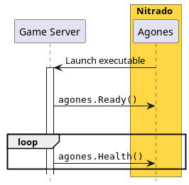
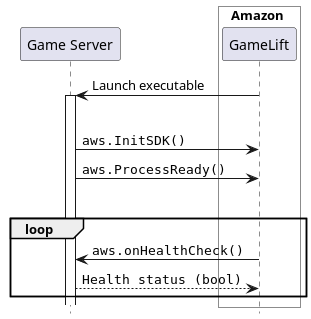
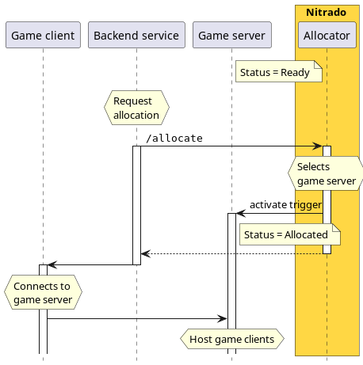
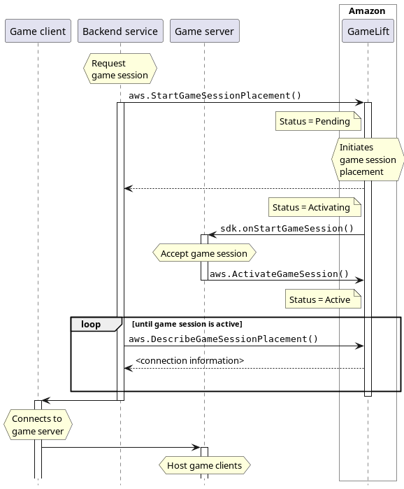
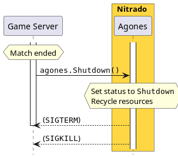
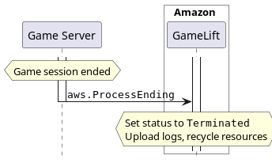

# Amazon GameLift Integration Documentation

## Introduction

This documentation serves as an integration guide for developers aiming to integrate their game services and game servers
into Nitrado multiplayer services, whereas a special focus lies on familiar concepts of Amazon GameLift.

The Nitrado multiplayer services consist of **GameFabric** to manage game server fleets,
the **Nitrado Allocator** to provide a pool of ready to play game servers for matchmaking,
and **[Agones](https://agones.dev/site/)**, which is the game server orchestration platform.

Table of contents:
[[toc]]

## Integration

The platform launches a new game server, ensures that it becomes ready, adds it to a pool of
available game servers where it can be allocated to host a match, and as a final step handles the shutdown.

### Game server startup

The Game server startup phase is when the platform launches the game server until it is ready to host a game.

**Nitrado**

The game server is launched within its container environment.

When the game server has started, it is required to call the Agones SDK function `agones.Ready()`.
This transitions the game server status from `Scheduled` to `Ready`.

See [Agones State Diagram](https://agones.dev/site/docs/reference/gameserver/#gameserver-state-diagram) for details.

Additionally Agones requires the game server to periodically call `agones.Health()`.
The required interval is configurable.

A failure to report health results in becoming `Unhealthy` and being `Shutdown`.

See [Agones client SDK overview](https://agones.dev/site/docs/guides/client-sdks/) for details.

**AWS**

Amazon GameLift has a similar initialization phase.

The game server is launched and is required to call `aws.InitSDK()` and once ready `aws.ProcessReady()`.

Amazon GameLift begins to call `aws.onHealthCheck()`, which is a callback that returns a boolean value indicating
the health status of the game server.

See [Initialize a game server at AWS](https://docs.aws.amazon.com/gamelift/latest/developerguide/gamelift-sdk-interactions.html#gamelift-sdk-interactions-launch)
for details.

The difference between both approaches is:

- The game server _sends_ the health report (active).
- The game server healthiness is implicit (no return type).

- The game server _responds_ to the health check (passive).
- The game server healthiness is explicit (boolean return type).

::: warning

Throughout the entire lifetime of the game server and its tooling (e.g. crash reports),
health reports must be sent to avoid shutdown.
:::

### Game server allocation

Game server allocation is when the matchmaker requests a game server to host a game session.

In most cases the game server needs to be notified about its allocation beforehand, and a way to accept or
reject the allocation.
Once accepted, the matchmaker, or more generally speaking the backend service, passes the game server address
and match information to the game client.

**Nitrado**

After becoming ready, a game server can be allocated at any time.

The backend service is required to call the Nitrado Allocator `/allocate` endpoint and request a game server.

See [Allocation: Allocator API documentation](/api/multiplayer-servers/allocation-allocator.html) for details

The Allocator selects a game server and activates a trigger for the game server.

These are the available triggers:

- creation or modification of a file,
- creation of Agones game server annotations,
- Agones state transition to `Allocated` (always available)

The game server is responsible for watching for changes in its allocation status.

Meanwhile, the Allocator passes the game server allocation back to the backend service,
where it is passed to the game client and used to connect with the game server.

::: info Technical Background

The game server container has an Allocation Sidecar, that waits for the state to become `Ready`.

Once ready, the sidecar registers the game server to the Allocator and waits for an allocation notification from the Allocator.

When the allocation notification comes in, it translates the request into a trigger and sets the status to `Allocated`.

:::

**AWS**

After initialization of the game server and once a game session has been created,
the backend service is required to call `aws.StartGameSessionPlacement()`.

This creates a `GameSessionPlacement` ticket, set its status to `Pending`, and returns it to the backend service.

Later on when a game server is selected, it sets the status to `Activating`
an calls `aws.onStartGameSession()`, which must be implemented by the game server.

The game server then activates the game session with `aws.ActivateGameSession()`,
which updates the game session with the placement information and set its status to `Active`.

The backend service uses `aws.DescribeGameSessionPlacement()` to determine the updated ticket status.
It can now pass the game server back to the game client.

See [Create a game session at AWS](https://docs.aws.amazon.com/gamelift/latest/developerguide/gamelift-sdk-interactions.html#gamelift-sdk-interactions-start)
for details.

There are several differences between the Amazon GameLift approach and Nitrado's.

- The game server watches for an allocation trigger.
- The game server does _not_ confirm the allocation.

- The game server implements a callback function (`aws.onStartGameSession()`).
- The game server confirms the allocation (`aws.ActivateGameSession()`).

::: info

Note that the implementation of `aws.onStartGameSession()` can be re-used to watch for the trigger activation,
but `aws.ActivateGameSession()` has no replacement.
:::

### Game server shutdown

The game server shutdown phase covers the shutdown behavior of the game server.

A game server shutdown can occur for various reasons, either when a game session ends and all players have left the game server,
when a game server is unhealthy, or when there is less demand for game servers and the platform scales down.

**Nitrado**

When a match ends, the game server is required to call `agones.Shutdown()` and then wait for `SIGTERM`.

**AWS**

The game server initiates the shutdown by calling `aws.ProcessEnding()`.

See [Shut down the game session at AWS](https://docs.aws.amazon.com/gamelift/latest/developerguide/gamelift-sdk-interactions.html#gamelift-sdk-interactions-shutdown)
for details.

The differences between both implementations:

- The game server waits for `SIGTERM`.

- The game server does not wait for `SIGTERM`.

::: warning

If the game server just exits, Agones eventually restarts the game server, leaving the game server in a possible inconsistent
state.

:::

#### Exit behavior

- **Always use non-zero exit codes for errors**.

  This is particularly crucial in the startup phase, where a sane restart policy, based on exit codes, is vital for large scale
  systems.

- **Before the game server stops, call `agones.Shutdown()`, if `agones.Ready()` has previously been called.**

  This allows Agones to restart the game server, which is more resource efficient than scheduling a new game server.

  An error during startup, together with calling `agones.Shutdown()` would result in a high churn rate.

- **Listen to `SIGTERM`.**

  You may receive a `SIGTERM` as a shutdown signal at any time the game server is not allocated, and in rare situations
  when it is allocated (usually only during manual and forced termination).

- **If stopping the game server requires a significant amount of time**, e.g. collecting crash reports, or uploading artifacts,
  the game server or the startup script need to continue sending the health reports, as failure to do so may result in a
  termination.

See [Health Failure Strategy at Agones](https://agones.dev/site/docs/guides/health-checking/#health-failure-strategy) for further
reading.

## Summary

Integrating Nitrado multiplayer services into matchmaking requires effort in detail:
the necessity to introduce a health report loop, watch an allocation trigger, and implement cloud-optimized exit behavior.

We wish you success with the integration!
