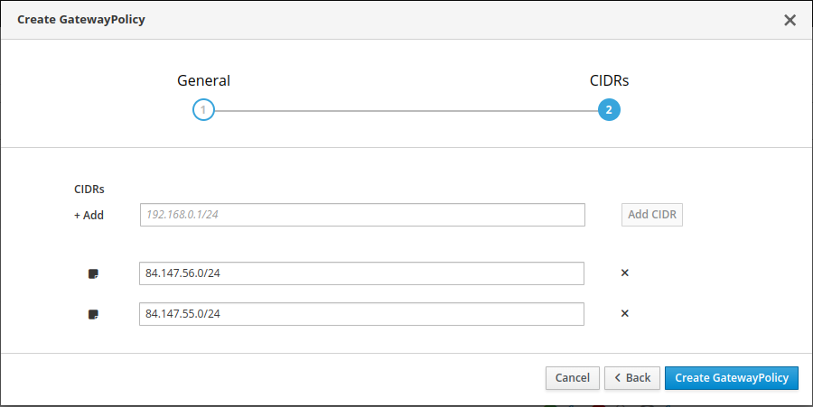
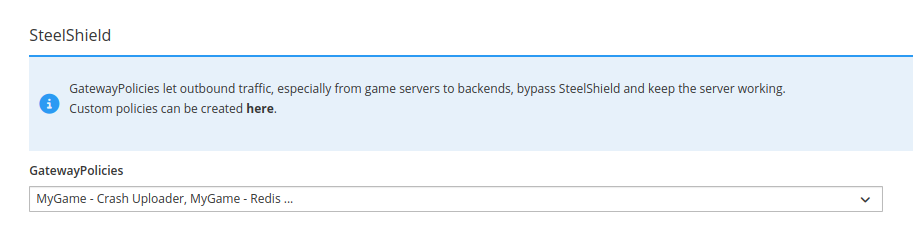

# Gateway Policies

Gateway policies provide an additional layer of protection for your game infrastructure by
redirecting specific outgoing game server traffic to destinations such as your game backend.

If SteelShield is active while unaware of your legitimate outgoing traffic, it might block connection attempts or responses that are not meant to be filtered.

::: tip Related Protection
For port-level protection, see [Ports and Protocols](protocols). For an overview of SteelShield, see the [SteelShield Introduction](/steelshield/unreal-engine-plugin/introduction).
:::

## Attack Scenario

Without Gateway Policies, an attacker can spoof a game host's IP address and send malicious requests to your game backend.
In response, you or your hosting provider might decide to block the IP address.
As a result, your game host, including legitimate game server traffic, would no longer be able to communicate with your game backend.

By redirecting traffic from your game server through the gateway, the traffic originates from gateway IP addresses that are typically unknown to attackers.
This makes spoofing a game host's IP address [largely](#exceptions) ineffective at disrupting communications with your game backend.

## Pre-requisites

In order to protect your game server's traffic, your GameFabric installation requires:

- Protection support enabled, usually indicated by the presence of the Protection/SteelShield navigation item.
- Sites that support Gateway Policies.

## Gateway Policy

A Gateway Policy specifies a set of destination CIDRs for which outgoing traffic should be redirected.

To manage the services and backends you interact with,
you can create multiple Gateway Policies and assign them to your ArmadaSets, Armadas, Formations, and Vessels.

You can assign the Gateway Policies in the Advanced Settings section of your game server configuration in GameFabric.

::: info
The assignment triggers an immediate rollout with the new policy assignment.
Allocated game servers are not affected, so they keep running under the old setup.

Updating an existing Gateway Policy on the other hand, does _not_ trigger a rollout.
:::

## Exceptions

In some cases, especially when there is a large number of new game servers, the application of the policy to a new game server may be delayed,
allowing traffic that is meant to be routed through the gateway to leave via the game host for a limited time.
