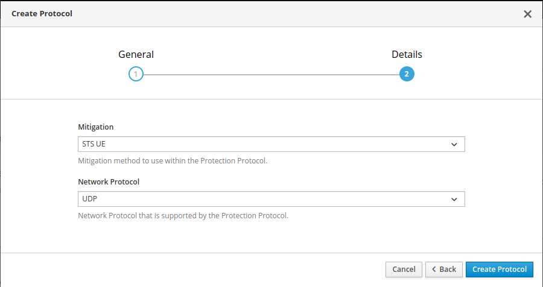
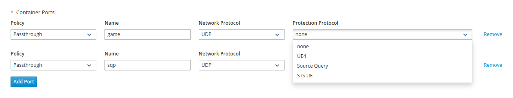

# Ports and Protocols

Game server ports are often vulnerable to attacks. 
GameFabric offers Protocols to protect your game server traffic with powerful SteelShield mitigations.

## Pre-requisites

In order to protect your game server's traffic, your GameFabric installation requires:

- Protection support enabled, usually indicated by the presence of the Protection/SteelShield navigation item.
- Sites that support SteelShield.

## Mitigations

SteelShield provides mitigations that are tailored to check and only allow specific network traffic.
To make use of the pre-defined mitigations you must create a new Protocol.

## Protocols

A Protocol — sometimes referred to as Protection Protocol, 
to distinguish it from a network protocol such as UDP or TCP,
describes the application protocol used by your game or service.

Some Mitigations only support specific network protocols, such as UDP and TCP.
In those cases, it is impossible to select a network protocol that is not supported by the Mitigation you selected.

::: warning
You can restrict your Protocol to only support either UDP or TCP, even though the Mitigation would allow both.
Allowing both protocols while only one is supported by the Mitigation is not allowed.
:::

Once the Protocol is created, you may use it in any ArmadaSet, Armada, Formation or Vessel.
In order to do so, in their Container configuration page, you must select a Protection Protocol for each game server port.

## Protect Game Server Ports

Any ArmadaSet, Armada, Formation or Vessel requires at least one game server port. 
This port is usually meant for communication between your game server and game clients.
In most cases however, your game server exposes more than a single port.
Each of those ports can be configured to use a different Protocol.

In order to make all of your game server's ports secure, it is strongly recommended to apply a Protection Protocol to each of them.

When the port is unprotected (`none`), traffic is forwarded as-is.

You can find the Protocol assignment to the right of the port specification for your containers.

::: warning
The assignment triggers an immediate rollout with the new port assignment.
Allocated game servers as always are not affected, so they keep running under the old setup.
:::

## Unsupported Sites

Sites are game server clusters, and SteelShield is not supported on all Sites. 
If you scale up and end up having game servers on multiple Sites, you may have game servers that are protected,
and game servers that are not protected, even if they run under the same revision.

We are working on a feature to provide insights on whether an ArmadaSets,
Armada, Formation or Vessel is protected, partially protected, or unprotected.
