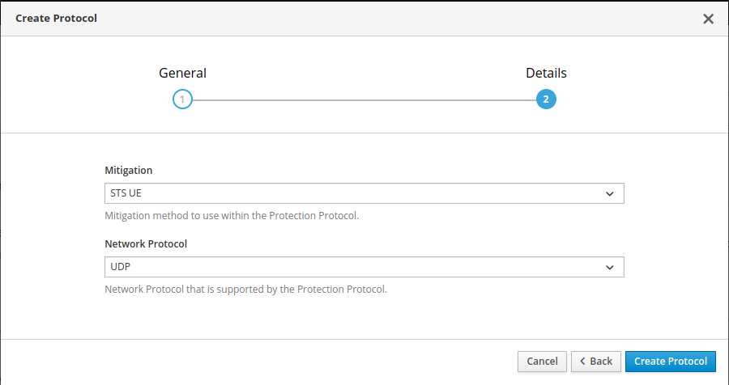
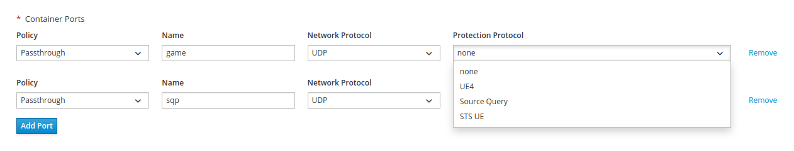

# SteelShield for Agones

SteelShield for Agones protects the Agones game server traffic from your GameFabric installation
with powerful mitigations.

## Pre-requisites

In order to protect the Agones game server traffic, your GameFabric installation requires:

- The SteelShield for Agones support enabled, usually indicated by the presence of the Protection/SteelShield navigation item.
- Sites that support SteelShield, e.g. bare-metal.

## Mitigations

SteelShield provides mitigations that are tailored to check and let through only specific game or network traffic.
To make use of the pre-defined mitigations you must create a new Protocol.

## Protocols

A Protocol – sometimes referred to as Protection Protocol, to distinguish it from a 
network protocol such as UDP or TCP –
describes the application protocol used by your game traffic or service.

When you create a new Protocol, you must select a Mitigation and a network protocol.
The network protocol that you select must be compatible with the Mitigation and their network protocol in order to be selectable.

::: warning
You can restrict your Protocol to only support one UDP or TCP, even though the Mitigation would allow both.
The other way round – allow both where only one is supported by the Mitigation – is not allowed.
:::

Once the Protocol is created, it is available to all ArmadaSets, Armadas, Formations or Vessels.
Nonetheless you need to actively select a Protection Protocol for each game server port of these entities.

## Protect game server ports

Any ArmadaSet, Armada, Formation or Vessel requires at least one game server port. 
This port is usually to allow communication between your game server and your connecting game clients.
It is common to even use multiple ports, one for the game engine, one for query services and so on.
For each of them you can apply different Protocols.

All ports are potentially vulnerable to attack, so by setting a Protection Protocol,
SteelShield applies a mitigation action to the traffic on these ports.

When the port is unprotected (`none`), SteelShield forwards any traffic without checking or filtering it.

You can find the Protocol assignment right next to the port specification under 
Vessel » Settings » Containers » Container Ports. It is the same for Armada Sets, Armadas and Formations.

You are only allowed to select Protection Protocols that are compatible with the selected network protocol (UDP, TCP).

::: warning
The assignment will trigger a rollout with the new port assignment.
Allocated game servers as always are not affected, so they keep running under the old setup.
:::

## Unsupported sites

Sites represent the clusters where game servers run, and SteelShield is not supported on all Sites. 
If you scale up and end up having game servers on multiple Sites, you may have game servers that are protected,
and game servers that are not protected, even if they run under the same revision.

We are working on a feature to provide insights on whether an ArmadaSets,
Armada, Formation or Vessel is protected, partially protected, or unprotected.
