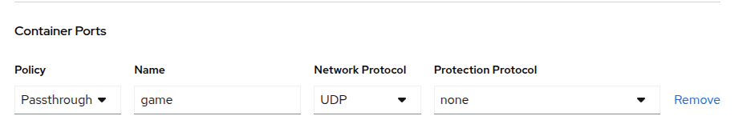

# How to enable advanced protection for game servers

For each Armada or Vessel go to `Settings`->`Containers`->`Container Ports`

select the **Protection Protocol** you want to use for each port and hit `Save`.

# Managing Protocols
You can manage your Protection Protocols under `SteelShield`->`Protocols`

# Mitigations

You can see all available Mitigations under `SteelShield`->`Mitigations`.

# GatewayPolicies
In order to make sure return traffic from any outgoing connections is not blocked you have to configure your backend services CIDRs inside a GatewayPolicy.

# Protection Status
In the UI under `Capacity`->`Sites` you can see the *Protection Status* for each of your Sites.

There are following possible values:

- **Unprotected**: No node in this site is protected
- **Protected**: Every node in this site is protected
- **Partially Protected**: Some nodes in this site are protected

::: info
At the moment **Partially Protected** is also shown if all of your nodes are protected but the buffer nodes are not.
For non maintenance operation this means that all of your capacity is protected.
:::
