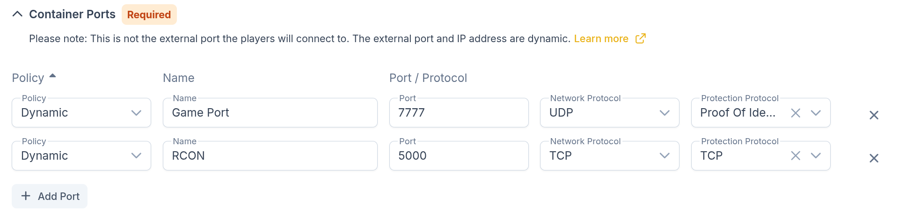
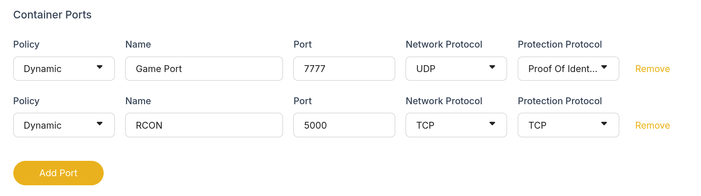

# Configure protection in GameFabric

By default, every service started in GameFabric has Level 1 protection in place. Level 1 protection handles smaller attacks with rate limiting. For stronger protection against larger attacks, configure Level 2 protection for your services wherever possible.

Correctly configured services greatly reduce the impact on your players during larger attacks. Basic rate limiting drops both good and bad traffic. With Level 2 protection, SteelShield uses the information you provide to keep good player traffic flowing to the server while it mitigates the attack traffic.

## How to configure Level 2+ protection for game servers

To enable higher levels of protection for your game servers:

### Modern UI

1. Navigate to your Armada or Vessel
2. Go to `Settings` → `Container Template & Volume` → `Container Ports`
3. Click `Add` to add a new port mapping
4. Choose `Dynamic` for the **Policy**
5. Fill in the **Name**, **Port/Protocol**, and **Protection Protocol** for each port
6. Click `Save`

### Legacy UI

1. Navigate to your Armada or Vessel
2. Go to `Settings` → `Containers` → `Container Ports`
3. Click `Add` to add a new port mapping
4. Choose `Dynamic` for the **Policy**
5. Fill in the **Name**, **Port/Protocol**, and **Protection Protocol** for each port
6. Click `Save`

### Protection Protocols

GameFabric provides the following protection protocols:

- **UE4 Generic Protection**: Protection for Unreal Engine 4's default network protocol. [*Level 2*]
- **UE5 Generic Protection**: Protection for Unreal Engine 5's default network protocol. [*Level 2*]
- **Source Query**: Protection for Valve's Source Query protocol. [*Level 2*]
- **Proof of Identity**: Protection for services that have completed Proof of Identity integration with SteelShield. [*Level 3*]
- **TCP**: Protection for inbound TCP connections. Use this for a listening TCP connection on your game server.

::: info Note
Some of these protocols may not be available in your GameFabric installation.
:::

## Gateway Policies

Gateway Policies control which external IP addresses can reach your service without passing through SteelShield.

GameFabric sends and receives that traffic on a different IP address than the main IP used for game communication.

To add a Gateway Policy:

1. Go to `SteelShield` → `GatewayPolicies`
2. Click `Add GatewayPolicy`
3. Add the `Name`, `Display Name`, and `Description` for the policy
4. Click `Next`
5. Enter the network CIDR for your backend service
6. Click `Add CIDR`
7. If you have multiple backend IPs, continue to add them in the same manner
8. Click `Create GatewayPolicy`

### When to use Gateway Policies

Use Gateway Policies when your server communicates with other backend services whose traffic SteelShield should not intercept.

An attacker can perform a reflection attack against your backend service provider by spoofing the main IP of your game server. The provider can interpret this traffic as an attack from your game server and start blocking it. As a result, your game server loses connectivity with your backend services.

A Gateway Policy routes backend traffic through separate gateway IP addresses that are typically unknown to attackers. This makes spoofing the game server's main IP address largely ineffective at disrupting communication with your backend services.

For the best protection, configure a Gateway Policy for all your backend services. This prevents attacks on the main game IP from disrupting how your servers communicate with those services.

## Protection status

To check your protection status:

1. Go to `Capacity` → `Sites`
2. View the *Protection Status* for each site

### Protection states

The system shows one of three protection states:

- **Unprotected**: No nodes in this site have protection
- **Protected**: All nodes in this site have protection
- **Partially Protected**: Some nodes in this site have protection

::: info
**Partially Protected** may also appear when all your nodes are protected but buffer nodes are not. For regular operations, this means all your capacity is protected.
:::
