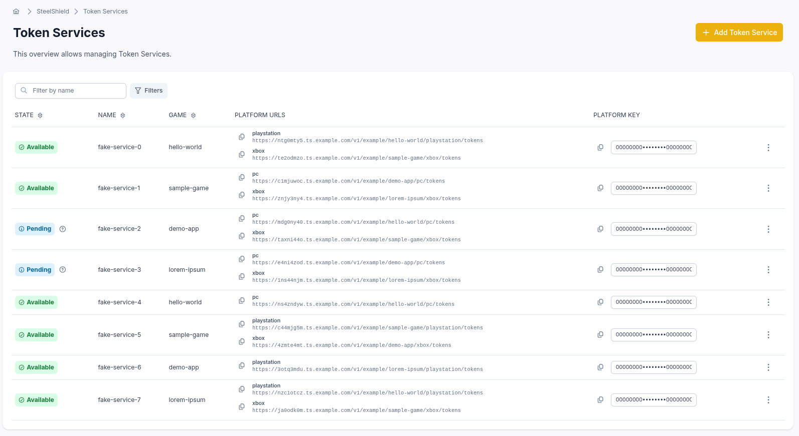
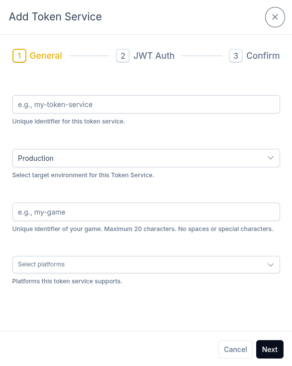
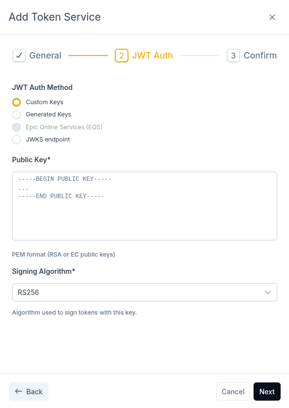
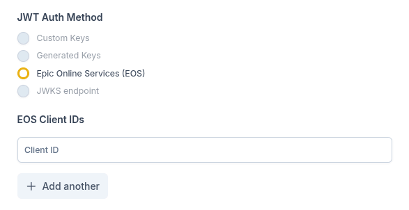
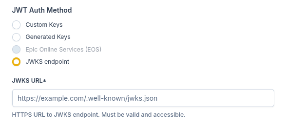
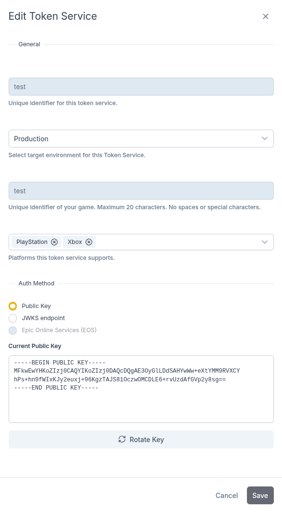

# Managing Token Services

This page describes how to create, edit, and delete Token Services through GameFabric.

## Accessing Token Services

Navigate to **SteelShield™ → Token Services** in the left sidebar to open the Token Services list:

The list shows every Token Service with its current **state**, **endpoint** for each enabled platform, and the **platform key** needed to contact them.
If the state has a reason, hover over the question mark icon next to it to read the reason.

## Adding a Token Service

To add a new Token Service, click **Add Token Service** on the Token Services page. The wizard consists of two steps:

1. **General**: name, environment, game name, and platforms.
2. **Authentication**: choose an authentication method and configure it.

### General settings

The General tab collects the basic configuration for the Token Service.

#### Environment

The **Environment** determines how the Token Service handles errors.
For a faulty request, the *Development* setting makes the Token Service return an [error response](/steelshield/token-service/api-reference#error-responses) that is relevant for developers.
For *Production*, the Token Service masks its behavior by always responding with success and a SteelShield token that does not function.

### Authentication settings

The JWT Auth tab lets you choose an authentication method and configure it per platform.

Choose one of the following authentication methods:

- [Custom Keys](#custom-keys): provide your own PEM public keys.
- [Generated Keys](#generated-keys): generate a key pair in the browser.
- [EOS (Epic Online Services)](#eos-epic-online-services): validate Epic Online Services tokens.
- [JWKS (JSON Web Key Set)](#jwks): use a remote JWKS endpoint.

See [Authentication Types](/steelshield/token-service/authentication-types) for full details.

#### Custom/Generated Keys

Upload one or more PEM public keys and specify a signing algorithm for each. Supported algorithms are RS256, RS384, RS512, ES256, ES384, and ES512.

Alternatively, you can generate an RSA key pair locally in the web interface.

::: warning
The private key never reaches GameFabric's backend. It is shown only once and cannot be retrieved later.
Save it securely before closing the dialog.
Do not include it with the game client. It is meant only for signing by the authentication backend.
:::

#### EOS (Epic Online Services)

To use EOS authentication, select **EOS** as the only platform in the **Platforms** list in the **General** tab. In the API, skip the platforms list.

Enter one or more Epic Online Services client IDs. The Token Service allows clients to authenticate with any of the client IDs you configure here.

#### JWKS

Provide an HTTPS URL to a JSON Web Key Set endpoint. The URL may look similar to `https://<hostname>/.well-known/jwks.json`, but it does not have to follow this format.

The Token Service regularly fetches the public keys from this endpoint to verify tokens.

### Confirm

Review the configuration and confirm to create the Token Service.
After creation, the Token Service enters the **Pending** state while being provisioned.
GameFabric then assigns it a hostname and platform keys, which appear in the Token Services list.
When provisioning completes, the status switches to **Available**.

## Editing a Token Service

To edit an existing Token Service, click the ellipsis button (`⋮`) on the row and select **Edit**. A wizard opens pre-filled with the current configuration. Make your changes and confirm to update the Token Service.

### Rotating the key

For Token Services that use **Custom Keys** or **Generated Keys**, you can rotate the keys without changing the service configuration.
This is useful when you need to replace the signing key (for example, after a key compromise or when rotating keys on a schedule).

To rotate the key:

1. In the edit wizard, scroll to the **Auth Method** section and select **Public Key**.
2. Click **Rotate Key** below the current public key display.
3. Choose one of two options:
   - **New custom key**: upload a new PEM public key file or paste the PEM content, then select a signing algorithm.
   - **Generate new pair**: click **Generate New Key Pair** to create a new RSA key pair in the browser. The private key is shown only once and cannot be retrieved later.
4. Click **Done** to exit the key input and then **Save** to finally apply the new key.

::: warning
Generating a new key pair invalidates the current public key **immediately**.
Existing integrations using the old key will stop authenticating until they are updated with the new public key.
:::

::: warning
The private key generated during key rotation is shown only once. Make sure to save it securely before closing the dialog.
:::

The new key takes effect immediately on save. The Token Service does **not** enter a pending state during key rotation.

### Rotating the key without downtime

Replacing an existing signing key immediately invalidates the previous key. This can leave a period where your customers cannot authenticate and receive a SteelShield token until your backend and Token Service share the same key again.

Rotating the key in place therefore requires downtime while you update the private signing key on your backend or the public signing key on the Token Service.

To avoid downtime, create a new Token Service with the new public key, then transition your game client to the new Token Service. Because the URL and platform key change, you must also issue a game client update with the new details.

## Deleting a Token Service

To delete an existing Token Service, click the ellipsis button (`⋮`) on the row and select **Delete**. The interface asks for confirmation once before deleting the Token Service.

## Status

Each Token Service has a status that reflects its current state:

- **Pending**: the Token Service is being provisioned or updated.
- **Available**: the Token Service is ready to accept requests.
- **Error**: the Token Service encountered an error. An error reason is displayed alongside the status.

When a Token Service is available, its status includes a hostname and platform keys for authenticating requests.
