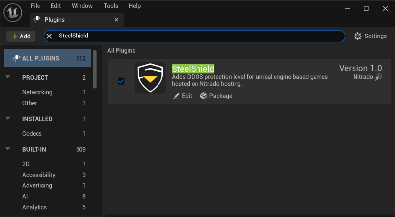

# Getting Started

This guide will help you get started with the SteelShield Plugin for Unreal Engine. The plugin provides integration
with the SteelShield DDoS protection system, allowing you to protect your game servers from large scale DDoS attacks.

## 1. Applying The Patch File

You need to apply the provided patch file to the Unreal Engine source code. In the below examples the `$BASE_DIR`
represents the location of both the Unreal Engine source code and the SteelShield Plugin code. You may need to change
the version of the patch used to suite the version of the Unreal Engine you are working with.

Normally, patches with minor number version differences can be applied to Unreal Engine version which share similar major
version numbers. For example, patch `ue5.2.1` can be applied to `ue5.2.0` without issue.

Once the patch file is applied, please rebuild the Unreal Engine using your preferred method.

```bash
$ cd $BASE_DIR/unreal_engine
$ git apply $BASE_DIR/steelshield_plugin/ue5.2.1-001_engine.patch
```

## 2. Copy Plugin Files

The next step is to copy the plugin files to your local projects plugins folder.

```bash
$ cd $BASE_DIR/plugin
$ cp -r SteelShield $UNREAL_PROJECTS_DIR/MyNewGame/Plugins
```

## 3. Enable the Plugin

The SteelShield Plugin should automatically be enabled once you copy it into your `Plugins` folder.

Go to `Editor→Plugins` to check that it has been picked up and enabled.



After confirming the plugin is enabled, you need to add it as a dependency of your project.
You can do that by editing your `*.build.cs` file to include the following

```csharp
PublicDependencyModuleNames.AddRange(new string[] { "SteelShield" });
```

As an example, if you have a project called `MyGame`, then you would have a section in your `MyGame.Build.cs` file that
looks like the following

```csharp
PublicDependencyModuleNames.AddRange(new string[]
{
    "Core",
    "CoreUObject",
    "Engine",
    "InputCore",
    "OnlineSubsystemUtils",
    "DeveloperSettings",
    "VoiceChat",
    "SteelShield"
});
```
